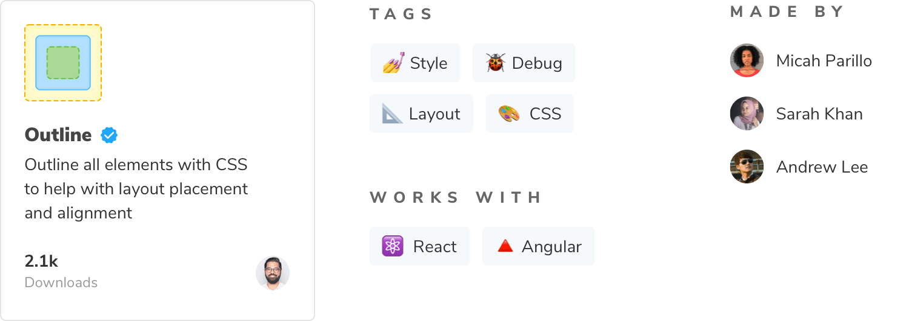

Storybook has two types of integrations, addons and recipes, which are listed in the [integration catalog](https://storybook.js.org/integrations/).

## Addons

Storybook addons are distributed via npm. The catalog is populated by querying npm's registry for Storybook-specific metadata in `package.json`.

Add your addon to the catalog by publishing a npm package that follows these requirements:

- `package.json` with [module information](./writing-addons.md#get-started) and [addon metadata](#addon-metadata)
- `README.md` file with installation and configuration instructions
- `/dist` directory containing transpiled ES5 code
- `preset.js` file written as an ES5 module at the root level

<Callout variant="info" icon="💡">

Get a refresher on how to [write a Storybook addon](./writing-addons.md).

</Callout>

### Addon metadata

We rely on metadata to organize your addon in the catalog. You must add the <code>storybook-addons</code> as the first keyword, followed by your addon's category. Additional keywords will be used in search and as tags.

| Property      | Description                            | Example                                                                   |
| ------------- | -------------------------------------- | ------------------------------------------------------------------------- |
| `name`        | Addon package name                     | storybook-addon-outline                                                   |
| `description` | Addon description                      | Outline all elements with CSS to help with layout placement and alignment |
| `author`      | Name of the author                     | winkerVSbecks                                                             |
| `keywords`    | List of keywords to describe the addon | `["storybook-addons","style","debug"]`                                    |
| `repository`  | Addon repository                       | `{"type": "git","url": "https://github.com/someone/my-addon" }`           |

Customize your addon's appearance by adding the `storybook` property with the following fields.

| Property                | Description                                               | Example                               |
| ----------------------- | --------------------------------------------------------- | ------------------------------------- |
| `displayName`           | Display name                                              | Outline                               |
| `icon`                  | Link to custom icon for the addon (SVG are not supported) | https://yoursite.com/outline-icon.png |
| `unsupportedFrameworks` | List of unsupported frameworks                            | `["vue"]`                             |
| `supportedFrameworks`   | List of supported frameworks                              | `["react", "angular"]`                |

Use the list below as a reference when filling in the values for both the `supportedFrameworks` and `unsupportedFrameworks` fields.

- react
- vue
- angular
- web-components
- ember
- html
- svelte
- preact
- react-native

<Callout variant="info" icon="💡">

Make sure to copy each item **exactly** as listed so that we can properly index your addon in our catalog.

</Callout>

```json
{
  // package.json

  "name": "storybook-addon-outline",
  "version": "1.0.0",
  "description": "Outline all elements with CSS to help with layout placement and alignment",
  "repository": {
    "type": "git",
    "url": "https://github.com/chromaui/storybook-outline"
  },
  "author": "winkerVSbecks",
  "keywords": ["storybook-addons", "style", "debug", "layout", "css"],
  "storybook": {
    "displayName": "Outline",
    "unsupportedFrameworks": ["vue"],
    "supportedFrameworks": ["react", "angular"],
    "icon": "https://yoursite.com/outline-icon.png"
  }
}
```

The `package.json` above appears like below in the catalog. See an example of a production package.json [here](https://github.com/chromaui/storybook-outline/blob/main/package.json).



#### How long does it take for my addon to show up in the catalog?

Once you publish the addon, it will appear in the catalog. There may be a delay between the time you publish your addon and when it's listed in the catalog. If your addon doesn't show up within 24 hours, [open an issue](https://github.com/storybookjs/frontpage/issues).

## Recipes

Recipes are a set of instructions to integrate third-party libraries into Storybook in cases where an addon does not exist or the integration requires some manual effort.

### Who owns them?

Recipes are written and maintained by the Storybook team. We create recipes based on community popularity, tool maturity, and stability of the integration. Our goal is to ensure that recipes continue to work over time.

Not finding the recipe that you want? If it's popular in the community, our docs team will write one. In the mean time, try searching for a solution — it's likely that someone has the same requirements as you do. You can also help us out by writing recipes on your own site which speeds up the research process.

### Request a recipe

If you'd like to request a recipe, head over to the [#maintenance channel](https://discord.com/channels/486522875931656193/490070912448724992) of our community Discord and ask.

## Learn more about the Storybook addon ecosystem

- [Types of addons](./addon-types.md) for other types of addons
- [Writing addons](./writing-addons.md) for the basics of addon development
- [Presets](./writing-presets.md) for preset development
- Integration catalog for requirements and available recipes
- [API reference](./addons-api.md) to learn about the available APIs
