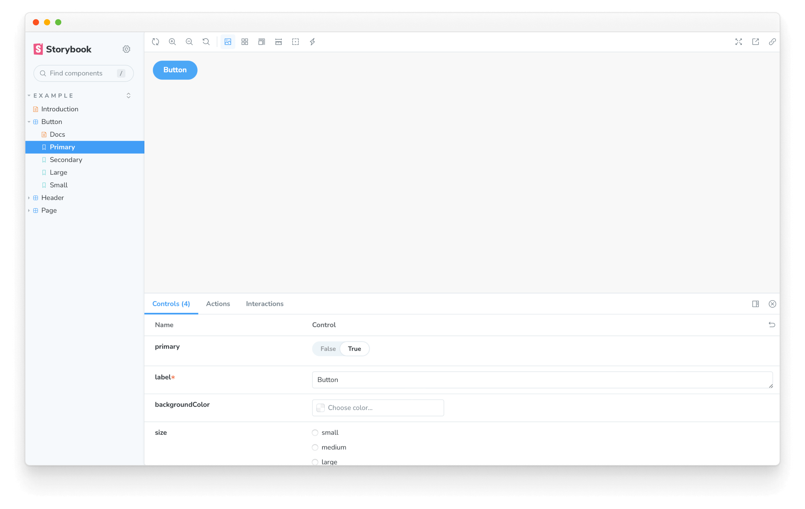
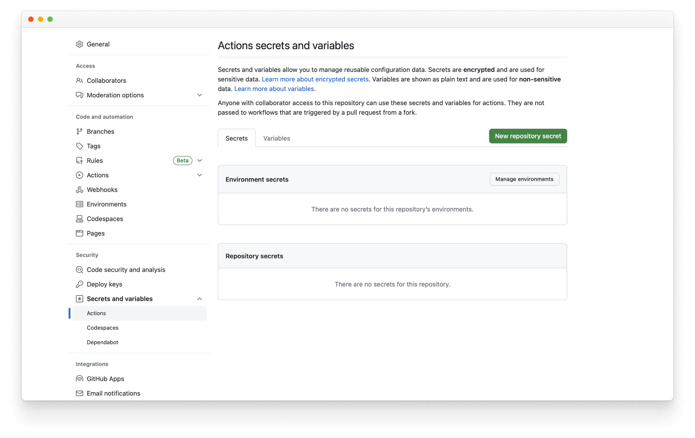

Storybook addons are a powerful way to extend Storybook's functionality and customize the development experience. They can be used to add new features, customize the UI, or integrate with third-party tools.

## What are we going to build?

This reference guide is to help you develop a mental model for how Storybook addons work by building a simple addon based on the popular [Outline addon](https://storybook.js.org/addons/@storybook/addon-outline/). Throughout this guide, you'll learn how addons are structured, Storybook's APIs, how to test your addon locally, and how to publish it.

<video autoPlay muted playsInline loop>
  <source
    src="storybook-addon-finished-state.mp4"
    type="video/mp4"
  />
</video>

## Addon anatomy

There are two main categories of addons, each with its role:

- **UI-based**: These addons are responsible for customizing the interface, enabling shortcuts for common tasks, or displaying additional information in the UI.
- **Presets**: [These](./writing-presets.md) are pre-configured settings or configurations that enable developers to quickly set up and customize their environment with a specific set of features, functionality, or technology.

### UI-based addons

The addon built in this guide is a UI-based addon, specifically a [toolbar](./addon-types.md#toolbars) addon, enabling users to draw outlines around each element in the story through a shortcut or click of a button. UI addons can create other types of UI elements, each with its function: [panels](./addon-types.md#panels) and [tabs](./addon-types.md#tabs), providing users with various ways to interact with the UI.

<!-- prettier-ignore-start -->

<CodeSnippets
  paths={[
    'common/storybook-addon-toolkit-toolbar-example.toolbar.ts.mdx',
    'common/storybook-addon-toolkit-panel-example.panel.ts.mdx',
    'common/storybook-addon-toolkit-tab-example.tab.ts.mdx',
  ]}
/>

<!-- prettier-ignore-end -->

## Setup

To create your first addon, you're going to use the [Addon Kit](https://github.com/storybookjs/addon-kit), a ready-to-use template featuring all the required building blocks, dependencies and configurations to help you get started building your addon. In the Addon Kit repository, click the **Use this template** button to create a new repository based on the Addon Kit's code.

<video autoPlay muted playsInline loop>
  <source
    src="addon-kit-clone-repo.mp4"
    type="video/mp4"
  />
</video>

Clone the repository you just created and install its dependencies. When the installation process finishes, you will be prompted with questions to configure your addon. Answer them, and when you're ready to start building your addon, run the following command to start Storybook in development mode and develop your addon in watch mode:

<!-- prettier-ignore-start -->

<CodeSnippets
  paths={[
    'common/storybook-addon-run-dev-mode.yarn.js.mdx',
    'common/storybook-addon-run-dev-mode.npm.js.mdx',
    'common/storybook-addon-run-dev-mode.pnpm.js.mdx',
  ]}
/>

<!-- prettier-ignore-end -->

<Callout variant="info">

The Addon Kit uses [Typescript](https://www.typescriptlang.org/) by default. If you want to use JavaScript instead, you can run the `eject-ts` command to convert the project to JavaScript.

</Callout>

### Understanding the build system

Addons built in the Storybook ecosystem rely on [tsup](https://tsup.egoist.dev/), a fast, zero-config bundler powered by [esbuild](https://esbuild.github.io/) to transpile your addon's code into modern JavaScript that can run in the browser. Out of the box, the Addon Kit comes with a pre-configured `tsup` configuration file that you can use to customize the build process of your addon.

When the build scripts run, it will look for the configuration file and pre-bundle the addon's code based on the configuration provided. Addons can interact with Storybook in various ways. They can define presets to modify the configuration, add behavior to the manager UI, or add behavior to the preview iframe. These different use cases require different bundle outputs because they target different runtimes and environments. Presets are executed in a Node environment. Storybook's manager and preview environments provide certain packages in the global scope, so addons don't need to bundle them or include them as dependencies in their `package.json` file.

The `tsup` configuration handles these complexities by default, but you can customize it according to their requirements. For a detailed explanation of the bundling techniques used, please refer to [the README of the addon-kit](https://github.com/storybookjs/addon-kit#bundling), and check out the default `tsup` configuration [here](https://github.com/storybookjs/addon-kit/blob/main/tsup.config.ts).

## Register the addon

By default, code for the UI-based addons is located in one of the following files, depending on the type of addon built: **`src/Tool.tsx`**, **`src/Panel.tsx`**, or **`src/Tab.tsx`**. Since we're building a toolbar addon, we can safely remove the `Panel` and `Tab` files and update the remaining file to the following:

<!-- prettier-ignore-start -->

<CodeSnippets
  paths={[
    'common/storybook-addon-tool-initial-setup.ts.mdx',
  ]}
/>

<!-- prettier-ignore-end -->

Going through the code blocks in sequence:

```ts
import { useGlobals, useStorybookApi } from '@storybook/manager-api';

import { Icons, IconButton } from '@storybook/components';
```

The [`useGlobals`](./addons-api.md#useglobals) and [`useStorybookApi`](./addons-api.md#usestorybookapi) hooks from the `manager-api` package are used to access the Storybook's APIs, allowing users to interact with the addon, such as enabling or disabling it. The `Icons` and `IconButtons` components from the [`@storybook/components`](https://www.npmjs.com/package/@storybook/components) package render the icons and buttons in the toolbar.

```ts
export const Tool = memo(function MyAddonSelector() {
  const [globals, updateGlobals] = useGlobals();
  const api = useStorybookApi();

  const isActive = [true, 'true'].includes(globals[PARAM_KEY]);

  const toggleMyTool = useCallback(() => {
    updateGlobals({
      [PARAM_KEY]: !isActive,
    });
  }, [isActive]);

  useEffect(() => {
    api.setAddonShortcut(ADDON_ID, {
      label: 'Toggle Addon [8]',
      defaultShortcut: ['8'],
      actionName: 'myaddon',
      showInMenu: false,
      action: toggleMyTool,
    });
  }, [toggleMyTool, api]);

  return (
    <IconButton
      key={TOOL_ID}
      active={isActive}
      title="Apply outlines to the preview"
      onClick={toggleMyTool}
    >
      <Icons icon="lightning" />
    </IconButton>
  );
});
```

The `Tool` component is the entry point of the addon. It renders the UI elements in the toolbar, registers a keyboard shortcut, and handles the logic to enable and disable the addon.

Moving onto the manager, here we register the addon with Storybook using a unique name and identifier. Since we've removed the `Panel` and `Tab` files, we'll need to adjust the file to only reference the addon we're building.

<!-- prettier-ignore-start -->

<CodeSnippets
  paths={[
    'common/storybook-addon-manager-initial-state.ts.mdx',
  ]}
/>

<!-- prettier-ignore-end -->

Notice the `match` property. It allows you to control the view mode where the addon is visible. If you only want to show it in a single mode, you must adjust the property to match the specific mode you aim for. In this case, it will be available in both story and documentation.

Run the `start` script to build and start Storybook and verify that the addon is registered correctly and showing in the UI.



### Style the addon

In Storybook, applying styles for addons is considered a side-effect. Therefore, we'll need to make some changes to our addon to allow it to use the styles when it is active and remove them when it's disabled. We're going to rely on two of Storybook's features to handle this: [decorators](../writing-stories/decorators.md) and [globals](../essentials/toolbars-and-globals.md#globals). To handle the CSS logic, we must include some helper functions to inject and remove the stylesheets from the DOM. Start by creating the helper file with the following content:

<!-- prettier-ignore-start -->

<CodeSnippets
  paths={[
    'common/storybook-addon-css-helpers.ts.mdx',
  ]}
/>

<!-- prettier-ignore-end -->

Next, create the file with the styles we want to inject with the following content:

<!-- prettier-ignore-start -->

<CodeSnippets
  paths={[
    'common/storybook-addon-css-example.ts.mdx',
  ]}
/>

<!-- prettier-ignore-end -->

Since the addon can be active in both the story and documentation modes, the DOM node for Storybook's preview `iframe` is different in these two modes. In fact, Storybook renders multiple story previews on one page when in documentation mode. Therefore, we'll need to choose the correct selector for the DOM node where the styles will be injected and ensure the CSS is scoped to that particular selector. That mechanism is provided as an example within the `src/withGlobals.ts` file, which we'll use to connect the styling and helper functions to the addon logic. Update the file to the following:

<!-- prettier-ignore-start -->

<CodeSnippets
  paths={[
    'common/storybook-addon-use-global.ts.mdx',
  ]}
/>

<!-- prettier-ignore-end -->

## Packaging and publishing

Storybook addons, similar to most packages in the JavaScript ecosystem, are distributed as NPM packages. However, they have specific criteria that need to be met to be published to NPM and crawled by the integration catalog:

1. Have a `dist` folder with the transpiled code.
2. A `package.json` file declaring:
   - Peer dependencies
   - Module-related information
   - Integration catalog metadata

### Module Metadata

The first category of metadata is related to the addon itself. This includes the entry for the module and which files to include when the addon is published. And all the peer-dependencies of the addon (e.g., `react`,`react-dom`, and Storybook's related APIs).

```json
{
  "exports": {
    ".": {
      "require": "./dist/index.js",
      "import": "./dist/index.mjs",
      "types": "./dist/index.d.ts"
    },
    "./manager": {
      "require": "./dist/manager.js",
      "import": "./dist/manager.mjs",
      "types": "./dist/manager.d.ts"
    },
    "./preview": {
      "require": "./dist/preview.js",
      "import": "./dist/preview.mjs",
      "types": "./dist/preview.d.ts"
    },
    "./package.json": "./package.json"
  },
  "main": "dist/index.js",
  "module": "dist/index.mjs",
  "types": "dist/index.d.ts",
  "files": ["dist/**/*", "README.md", "*.js", "*.d.ts"],
  "peerDependencies": {
    "@storybook/blocks": "^7.0.0",
    "@storybook/components": "^7.0.0",
    "@storybook/core-events": "^7.0.0",
    "@storybook/manager-api": "^7.0.0",
    "@storybook/preview-api": "^7.0.0",
    "@storybook/theming": "^7.0.0",
    "@storybook/types": "^7.0.0",
    "react": "^16.8.0 || ^17.0.0 || ^18.0.0",
    "react-dom": "^16.8.0 || ^17.0.0 || ^18.0.0"
  }
}
```

#### Why peer-dependencies?

A standard practice in the JavaScript ecosystem ensuring compatibility between modules or packages that are meant to work together, often in a plugin or extension scenario. Peer-dependencies are dependencies that are not bundled with the addon but are expected to be installed by the consumer of the addon. When a module relies on a specific version of another module, it might assume certain features, APIs, or behavior provided by that dependency. By specifying a peer dependency, the module can indicate its compatibility requirements and avoid potential conflicts or unexpected behavior due to incompatible versions.

### Integration Catalog Metadata

The second metadata category is related to the [integration catalog](https://storybook.js.org/integrations). Most of this information is already pre-configured by the Addon Kit. However, items like the display name, icon, and frameworks must be configured via the `storybook` property to be displayed in the catalog.

```json
{
  "name": "my-storybook-addon",
  "version": "1.0.0",
  "description": "My first storybook addon",
  "author": "Your Name",
  "storybook": {
    "displayName": "My Storybook Addon",
    "unsupportedFrameworks": ["react-native"],
    "icon": "https://yoursite.com/link-to-your-icon.png"
  },
  "keywords": ["storybook-addons", "appearance", "style", "css", "layout", "debug"]
}
```

<Callout variant="info">

The `storybook` configuration element includes additional properties that help customize the addon's searchability and indexing. For more information, see the [Integration catalog documentation](./integration-catalog.md).

</Callout>

One essential item to note is the `keywords` property as it maps to the catalog's tag system. Adding the `storybook-addons` ensures that the addon is discoverable in the catalog when searching for addons. The remaining keywords help with the searchability and categorization of the addon.

### Publishing to NPM

Once you're ready to publish your addon to NPM, the Addon Kit comes pre-configured with the [Auto](https://github.com/intuit/auto) package for release management. It generates a changelog and uploads the package to NPM and GitHub automatically. Therefore, you need to configure access to both.

1. Authenticate using [npm adduser](https://docs.npmjs.com/cli/v9/commands/npm-adduser)
2. Generate a [access token](https://docs.npmjs.com/creating-and-viewing-access-tokens#creating-access-tokens) with both `read` and `publish` permissions.
3. Create a [personal access token](https://docs.github.com/en/github/authenticating-to-github/keeping-your-account-and-data-secure/creating-a-personal-access-token) with `repo` and `workflow` scoped permissions.
4. Create a `.env` file in the root of your project and add the following:

```plaintext
GH_TOKEN=value_you_just_got_from_github
NPM_TOKEN=value_you_just_got_from_npm
```

Next, run the following command to create labels on GitHub. You'll use these labels to categorize changes to the package.

```shell
npx auto create-labels
```

Finally, run the following command to create a release for your addon. This will build and package the addon code, bump the version, push the release into GitHub and npm, and generate a changelog.

<!-- prettier-ignore-start -->

<CodeSnippets
  paths={[
    'common/storybook-addon-release.yarn.js.mdx',
    'common/storybook-addon-release.npm.js.mdx',
    'common/storybook-addon-release.pnpm.js.mdx',
  ]}
/>

<!-- prettier-ignore-end -->

### CI automation

By default, the Addon Kit comes pre-configured with a GitHub Actions workflow, enabling you to automate the release management process. This ensures that the package is always up to date with the latest changes and that the changelog is updated accordingly. However, you'll need additional configuration to use your NPM and GitHub tokens to publish the package successfully. In your repository, click the **Settings** tab, then the **Secrets and variables** dropdown, followed by the **Actions** item. You should see the following screen:



Then, click the **New repository secret**, name it `NPM_TOKEN`, and paste the token you generated earlier. Whenever you merge a pull request to the default branch, the workflow will run and publish a new release, automatically incrementing the version number and updating the changelog.

## Learn more about the Storybook addon ecosystem

- [Types of addons](./addon-types.md) for other types of addons
- Writing addons for the basics of addon development
- [Presets](./writing-presets.md) for preset development
- [Integration catalog](./integration-catalog.md) for requirements and available recipes
- [API reference](./addons-api.md) to learn about the available APIs
