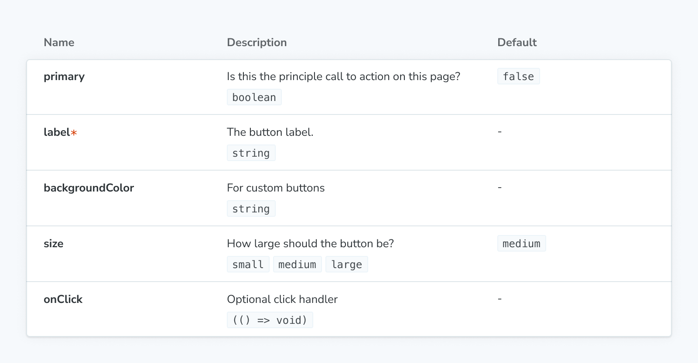

The `ArgTypes` block can be used to show a static table of [arg types](./argtypes.md) for a given component, as a way to document its interface.

<div class="aside">

💡 If you’re looking for a dynamic table that shows a story’s current arg values for a story and supports users changing them, see the [`Controls`](./doc-block-controls.md) block instead.

</div>



<!-- prettier-ignore-start -->
```md
{/* ButtonDocs.mdx */}

import { Meta, ArgTypes } from '@storybook/blocks';
import * as ButtonStories from './Button.stories';

<Meta of={ButtonStories} />

<ArgTypes of={ButtonStories} />
```
<!-- prettier-ignore-end -->

## ArgTypes

```js
import { ArgTypes } from '@storybook/blocks';
```

<details>
<summary>Configuring with props <strong>and</strong> parameters</summary>

ℹ️ Like most blocks, the `ArgTypes` block is configured with props in MDX. Many of those props derive their default value from a corresponding [parameter](../writing-stories/parameters.md) in the block's namespace, `parameters.docs.argTypes`.

The following `exclude` configurations are equivalent:

<!-- prettier-ignore-start -->

<CodeSnippets
  paths={[
    'angular/api-doc-block-argtypes-parameter.ts.mdx',
    'web-components/api-doc-block-argtypes-parameter.js.mdx',
    'web-components/api-doc-block-argtypes-parameter.ts.mdx',
    'web-components/api-doc-block-argtypes-parameter.ts.mdx',
    'common/api-doc-block-argtypes-parameter.js.mdx',
    'common/api-doc-block-argtypes-parameter.ts.mdx',
  ]}
/>

<!-- prettier-ignore-end -->

<!-- prettier-ignore-start -->
```md
{/* ButtonDocs.mdx */}

<ArgTypes of={ButtonStories} exclude={['style']} />
```
<!-- prettier-ignore-end -->

The example above applied the parameter at the [component](../writing-stories/parameters.md#component-parameters) (or meta) level, but it could also be applied at the [project](../writing-stories/parameters.md#global-parameters) or [story](../writing-stories/parameters.md#story-parameters) level.

</details>

### `exclude`

Type: `string[] | RegExp`

Default: `parameters.docs.argTypes.exclude`

Specifies which arg types to exclude from the args table. Any arg types whose names match the regex or are part of the array will be left out.

### `include`

Type: `string[] | RegExp`

Default: `parameters.docs.argTypes.include`

Specifies which arg types to include in the args table. Any arg types whose names don’t match the regex or are not part of the array will be left out.

### `of`

Type: Story export or CSF file exports

Specifies which story to get the arg types from. If a CSF file exports is provided, it will use the primary (first) story in the file.

### `sort`

Type: `'none' | 'alpha' | 'requiredFirst'`

Default: `parameters.docs.argTypes.sort` or `'none'`

Specifies how the arg types are sorted.

- **none**: Unsorted, displayed in the same order the arg types are processed in
- **alpha**: Sorted alphabetically, by the arg type's name
- **requiredFirst**: Same as `alpha`, with any required arg types displayed first
