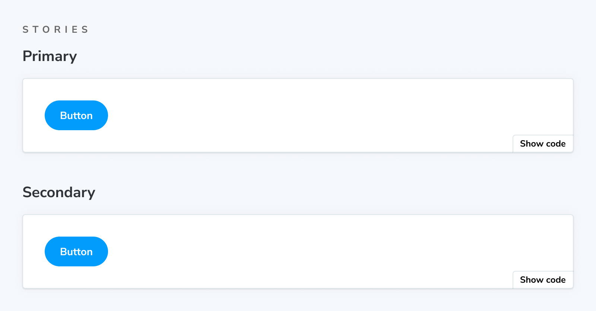

The `Stories` block renders the full collection of stories in a stories file.



<!-- prettier-ignore-start -->
```md
{/* ButtonDocs.mdx */}

import { Meta, Stories } from '@storybook/blocks';
import * as ButtonStories from './Button.stories';

<Meta of={ButtonStories} />

<Stories />
```
<!-- prettier-ignore-end -->

## Stories

```js
import { Stories } from '@storybook/blocks';
```

`Stories` is configured with the following props:

### `includePrimary`

Type: `boolean`

Default: `true`

Determines if the collection of stories includes the primary (first) story.

<div class="aside">

💡 If a stories file contains only one story and `includePrimary={true}`, the `Stories` block will render nothing to avoid a potentially confusing situation.

</div>

### `title`

Type: `string`

Default: `'Stories'`

Sets the heading content preceding the collection of stories.
