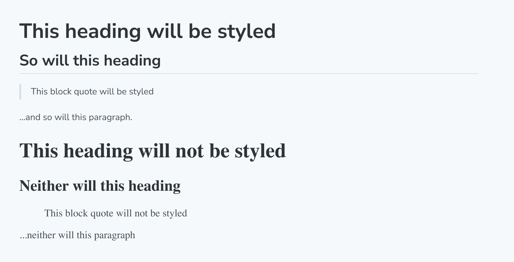

The `Unstyled` block is a special block that disables Storybook's default styling in MDX docs wherever it is added.

By default, most elements (like `h1`, `p`, etc.) in docs have a few default styles applied to ensure the docs look good. However, sometimes you might want some of your content to not have these styles applied. In those cases, wrap the content with the `Unstyled` block to remove the default styles.

<!-- prettier-ignore-start -->
```md
import { Meta, Unstyled } from "@storybook/blocks";
import { Header } from "./Header.tsx";

<Meta title="Unstyled" />

> This block quote will be styled

... and so will this paragraph.

<Unstyled>
  > This block quote will not be styled

  ... neither will this paragraph, nor the following component (which contains an \<h1\>):

  <Header />

</Unstyled>
```
<!-- prettier-ignore-end -->

Yields:



<div class="aside">

ℹ️ The other blocks like [`Story`](./doc-block-story.md) and [`Canvas`](./doc-block-canvas.md) are already unstyled, so there’s no need to wrap those in the `Unstyled` block to ensure that Storybook’s styles don’t bleed into the stories. However, if you import your components directly in the MDX, you most likely want to wrap them in the Unstyled block.

</div>

<div class="aside">

💡 Due to how CSS inheritance works it’s best to always add the Unstyled block to the root of your MDX, and not nested into other elements. The following example will cause some Storybook styles like `color` to be inherited into `CustomComponent` because they are applied to the root `div`:

<!-- prettier-ignore-start -->
```md
<div>
  <Unstyled>
    <CustomComponent/>
  </Unstyled>
</div>
```
<!-- prettier-ignore-end -->

</div>

## Unstyled

```js
import { Unstyled } from '@storybook/blocks';
```

`Unstyled` is configured with the following props:

### `children`

Type: `React.ReactNode`

Provides the content to which you do _not_ want to apply default docs styles.
