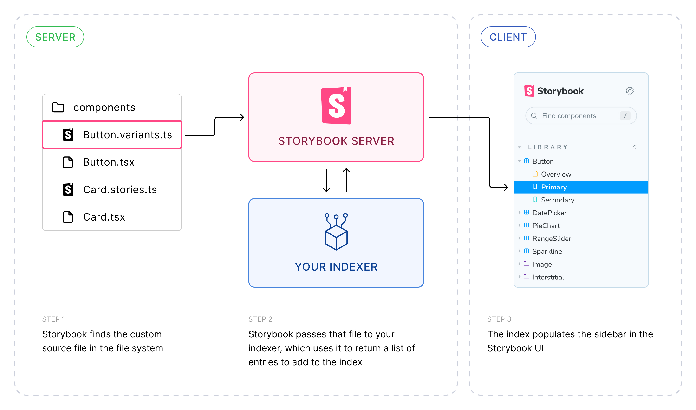

(⚠️ **Experimental**)

<Callout variant="warning" icon="🧪">

While this feature is experimental, it must be specified by the `experimental_indexers` property of [`StorybookConfig`](./main-config.md).

</Callout>

Parent: [main.js|ts configuration](./main-config.md)

Type: `(existingIndexers: Indexer[]) => Promise<Indexer[]>`

Indexers are responsible for building Storybook's index of stories—the list of all stories and a subset of their metadata like `id`, `title`, `tags`, and more. The index can be read at the `/index.json` route of your Storybook.

The indexers API is an advanced feature that allows you to customize Storybook's indexers, which dictate how Storybook indexes and parses files into story entries. This adds more flexibility to how you can write stories, including which language stories are defined in or where to get stories from.

They are defined as a function that returns the full list of indexers, including the existing ones. This allows you to add your own indexer to the list, or to replace an existing one:

<!-- prettier-ignore-start -->

<CodeSnippets
  paths={[
    'common/main-config-indexers.js.mdx',
    'common/main-config-indexers.ts.mdx',
  ]}
/>

<!-- prettier-ignore-end -->

Unless your indexer is doing something relatively trivial (e.g. [indexing stories with a different naming convention](../configure/sidebar-and-urls#story-indexers)), in addition to indexing the file, you will likely need to [transpile it to CSF](#transpiling-to-csf) so that Storybook can read them in the browser.

## `Indexer`

Type:

```ts
{
  test: RegExp;
  createIndex: (fileName: string, options: IndexerOptions) => Promise<IndexInput[]>;
}
```

Specifies which files to index and how to index them as stories.

### `test`

(Required)

Type: `RegExp`

A regular expression run against file names included in the [`stories`](./main-config-stories.md) configuration that should match all files to be handled by this indexer.

### `createIndex`

(Required)

Type: `(fileName: string, options: IndexerOptions) => Promise<IndexInput[]>`

Function that accepts a single CSF file and returns a list of entries to index.

#### `fileName`

Type: `string`

The name of the CSF file used to create entries to index.

#### `IndexerOptions`

Type:

```ts
{
  makeTitle: (userTitle?: string) => string;
}
```

Options for indexing the file.

##### `makeTitle`

Type: `(userTitle?: string) => string`

A function that takes a user-provided title and returns a formatted title for the index entry, which is used in the sidebar. If no user title is provided, one is automatically generated based on the file name and path.

See [`IndexInput.title`](#title) for example usage.

#### `IndexInput`

Type:

```ts
{
  exportName: string;
  importPath: string;
  type: 'story';
  metaId?: string;
  name?: string;
  tags?: string[];
  title?: string;
  __id?: string;
}
```

An object representing a story to be added to the stories index.

##### `exportName`

(Required)

Type: `string`

For each `IndexInput`, the indexer will add this export (from the file found at `importPath`) as an entry in the index.

##### `importPath`

(Required)

Type: `string`

The file to import from, e.g. the [CSF](./csf.md) file.

It is likely that the [`fileName`](#filename) being indexed is not CSF, in which you will need to [transpile it to CSF](#transpiling-to-csf) so that Storybook can read it in the browser.

##### `type`

(Required)

Type: `'story'`

The type of entry.

##### `metaId`

Type: `string`

Default: Auto-generated from [`title`](#title)

Define the custom id for meta of the entry.

If specified, the export default (meta) in the CSF file _must_ have a corresponding `id` property, to be correctly matched.

##### `name`

Type: `string`

Default: Auto-generated from [`exportName`](#exportname)

The name of the entry.

##### `tags`

Type: `string[]`

Tags for filtering entries in Storybook and its tools.

##### `title`

Type: `string`

Default: Auto-generated from default export of [`importPath`](#importpath)

Determines the location of the entry in the sidebar.

Most of the time, you should **not** specify a title, so that your indexer will use the default naming behavior. When specifying a title, you **must** use the [`makeTitle`](#maketitle) function provided in [`IndexerOptions`](#indexeroptions) to also use this behavior. For example, here's an indexer that merely appends a "Custom" prefix to the title derived from the file name:

<!-- prettier-ignore-start -->

<CodeSnippets
  paths={[
    'common/main-config-indexers-title.js.mdx',
    'common/main-config-indexers-title.ts.mdx',
  ]}
/>

<!-- prettier-ignore-end -->

##### `__id`

Type: `string`

Default: Auto-generated from [`title`](#title)/[`metaId`](#metaid) and [`exportName`](#exportname)

Define the custom id for the story of the entry.

If specified, the story in the CSF file **must** have a corresponding `__id` property, to be correctly matched.

Only use this if you need to override the auto-generated id.

## Transpiling to CSF

The value of [`importPath`](#importpath) in an [`IndexInput`](#indexinput) must resolve to a [CSF](./csf.md) file. Most custom indexers, however, are only necessary because the input is _not_ CSF. Therefore, you will likely need to transpile the input to CSF, so that Storybook can read it in the browser and render your stories.

Transpiling the custom source format to CSF is beyond the scope of this documentation. This transpilation is often done at the builder level ([Vite](../builders/vite.md) and/or [Webpack](../builders/webpack.md)), and we recommend using [unplugin](https://github.com/unjs/unplugin) to create plugins for multiple builders.

The general architecture looks something like this:



1. Using the [`stories`](./main-config-stories.md) configuration, Storybook finds all files that match the [`test`](#test) property of your indexer
2. Storybook passes each matching file to your indexer's [`createIndex` function](#createindex), which uses the file contents to generate and return a list of index entries (stories) to add to the index
3. The index populates the sidebar in the Storybook UI


4. In the Storybook UI, the user navigates to a URL matching the story id and the browser requests the CSF file specified by the [`importPath`](#importpath) property of the index entry
5. Back on the server, your builder plugin transpiles the source file to CSF, and serves it to the client
6. The Storybook UI reads the CSF file, imports the story specified by [`exportName`](#exportname), and renders it

Let's look at an example of how this might work.

First, here's an example of a non-CSF source file:

```ts
// Button.variants.js|ts

import { variantsFromComponent, createStoryFromVariant } from '../utils';
import { Button } from './Button';

/**
 * Returns raw strings representing stories via component props, eg.
 * 'export const PrimaryVariant = {
 *    args: {
 *      primary: true
 *    },
 *  };'
 */
export const generateStories = () => {
  const variants = variantsFromComponent(Button);
  return variants.map((variant) => createStoryFromVariant(variant));
};
```

The builder plugin would then:

1. Receive and read the source file
2. Import the exported `generateStories` function
3. Run the function to generate the stories
4. Write the stories to a CSF file

That resulting CSF file would then be indexed by Storybook. It would look something like this:

```js
// virtual:Button.variants.js|ts

import { Button } from './Button';

export default {
  component: Button,
};

export const Primary = {
  args: {
    primary: true,
  },
};
```

### Examples

Some example usages of custom indexers include:

<details open>

<summary>Generating stories dynamically from fixture data or API endpoints</summary>

This indexer generates stories for components based on JSON fixture data. It looks for `*.stories.json` files in the project, adds them to the index and separately converts their content to CSF.

<!-- prettier-ignore-start -->

<CodeSnippets
  paths={[
    'common/main-config-indexers-jsonstories.js.mdx',
    'common/main-config-indexers-jsonstories.ts.mdx',
  ]}
/>

<!-- prettier-ignore-end -->

An example input JSON file could look like this:

```json
{
  "Button": {
    "componentPath": "./button/Button.jsx",
    "stories": {
      "Primary": {
        "args": {
          "primary": true
        },
      "Secondary": {
        "args": {
          "primary": false
        }
      }
    }
  },
  "Dialog": {
    "componentPath": "./dialog/Dialog.jsx",
    "stories": {
      "Closed": {},
      "Open": {
        "args": {
          "isOpen": true
        }
      },
    }
  }
}
```

A builder plugin will then need to transform the JSON file into a regular CSF file. This transformation could be done with a Vite plugin similar to this:

```ts
// vite-plugin-storybook-json-stories.ts

import type { PluginOption } from 'vite';
import fs from 'fs/promises';

function JsonStoriesPlugin(): PluginOption {
  return {
    name: 'vite-plugin-storybook-json-stories',
    load(id) {
      if (!id.startsWith('virtual:jsonstories')) {
        return;
      }

      const [, fileName, componentName] = id.split('--');
      const content = JSON.parse(fs.readFileSync(fileName));

      const { componentPath, stories } = getComponentStoriesFromJson(content, componentName);

      return `
        import ${componentName} from '${componentPath}';

        export default { component: ${componentName} };

        ${stories.map((story) => `export const ${story.name} = ${story.config};\n`)}
      `;
    },
  };
}
```

</details>

<details>

<summary>Generating stories with an alternative API</summary>

You can use a custom indexer and builder plugin to create your own API for defining stories, such as imperatively defining stories similar to the legacy [`storiesOf`](https://github.com/storybookjs/storybook/blob/main/code/lib/preview-api/docs/storiesOf.md) format.

The [dynamic stories proof of concept](https://stackblitz.com/edit/github-h2rgfk?file=README.md) is an elaborate, functional example of doing just that. It contains everything needed to support such a feature, including the indexer, a Vite plugin and a Webpack loader.

</details>

<details>

<summary>Defining stories in non-JavaScript language</summary>

Custom indexers can be used for an advanced purpose: defining stories in any language, including template languages, and converting the files to CSF. To see examples of this in action, you can refer to [`@storybook/addon-svelte-csf`](https://github.com/storybookjs/addon-svelte-csf) for Svelte template syntax and [`storybook-vue-addon`](https://github.com/tobiasdiez/storybook-vue-addon) for Vue template syntax.

</details>
