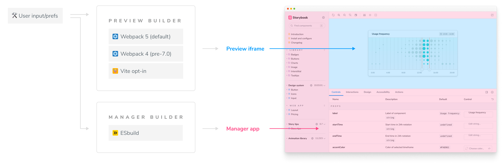

Storybook is architected to support multiple builders, including [Webpack](https://webpack.js.org/), [Vite](https://vitejs.dev/), and [ESBuild](https://esbuild.github.io/). The builder API is the set of interfaces you can use to add a new builder to Storybook.

## How do builders work?

In Storybook, a builder is responsible for compiling your components and stories into JS bundles that run in the browser. A builder also provides a development server for interactive development and a production mode for optimized bundles.

To opt into a builder, the user must add it as a dependency and then edit their configuration file (`.storybook/main.js`) to enable it. For example, with the Vite builder:

<!-- prettier-ignore-start -->

<CodeSnippets
  paths={[
    'common/storybook-vite-builder-install.yarn.js.mdx',
    'common/storybook-vite-builder-install.npm.js.mdx',
  ]}
/>

<!-- prettier-ignore-end -->

<!-- prettier-ignore-start -->

<CodeSnippets
  paths={[
    'common/storybook-vite-builder-register.js.mdx',
  ]}
/>

<!-- prettier-ignore-end -->

## Builder API

In Storybook, every builder must implement the following [API](https://github.com/storybookjs/storybook/blob/next/code/lib/core-common/src/types.ts#L170-L189), exposing the following configuration options and entry points:

<!-- prettier-ignore-start -->

<CodeSnippets
  paths={[
    'common/storybook-builder-api-interface.ts.mdx',
  ]}
/>

<!-- prettier-ignore-end -->

In development mode, the `start` API call is responsible for initializing the development server to monitor the file system for changes (for example, components and stories) then execute a hot module reload in the browser.
It also provides a **bail** function to allow the running process to end gracefully, either via user input or error.

In production, the `build` API call is responsible for generating a static Storybook build, storing it by default in the `storybook-static` directory if no additional configuration is provided. The generated output should contain everything the user needs to view its Storybook by opening either the `index.html` or `iframe.html` in a browser with no other processes running.

## Implementation

Under the hood, a builder is responsible for serving/building the preview `iframe`, which has its own set of requirements. To fully support Storybook, including the [Essential addons](../writing-stories/introduction.md) that ship with Storybook, it must consider the following.

### Import stories

The `stories` configuration field enables story loading in Storybook. It defines an array of file globs containing the physical location of the component's stories. The builder must be able to load those files and monitor them for changes and update the UI accordingly.

### Provide configuration options

By default, Storybook's configuration is handled in a dedicated file (`storybook/main.js|ts`), giving the user the option to customize it to suit its needs. The builder should also provide its own configuration support through additional fields or some other builder-appropriate mechanism. For example:

<!-- prettier-ignore-start -->

<CodeSnippets
  paths={[
    'common/storybook-builder-api-configuration-options.ts.mdx',
  ]}
/>

<!-- prettier-ignore-end -->

### Handle preview.js exports

The [`preview.js`](../configure/overview.md#configure-story-rendering) configuration file allows users to control how the story renders in the UI. This is provided via the [decorators](../writing-stories/decorators.md) named export. When Storybook starts, it converts these named exports into internal API calls via virtual module entry, for example, `addDecorator()`. The builder must also provide a similar implementation. For example:

<!-- prettier-ignore-start -->

<CodeSnippets
  paths={[
    'common/storybook-builder-api-preview-exports.ts.mdx',
  ]}
/>

<!-- prettier-ignore-end -->

### MDX support

[Storybook's Docs](../writing-docs/introduction.md) includes the ability to author stories/documentation in MDX using a Webpack loader. The builder must also know how to interpret MDX and invoke Storybook's special extensions. For example:

<!-- prettier-ignore-start -->

<CodeSnippets
  paths={[
    'common/storybook-builder-api-mdx.ts.mdx',
  ]}
/>

<!-- prettier-ignore-end -->

### Generate source code snippets

Storybook annotates components and stories with additional metadata related to their inputs to automatically generate interactive controls and documentation. Currently, this is provided via Webpack loaders/plugins. The builder must re-implement this to support those features.

### Generate a static build

One of Storybook's core features it's the ability to generate a static build that can be [published](../sharing/publish-storybook.md) to a web hosting service. The builder must also be able to provide a similar mechanism. For example:

<!-- prettier-ignore-start -->

<CodeSnippets
  paths={[
    'common/storybook-builder-api-build-server.ts.mdx',
  ]}
/>

<!-- prettier-ignore-end -->

### Development server integration

By default, when Storybook starts in development mode, it relies on its internal development server. The builder needs to be able to integrate with it. For example:

<!-- prettier-ignore-start -->

<CodeSnippets
  paths={[
    'common/storybook-builder-api-dev-server.ts.mdx',
  ]}
/>

<!-- prettier-ignore-end -->

### Shutdown the development server

The builder must provide a way to stop the development server once the process terminates; this can be via user input or error. For example:

<!-- prettier-ignore-start -->

<CodeSnippets
  paths={[
    'common/storybook-builder-api-shutdown-server.ts.mdx',
  ]}
/>

<!-- prettier-ignore-end -->

### HMR support

While running in development mode, the builder's development server must be able to reload the page once a change happens, either in a story, component, or helper function.

### More information

This area is under rapid development, so the documented is still in progress and subject to change. If you are interested in writing your builder, we encourage you to check [webpack](https://github.com/storybookjs/storybook/tree/next/code/lib/builder-webpack5), [Vite](https://github.com/storybookjs/builder-vite), and Modern Web's [dev-server-storybook](https://github.com/modernweb-dev/web/blob/master/packages/dev-server-storybook/src/serve/storybookPlugin.ts) source code. In addition, we have a wonderful contributor community on [Storybook Discord](https://discord.gg/storybook) if you have questions. Ping us in the [#contributing](https://discord.com/channels/486522875931656193/839297503446695956) channel.

#### Learn more about builders

- [Vite builder](./vite.md) for bundling with Vite
- [Webpack builder](./webpack.md) for bundling with Webpack
- Builder API for building a Storybook builder
