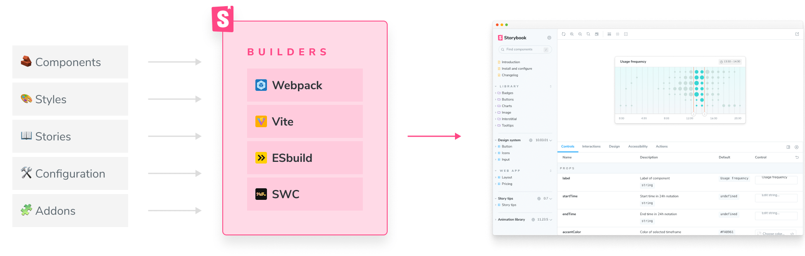

Storybook, at its core, is powered by builders such as Webpack and Vite. These builders spin up a development environment, compile your code—Javascript, CSS, and MDX—into an executable bundle and update the browser in real-time.



## CLI basics

Before diving into setting up Storybook's builders, let's look at how the CLI configures them. When you initialize Storybook (via `npx storybook@latest init`), the CLI automatically detects which builder to use based on your application. For example, if you're working with Vite, it will install the Vite builder. If you're working with Webpack, it installs the Webpack 5 builder by default.

Additionally, you can also provide a flag to Storybook's CLI and specify the builder you want to use:

```shell
npx storybook@latest init --builder <webpack5 | vite>
```

## Manual setup

Storybook uses the Webpack 5 builder by default if you don't specify one. If you want to use a different builder in your application, these docs detail how you can set up Storybook's supported builders.

- [**Vite builder**](./vite.md) for bundling your stories with Vite with near-instant HMR.
- [**Webpack**](./webpack.md) for bundling your stories with Webpack with improved performance
