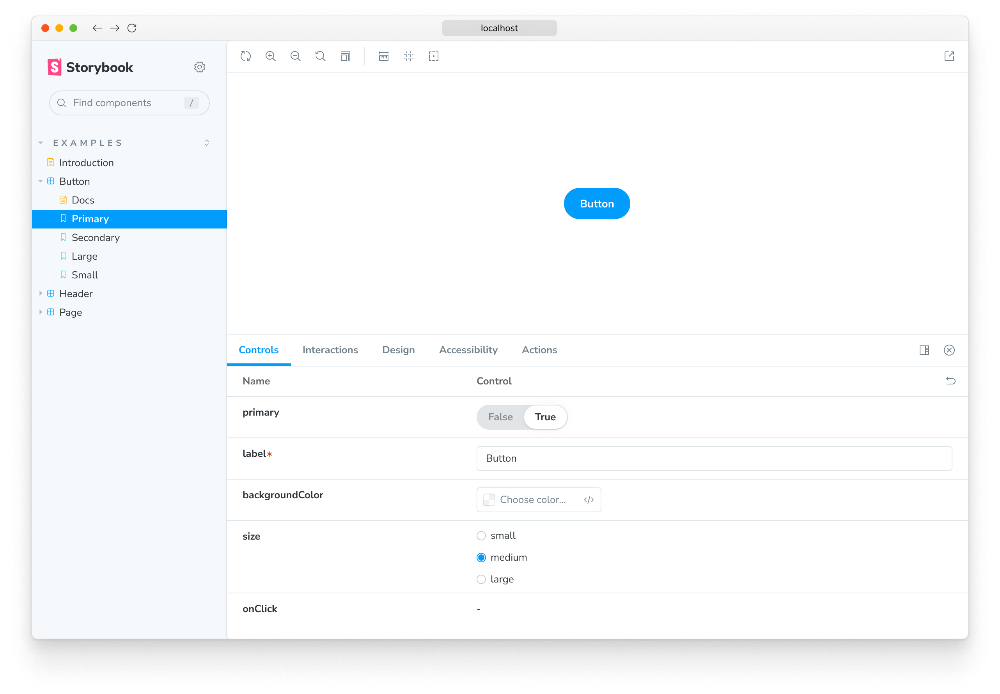

The `layout` [parameter](../writing-stories/parameters.md) allows you to configure how stories are positioned in Storybook's Canvas tab.

## Global layout

You can add the parameter to your [`./storybook/preview.js`](./overview.md#configure-story-rendering), like so:

<!-- prettier-ignore-start -->

<CodeSnippets
  paths={[
    'common/storybook-preview-layout-param.js.mdx',
    'common/storybook-preview-layout-param.ts.mdx',
  ]}
/>

<!-- prettier-ignore-end -->

In the example above, Storybook will center all stories in the UI. `layout` accepts these options:

- `centered`: center the component horizontally and vertically in the Canvas
- `fullscreen`: allow the component to expand to the full width and height of the Canvas
- `padded`: _(default)_ Add extra padding around the component

## Component layout

You can also set it at a component level like so:

<!-- prettier-ignore-start -->

<CodeSnippets
  paths={[
    'angular/storybook-component-layout-param.ts.mdx',
    'web-components/storybook-component-layout-param.js.mdx',
    'web-components/storybook-component-layout-param.ts.mdx',
    'common/storybook-component-layout-param.js.mdx',
    'common/storybook-component-layout-param.ts.mdx',
  ]}
/>

<!-- prettier-ignore-end -->

## Story layout

Or even apply it to specific stories like so:

<!-- prettier-ignore-start -->

<CodeSnippets
  paths={[
    'angular/storybook-story-layout-param.ts.mdx',
    'web-components/storybook-story-layout-param.js.mdx',
    'web-components/storybook-story-layout-param.ts.mdx',
    'common/storybook-story-layout-param.js.mdx',
    'common/storybook-story-layout-param.ts.mdx',
  ]}
  usesCsf3
  csf2Path="configure/story-layout#snippet-storybook-story-layout-param"
/>

<!-- prettier-ignore-end -->
