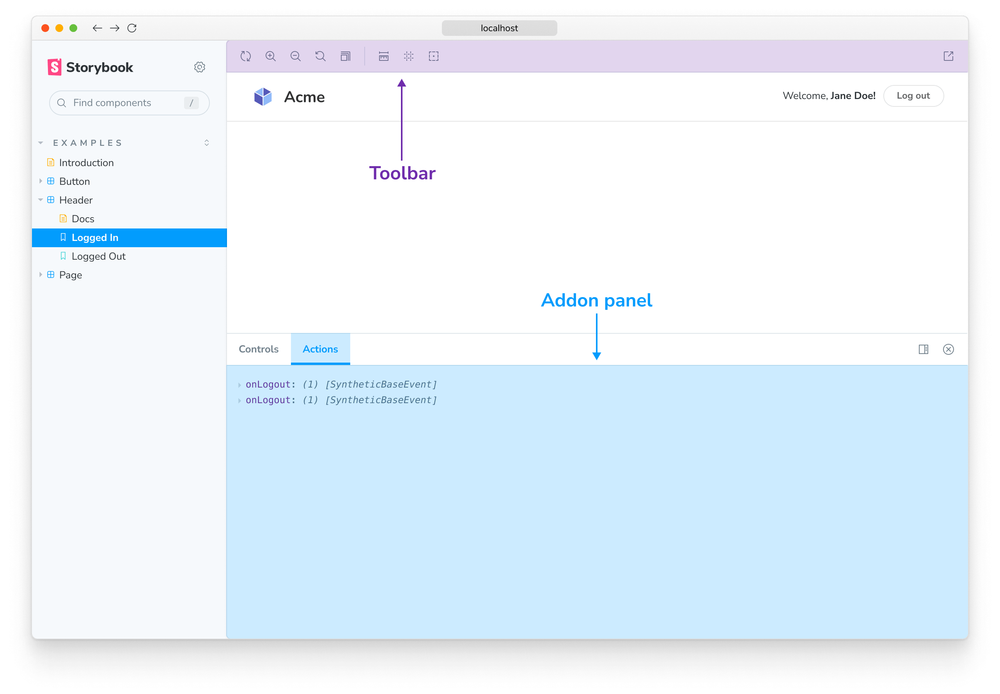

A key strength of Storybook is its extensibility. Use addons to extend and customize Storybook to fit your team’s development workflow.

Addons are integral to the way Storybook works. Many of Storybook's core features are implemented as addons! These addons are installed out of the box with [essentials](../essentials/introduction.md).

## Addon features

The most obvious thing addons affect in Storybook is the UI of Storybook itself. Within the UI the **toolbar** and **addons panel** are the two chief places addons will appear.

Addons can also hook into the rendering of your story in the preview pane via injecting their own [decorators](../writing-stories/decorators.md).

Finally, addons can affect the build setup of Storybook by injecting their own webpack configuration to allow the use of other tools in Storybook. Addons that do only this are often referred to as [presets](../addons/addon-types.md).

## Essential, core and community addons

There are many, many Storybook addons, but they can be roughly categorized into three areas:

- **Essential** addons are core-team developed addons that are considered a part of the out-of-the-box user experience. These ship by default with new Storybook installations.
- **Core** addons are developed by the core team. They are kept in sync with the development of Storybook itself and written in idiomatic ways as templates for other addons. They can be found within the [Storybook monorepo](https://github.com/storybookjs/storybook/tree/next/code/addons).
- **Community** addons are addons written by the massive Storybook community. They can be found on our [website](https://storybook.js.org/addons/), [GitHub](https://github.com/), and [npm](https://www.npmjs.com/).
