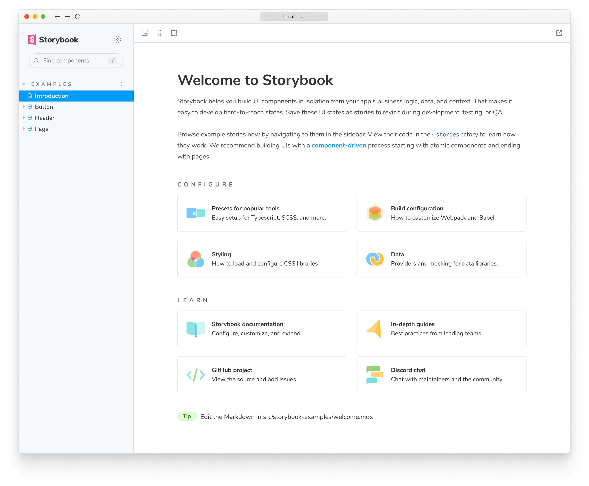
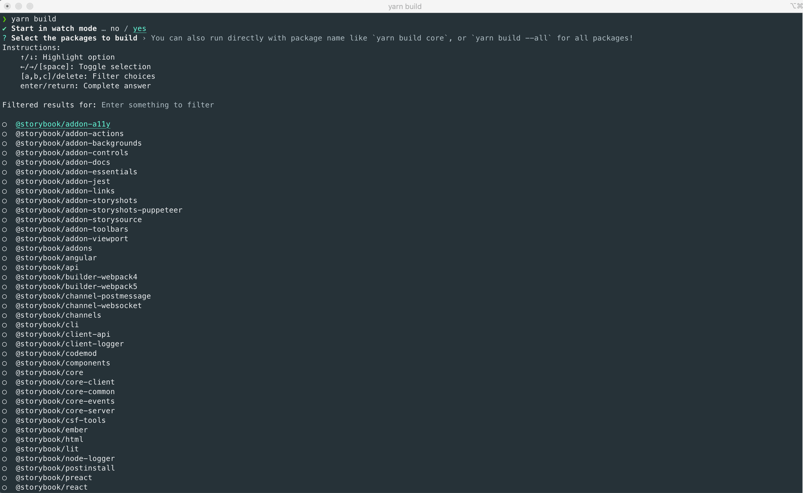
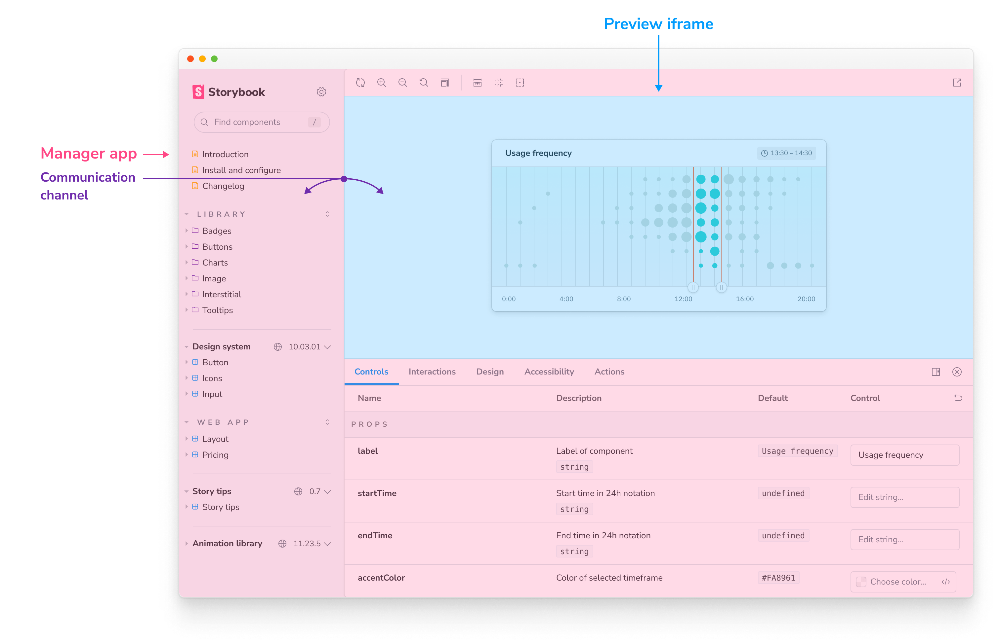

Contribute a new feature or bug fix to [Storybook's monorepo](https://github.com/storybookjs/storybook). This page outlines how to get your environment set up to contribute code.

## Prerequisites

- Ensure you have Node version 18 installed (suggestion: v18.16.0).
- Ensure if you are using Windows to use the Windows Subsystem for Linux (WSL).

## Initial setup

Start by [forking](https://docs.github.com/en/github/getting-started-with-github/quickstart/fork-a-repo) the Storybook monorepo and cloning it locally.

```shell
git clone https://github.com/your-username/storybook.git
cd storybook
```

Storybook uses the [Yarn](https://yarnpkg.com/) package manager. Use [Corepack](https://github.com/nodejs/corepack) to set up the correct version for use with Storybook.

```shell
corepack enable
```

## Run your first sandbox

Storybook development happens in a set of _sandboxes_ which are templated Storybook environments corresponding to different user setups. Within each sandbox, we inject a set of generalized stories that allow us to test core features and addons in all such environments.

To run a sandbox locally, you can use the `start` command:

```shell
yarn start
```

It will install the required prerequisites, build the code, create and link a starter example based on a Vite React setup and finally start the Storybook server.

If all goes well, you should see the sandbox running.



## Running a different sandbox template

By default, the `start` command is configured to initialize a Vite-based React template. If you're planning on working on a different renderer instead, you can do so as well. Start by running the `task` command as follows:

```shell
yarn task
```

When prompted, answer the questions as accurately as possible to allow Storybook to determine your goals. After answering these questions, you should see the entire command with the options you've selected should you require to re-run it.

<Callout variant="info" icon="💡">

The `yarn task` command takes a few development shortcuts that can catch you off guard when switching branches and may require you to re-run both the `install` and `compile` tasks. You can speed up the process by running the command with the `start-from=install` flag.

</Callout>

## Running tests

After successfully running your [first sandbox](#run-your-first-sandbox), you should have a fully functional Storybook version built on your local machine. Before jumping onto any code changes, verifying everything is working is essential—specifically, the test suite.

Run the following command to execute the tests:

```shell
yarn test
```

## Start developing

Now that you've [verified your setup](#running-tests), it's time to jump into code. The simplest way is to run one of the sandboxes in one terminal window and the interactive build process in a separate terminal.

Assuming you're still running the Vite-based React sandbox initialized after running the `yarn start` command, open a new terminal window and navigate to the `code` directory of the Storybook monorepo. Then, create a new branch for your contribution by running the following command:

```shell
git checkout -b my-first-storybook-contribution
```

Lastly, run the build process with the following:

```shell
yarn build
```

When prompted to start the build process in `watch` mode, answer **yes** to develop in interactive mode. Afterward, choose which packages you want to build. For example, if you're going to work on a feature for `@storybook/addon-docs`, you might want to select both `@storybook/addon-docs` and `@storybook/components`.

<Callout variant="info" icon="💡">

Build's `watch` mode is great for interactive development. However, for performance reasons, it only transpiles your code and doesn't execute the TypeScript compiler. If something isn't working as expected, try running the `build` command **WITHOUT** enabling watch mode: it will re-generate TypeScript types and perform automatic type checking for you.

</Callout>



If the work you'll be doing affects the `Preview` (the innermost Storybook `iframe`, where the stories are displayed), it will automatically refresh one to two seconds after you save.

Otherwise, if it affects the `Manager` (the outermost Storybook `iframe` where the addons are displayed), you'll need to refresh manually after saving.



## Check your work

When you're done coding, add documentation and tests as appropriate. That simplifies the PR review process, which means your code will get merged faster.

### Add stories

Adding a story or set of generic stories to our suite helps you test your work.

Assuming you're working on one of the [Essential addons](../essentials/index.md), there's a chance that a complete set of stories already exists. Check the addon's `template/stories` directory that documents how it's supposed to work and add your stories there.

If you're modifying something related to a specific renderer (e.g., React, Vue, etc.), it will also have a similar `template/stories` directory in which you'll need to add your stories.

### Add tests

Unit tests ensure that Storybook doesn't break accidentally. If your code can regress in non-obvious ways, include unit tests with your pull request. Use the following naming convention:

```
+-- parentFolder
|   +-- [filename].ts
|   +-- [filename].test.ts
```

### End-to-end tests (e2e)

Storybook's monorepo is set up to rely on end-to-end testing with [Playwright](https://playwright.dev) during CI. To help with testing, we encourage running this test suite before submitting your contribution.

To run an e2e test against a sandbox, you can use the `e2e-tests` task:

```shell
yarn task --task e2e-tests --template=react-vite/default-ts --start-from=auto
```

If there are issues and you'd like to debug them, you can pass a `DEBUG=1` environment variable, and Playwright will run in watch mode.

```shell
DEBUG=1 yarn task --task e2e-tests --template=react-vite/default-ts --start-from=auto
```

## Submit a pull request

Before submitting your contribution, run the test suite one last time with the following:

```shell
yarn test
```

<Callout variant="info" icon="💡">

Storybook relies on [Jest](https://jestjs.io/) as part of it's testing suite. During the test run, if you spot that snapshot tests are failing, re-run the command with the `-u` flag to update them.

</Callout>

Doing this prevents last-minute bugs and is a great way to merge your contribution faster once you submit your pull request. Failing to do so will lead to one of the maintainers mark the pull request with the **Work in Progress** label until all tests pass.

### Target `next` branch

Once the test suite finishes, it's time to commit, push and open a pull request against Storybook's `next` (default) branch. This branch is where all active development happens and is associated with the latest prerelease version (e.g., `7.0.0-alpha.47`).

If your contribution focuses on a bugfix and you want it featured in the next stable release, mention it in the pull request description. We'll try to patch it if it appears non-disruptive and fixes a critical bug.

#### Useful resources when working with forks

- [Sync a fork](https://docs.github.com/en/github/collaborating-with-issues-and-pull-requests/working-with-forks/syncing-a-fork)
- [Merge an upstream repository into your fork](https://docs.github.com/en/github/collaborating-with-issues-and-pull-requests/working-with-forks/merging-an-upstream-repository-into-your-fork)

### Reproducing job failures

After creating your PR, if one of the CI jobs failed, when checking the logs of that job, you will see that it printed a message explaining how to reproduce the task locally. Typically that involves running the task against the right template:

```shell
yarn task --task e2e-tests --template=react-vite/default-ts --start-from=install
```

Typically it is a good idea to start from the `install` task to ensure your local code is completely up to date. If you reproduce the failure, you can try and make fixes, [compile them](#start-developing) with `build`, then rerun the task with `--start-from=auto`.

<Callout variant="info" icon="💡">

The default instructions run the code in "linked" mode, meaning built changes to Storybook library code will be reflected in the sandbox immediately (the next time you run the task). However, CI runs in "unlinked" mode, which in rare cases, will behave differently.

If you are having trouble reproducing, try rerunning the command with the `--no-link` flag. If you need to do that, you'll need to run it with `--start-from=compile` after each code change.

</Callout>

## How to work with reproductions

We encourage bug reports to include reproductions. In the same way that it's possible to [develop interactively](#start-developing) against example projects in the monorepo, it's also possible to develop against a reproduction repository.

To do so, run the following command in the root of the monorepo:

```shell
npx storybook@next link https://github.com/your-username/your-project.git
```

This command creates a project `../storybook-repros/your-project`, and automatically links it to your local Storybook code. After connecting it, you should be able to run Storybook and develop as mentioned [above](#start-developing).

If you already have a reproduction on your local machine, you can similarly link it to your monorepo dev setup with the `--local` flag:

```shell
npx storybook@next link --local /path/to/local-repro-directory
```

<Callout variant="info" icon="💡">

The `storybook link` command relies on [Yarn linking](https://yarnpkg.com/cli/link/) under the hood. It requires your local reproduction to be using [Yarn 2 or higher](https://yarnpkg.com/) as well, which is the case if you've already enabled it with the [`storybook sandbox`](./how-to-reproduce.md) command per our contribution guidelines. The process will fail if you're trying to link a non-Yarn 2 project.

</Callout>

## Developing a template

The first step is to add an entry to `code/lib/cli/src/sandbox-templates.ts`, which is the master list of all repro templates:

```ts
'cra/default-js': {
    name: 'Create React App (Javascript)',
    script: 'npx create-react-app .',
    inDevelopment: true,
    expected: {
      framework: '@storybook/cra',
      renderer: '@storybook/react',
      builder: '@storybook/builder-webpack5',
    },
  },
```

Add the `inDevelopment` flag until the PR is merged (you can fast-follow it with a second PR to remove the flag), as it'll make the development process much easier.

The **`key`** `cra/default-js` consists of two parts:

- The prefix is the tool that was used to generate the repro app
- The suffix is options that modify the default install, e.g. a specific version or options

The **`script`** field is what generates the application environment. The `.` argument is “the current working directory” which is auto-generated based on the key (e.g. `repros/cra/default-js/before-storybook`). The `{{beforeDir}}` key can also be used, which will be replaced by the path of that directory.

The rest of the fields are self-explanatory:

The **`skipTasks`** field exists because some sandboxes might not work properly in specific tasks temporarily, but we might still want to run the other tasks. For instance, a bug was introduced outside of our control, which fails only in the `test-runner` task.

The **`name`** field should contain a human readable name/description of the template.

The **`expected`** field reflects what framework/renderer/builder we expect `sb init` to generate. This is useful for assertions while generating sandboxes. If the template is generated with a different expected framework, for instance, it will fail, serving as a way to detect regressions.

### Running a sandbox

If your template has a `inDevelopment` flag, it will be generated (locally) as part of the sandbox process. You can create the sandbox with the following command, where `<template-key>` is replaced by the id of the selected template e.g. `cra/default-js`:

```bash
yarn task --task dev --template <template-key> --start-from=install
```

Templates with `inDevelopment` will automatically run with `--no-link` flag as it is required for the local template generation to work.

Once the PR is merged, the template will be generated on a nightly cadence and you can remove the `inDevelopment` flag and the sandbox will pull the code from our templates repository.

## Troubleshooting

<details>

<summary><code>yarn build --all --watch</code> watches everything but is resource-intensive</summary>

It's troublesome to know which packages you'll change ahead of time, and watching them can be highly demanding, even on modern machines. If you're working on a powerful enough machine, you can use `yarn build --all --watch` instead of `yarn build`.

</details>

## Learn more about contributing to Storybook

- [RFC process](./RFC.md) for authoring feature requests
- Code for features and bug fixes
- [Frameworks](./framework.md) to get started with a new framework
- [Documentation](./documentation-updates.md) for documentation improvements, typos, and clarifications
- [Examples](./new-snippets.md) for new snippets and examples
