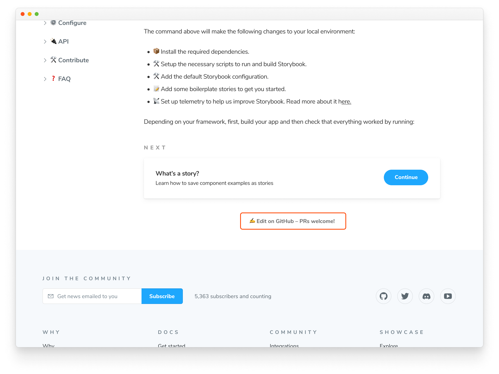
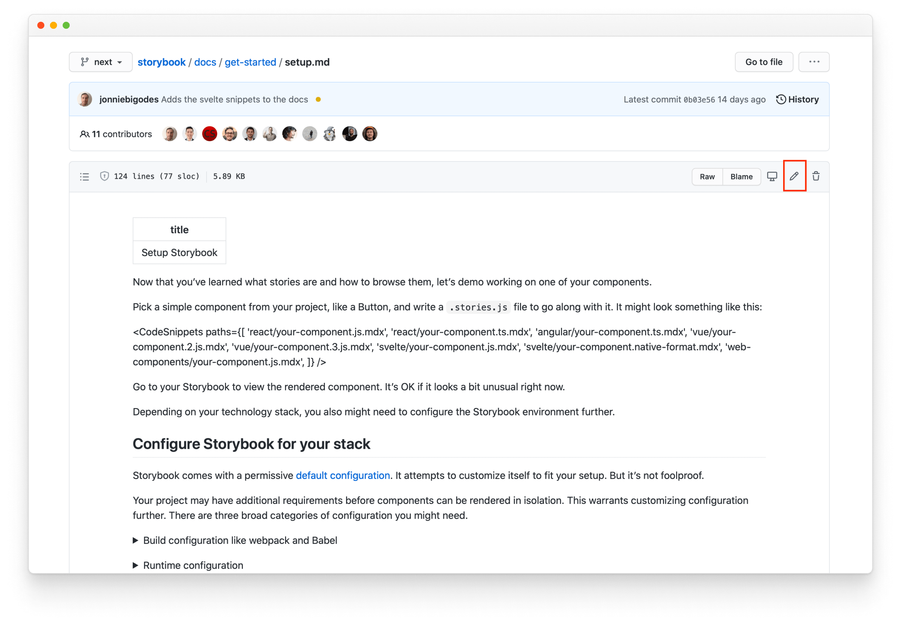
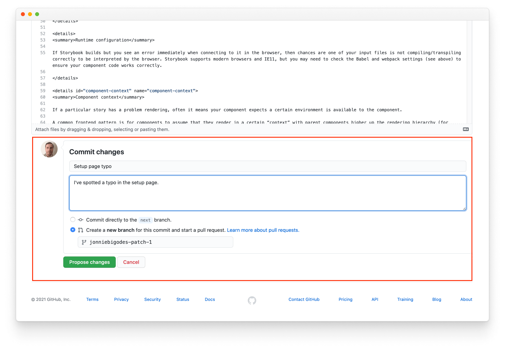

Fix a typo or clarify a section of the docs. This page outlines how to edit the documentation.

## Find the Markdown file

Scroll to the bottom of the document in question, then click ✍️ Edit on GitHub – PRs welcome! This will open the Markdown file on GitHub.

Use GitHub's web editor by clicking the pencil icon on the right-hand corner. Tweak the document to your liking.

Scroll down to the bottom of the document page on GitHub and describe what you changed and why. Select the `Create a new branch for this commit and start a pull request` option then click the `Propose changes` button.

## Create the pull request

In the Storybook repository, create a pull request that describes changes and includes additional context that would help maintainers review. Once you submit the PR, a maintainer will guide you through the triage and merge process.

## Learn more about contributing to Storybook

- [RFC process](./RFC.md) for authoring feature requests
- [Code](./code.md) for features and bug fixes
- [Frameworks](./framework.md) to get started with a new framework
- Documentation for documentation improvements, typos, and clarifications
- [Examples](./new-snippets.md) for new snippets and examples
