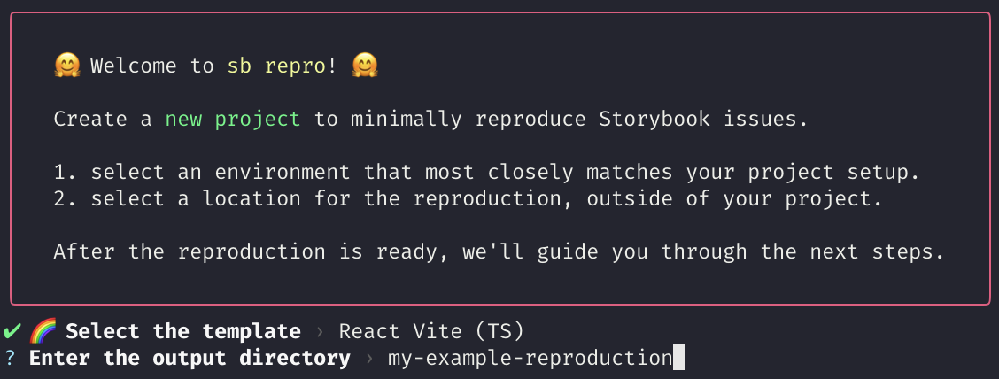
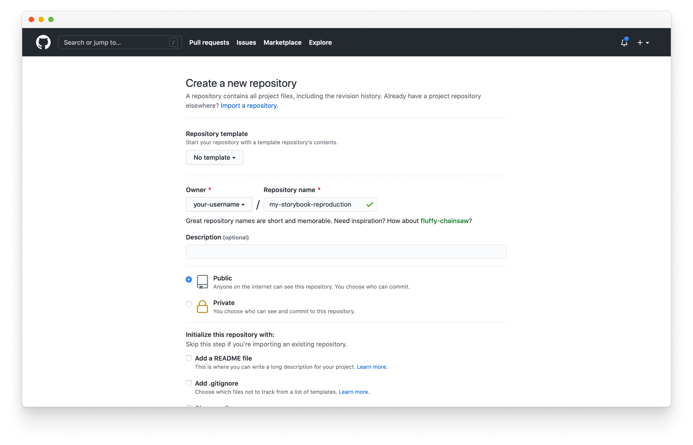
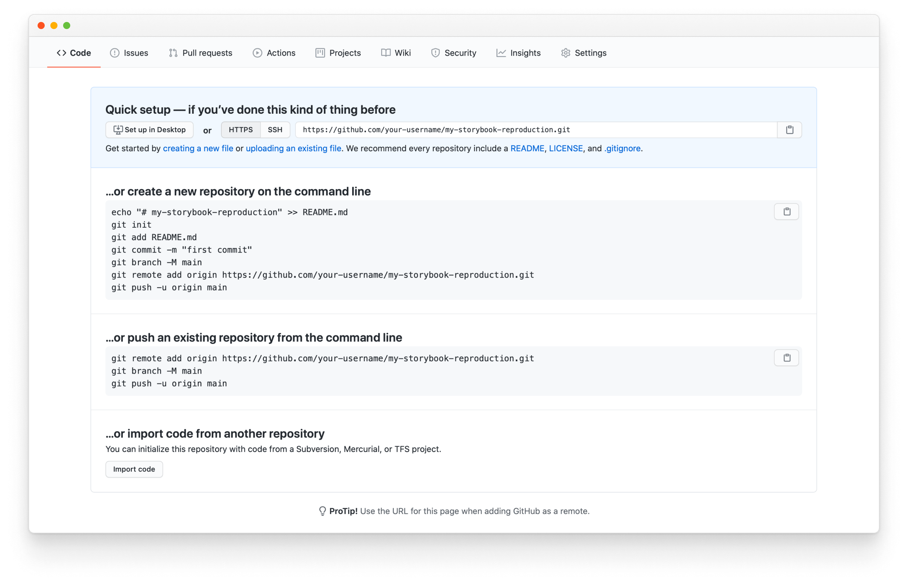

A reproducible test case lets you isolate the cause of a problem, which is the first step towards fixing it! This page outlines how to get set up to create a reproduction.

## Why should you create a reproduction?

A reproducible test case is a great way to share a specific set of conditions that causes a bug. It allows both the maintainers and the community to verify, narrow down the cause of the problem and help you fix the issue.

## Pre-requisites

Make sure you have:

- Installed [`Yarn`](https://yarnpkg.com/) on your local development machine.
- A [GitHub account](https://github.com/signup) for hosting the reproduction's code.
- A [Chromatic account](https://www.chromatic.com/start/?utm_source=storybook_website&utm_medium=link&utm_campaign=storybook) for publishing your Storybook.

## Initial setup

First, open a terminal and run the following command:

```shell
npx storybook@next sandbox
```

<div class="aside">
💡 You can append a template name in the command to get filtered results e.g. <code>npx storybook@next sandbox react</code>
</div>

Next, choose the template you want to work with:


Finally, enter a location for your reproduction:



<div class="aside">
💡 If you don't provide a full path for the reproduction it will be generated in the current directory.
</div>

If everything worked as it should, you should have a fully functional Storybook set up in your local environment.

## Third-party dependencies & addons

Before adding code, install and configure any necessary packages. For example, if you run into a problem with a CSS framework (e.g., [Tailwind](https://tailwindcss.com/)), you should install and configure it.

Install and configure any Storybook [addons](https://storybook.js.org/addons/) that relate to the issue (e.g.,`@storybook/addon-a11y`).

## Add stories

Any Storybook reproduction wouldn't be complete without [stories](../writing-stories/introduction.md). To help fix your issue faster, we encourage you to include the minimum amount of stories that will replicate your issue.

## Host

When you've finished your work, you'll need to host your reproduction. Start by signing into GitHub.com and create a [new repository](https://github.com/new).



Then, follow GitHub's instructions to set up the repository.



<div class="aside">
 💡 Don't forget to replace <code>your-username</code> with your own account name.
</div>

## Publish

An excellent way to check your reproduction is to have it deployed online. We recommend [Chromatic](https://www.chromatic.com/?utm_source=storybook_website&utm_medium=link&utm_campaign=storybook), a free publishing service created by the Storybook maintainers. It allows you to deploy and host your reproduction safely and securely in the cloud.

### Helpful resources when working with Chromatic

- [Publish Storybook](../sharing/publish-storybook.md)
- [Setup Chromatic](https://www.chromatic.com/docs/setup?utm_source=storybook_website&utm_medium=link&utm_campaign=storybook)
- [Automate Chromatic with continuous integration](https://www.chromatic.com/docs/ci?utm_source=storybook_website&utm_medium=link&utm_campaign=storybook)

## Submit the issue

Finally, create your issue in the [Storybook issue tracker](https://github.com/storybookjs/storybook/issues/new/choose), go through the required steps, and provide a detailed description of the problem. Add the GitHub repository and [deployed reproduction](https://www.chromatic.com/docs/setup?utm_source=storybook_website&utm_medium=link&utm_campaign=storybook#view-published-storybook) to help with the triage process.
