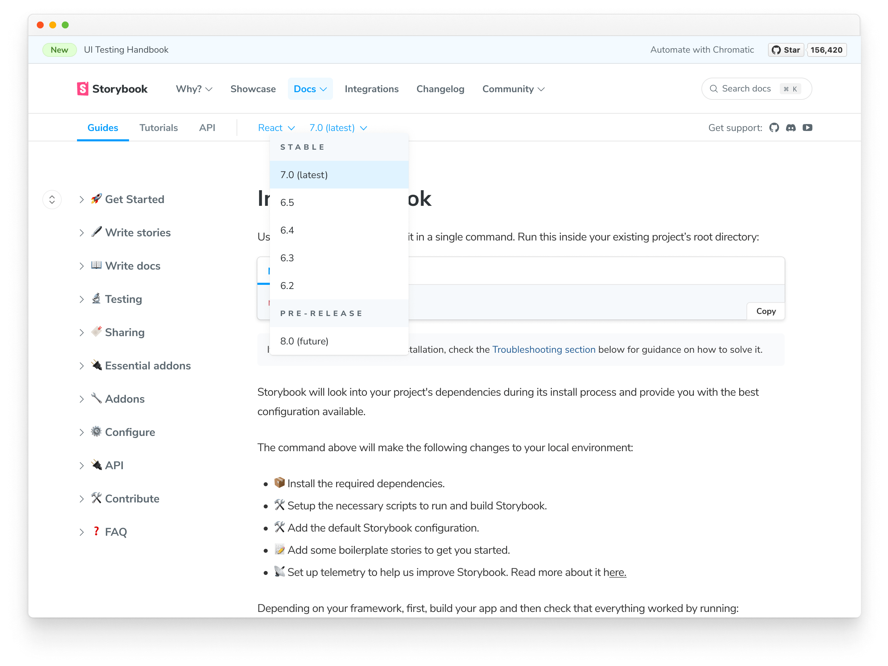

Add or update the code snippets in the documentation. This page outlines how the code snippets are structured.

## Documented frameworks

Storybook maintains code snippets for a [variety of frameworks](../configure/frameworks-feature-support.md). We try to keep them up to date as framework APIs evolve. But it's tricky to keep track of every API change in every framework.

We welcome community contributions to the code snippets. Here's a matrix of the frameworks we have snippets for. Help us add snippets for your favorite framework.

| React                                                                        | Vue                                                                        | Angular                                                                        | Web Components                                                                        | Svelte                                                                        | Solid                                                                        | Ember | HTML | Preact |
| ---------------------------------------------------------------------------- | -------------------------------------------------------------------------- | ------------------------------------------------------------------------------ | ------------------------------------------------------------------------------------- | ----------------------------------------------------------------------------- | ---------------------------------------------------------------------------- | ----- | ---- | ------ |
| [✅](https://github.com/storybookjs/storybook/tree/next/docs/snippets/react) | [✅](https://github.com/storybookjs/storybook/tree/next/docs/snippets/vue) | [✅](https://github.com/storybookjs/storybook/tree/next/docs/snippets/angular) | [✅](https://github.com/storybookjs/storybook/tree/next/docs/snippets/web-components) | [✅](https://github.com/storybookjs/storybook/tree/next/docs/snippets/svelte) | [✅](https://github.com/storybookjs/storybook/tree/next/docs/snippets/solid) | ❌    | ❌   | ❌     |

## Setup

Assuming you've already followed the [local environment guide](./code.md#initial-setup), the first thing you need to do is create a branch on your local Storybook monorepo by running the following command:

```shell
git checkout -b code-snippets-for-framework
```

Before adding your snippets, open the `docs` folder with your editor of choice. Get familiarized with the documentation, including how the snippets are organized and their contents.

Then inside the root folder of the Storybook monorepo, run the following command:

```shell
yarn task
```

Select the option `Synchronize documentation (sync-docs)` and type the path of your `frontpage` project folder. Now every file change inside the monorepo `docs` folder will be reflected in the frontpage repo at `src/content/docs`.

### Add your first snippet

Now that you're familiar with how the documentation is structured, it's time to add the code snippets. First, go to the `docs/snippets/` folder and create a new directory for your framework of choice (e.g., `ember`).

Browse the documentation and look for the code snippets you're willing to contribute. For example, on the [setup page](https://github.com/storybookjs/storybook/blob/next/docs/get-started/setup.md), you should see something similar to:

```jsx
// /docs/get-started/setup.md

<!-- prettier-ignore-start -->

<CodeSnippets
  paths={[
    'react/your-component.js.mdx',
    'react/your-component.ts.mdx',
    'angular/your-component.ts.mdx',
    'vue/your-component.2.js.mdx',
    'vue/your-component.3.js.mdx',
    'svelte/your-component.js.mdx',
    'web-components/your-component.js.mdx',
    'solid/your-component.js.mdx',
    'solid/your-component.ts.mdx',
  ]}
/>

<!-- prettier-ignore-end -->
```

Create the file `ember/your-component.js.mdx`, similar to the other frameworks, and reference it.

```jsx
// /docs/get-started/setup.md

<!-- prettier-ignore-start -->

<CodeSnippets
  paths={[
    'react/your-component.js.mdx',
    'react/your-component.ts.mdx',
    'angular/your-component.ts.mdx',
    'vue/your-component.2.js.mdx',
    'vue/your-component.3.js.mdx',
    'svelte/your-component.js.mdx',
    'web-components/your-component.js.mdx',
    'solid/your-component.js.mdx',
    'solid/your-component.ts.mdx',
    'ember/your-component.js.mdx', //👈🏼 The code snippet you created.
  ]}
/>

<!-- prettier-ignore-end -->
```

<Callout variant="info" icon="💡">

Code snippets are divided into various file extensions, if you're contributing a TypeScript file use `.ts.mdx`, or if you're adding JavaScript files use `.js.mdx`.

</Callout>

Go through the rest of the documentation and repeat the process.

### Preview your work

Before submitting your contribution, we advise you to check your work against the Storybook website. Doing this prevents last-minute issues with the documentation and is also an excellent way for the maintainers to merge faster once you submit the pull request. However, failing to do so will lead one of the maintainers to notify you that your contribution has an issue.

Start by forking [frontpage repo](https://github.com/storybookjs/frontpage) and cloning it locally.

```shell
git clone https://github.com/your-username/frontpage.git
```

Navigate to the `frontpage` directory and install the required dependencies with the following command:

```shell
yarn
```

Next, make sure that you have running the `Synchronize documentation (sync-docs)` task from Storybook monorepo. Then, execute the following command to launch the Storybook website.

```shell
yarn start:docs-only
```

<Callout variant="info" icon="💡">

During the start process if there's an issue with the documentation, the process will stop and you'll get a notification.

</Callout>

Open a browser window to `http://localhost:8000`, click the Docs link, and select your framework from the dropdown.



Go through the documentation and check your work.

## Submit your contribution

Finally, commit, push and open a pull request in the Storybook monorepo. Add a clear description of the work you've done, and one of the maintainers will guide you through the merge process.

## Learn more about contributing to Storybook

- [RFC process](./RFC.md) for authoring feature requests
- [Code](./code.md) for features and bug fixes
- [Frameworks](./framework.md) to get started with a new framework
- [Documentation](./documentation-updates.md) for documentation improvements, typos, and clarifications
- [Examples](./new-snippets.md) for new snippets and examples
