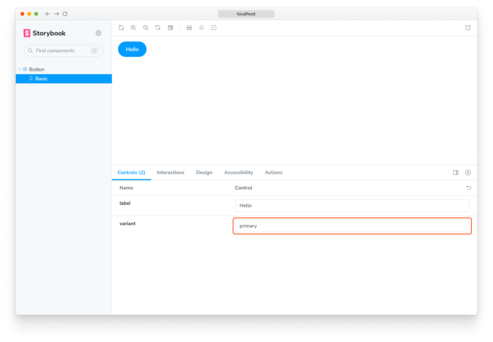
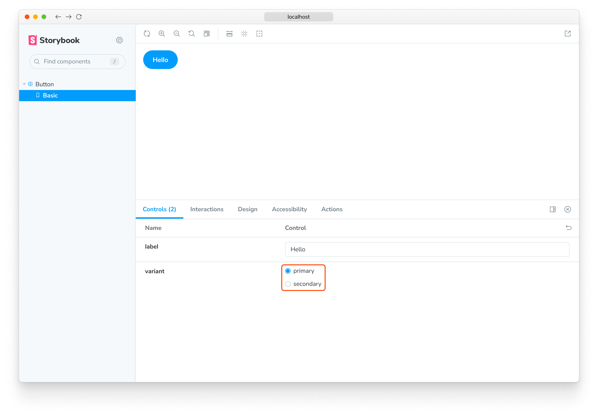
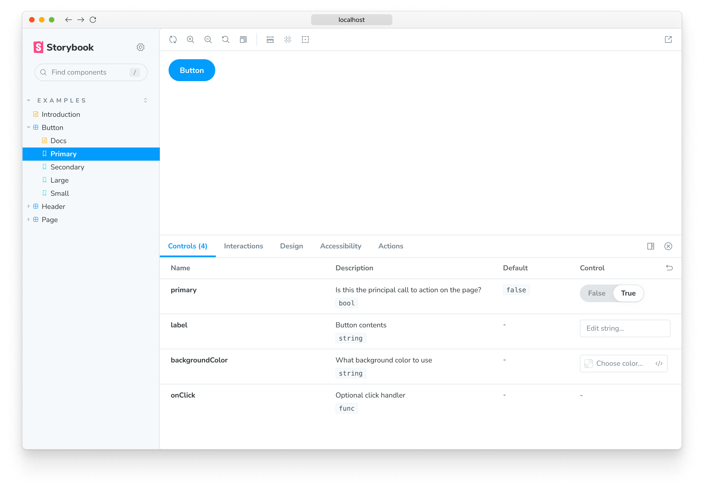

<YouTubeCallout id="vAh0KdRcXpI" title="How to connect props with Storybook controls" />

Storybook Controls gives you a graphical UI to interact with a component's arguments dynamically without needing to code. It creates an addon panel next to your component examples ("stories"), so you can edit them live.

<video autoPlay muted playsInline loop>
  <source
    src="addon-controls-demo-optimized.mp4"
    type="video/mp4"
  />
</video>

Controls do not require any modification to your components. Stories for controls are:

- Convenient. Auto-generate controls based on React/Vue/Angular/etc. components.
- Portable. Reuse your interactive stories in documentation, tests, and even in designs.
- Rich. Customize the controls and interactive data to suit your exact needs.

To use the Controls addon, you need to write your stories using [args](../writing-stories/args.md). Storybook will automatically generate UI controls based on your args and what it can infer about your component. Still, you can configure the controls further using [argTypes](../api/argtypes.md), see below.

💡 If you have stories in the older pre-Storybook 6 style, check the <a href="https://medium.com/storybookjs/storybook-6-migration-guide-200346241bb5">args & controls migration guide</a> to learn how to convert your existing stories for args.

## Choosing the control type

By default, Storybook will choose a control for each arg based on the initial value of the arg. It works well with certain types of args, such as boolean values or free-text strings, but in other cases, you want a more restricted control.

<!-- prettier-ignore-start -->

<FeatureSnippets
  paths={[
    'essentials/auto-generated-controls/react.mdx',
    'essentials/auto-generated-controls/vue.mdx',
    'essentials/auto-generated-controls/angular.mdx',
    'essentials/auto-generated-controls/web-components.mdx',
    'essentials/auto-generated-controls/ember.mdx',
    'essentials/auto-generated-controls/fallback.mdx',
  ]}
/>

<!-- prettier-ignore-end -->

For instance, suppose you have a `variant` arg on your story that should be `primary` or `secondary`:

<!-- prettier-ignore-start -->

<CodeSnippets
  paths={[
    'angular/button-story-controls-primary-variant.ts.mdx',
    'web-components/button-story-controls-primary-variant.js.mdx',
    'web-components/button-story-controls-primary-variant.ts.mdx',
    'common/button-story-controls-primary-variant.js.mdx',
    'common/button-story-controls-primary-variant.ts.mdx',
  ]}
  usesCsf3
  csf2Path="essentials/controls#snippet-button-story-controls-primary-variant"
/>

<!-- prettier-ignore-end -->

By default, Storybook will render a free text input for the `variant` arg:

It works as long as you type a valid string into the auto-generated text control. Still, it's not the best UI for our scenario, given that the component only accepts `primary` or `secondary` as variants. Let’s replace it with Storybook’s radio component.

We can specify which controls get used by declaring a custom [argType](../api/argtypes.md) for the `variant` property. ArgTypes encode basic metadata for args, such as name, description, defaultValue for an arg. These get automatically filled in by Storybook Docs.

`ArgTypes` can also contain arbitrary annotations, which the user can override. Since `variant` is a property of the component, let's put that annotation on the default export.

<!-- prettier-ignore-start -->

<CodeSnippets
  paths={[
    'angular/button-story-controls-radio-group.ts.mdx',
    'web-components/button-story-controls-radio-group.js.mdx',
    'web-components/button-story-controls-radio-group.ts.mdx',
    'common/button-story-controls-radio-group.js.mdx',
    'common/button-story-controls-radio-group.ts.mdx',
  ]}
/>

<!-- prettier-ignore-end -->

💡 ArgTypes are a powerful feature that can be used to customize the controls for your stories. See the documentation about [customizing controls](#annotation) with `argTypes` annotation for more information.

This replaces the input with a radio group for a more intuitive experience.

## Custom control type matchers

For a few types, Controls can automatically be inferred with [regex](https://developer.mozilla.org/docs/Web/JavaScript/Reference/Global_Objects/RegExp). If you've used the Storybook CLI to setup your project it should have automatically created the following defaults in `.storybook/preview.js`:

| Data type |              Default regex               |                        Description                        |
| :-------: | :--------------------------------------: | :-------------------------------------------------------: |
| **color** | <code>/(background&#124;color)$/i</code> | Will display a color picker UI for the args that match it |
| **date**  |                `/Date$/`                 | Will display a date picker UI for the args that match it  |

If you haven't used the CLI to setup the configuration, or if you want to define your own patterns, use the `matchers` property in the `controls` parameter:

<!-- prettier-ignore-start -->

<CodeSnippets
  paths={[
    'common/storybook-addon-controls-custom-matchers.js.mdx',
    'common/storybook-addon-controls-custom-matchers.ts.mdx',
  ]}
/>

<!-- prettier-ignore-end -->

## Fully custom args

Until now, we only used auto-generated controls based on the component we're writing stories for. If we are writing [complex stories](../writing-stories/stories-for-multiple-components.md), we may want to add controls for args that aren’t part of the component.

<!-- prettier-ignore-start -->

<CodeSnippets
  paths={[
    'react/table-story-fully-customize-controls.js.mdx',
    'react/table-story-fully-customize-controls.ts.mdx',
    'vue/table-story-fully-customize-controls.2.js.mdx',
    'vue/table-story-fully-customize-controls.2.ts.mdx',
    'vue/table-story-fully-customize-controls.3.js.mdx',
    'vue/table-story-fully-customize-controls.3.ts.mdx',
    'angular/table-story-fully-customize-controls.ts.mdx',
    'web-components/table-story-fully-customize-controls.js.mdx',
    'web-components/table-story-fully-customize-controls.ts.mdx',
    'solid/table-story-fully-customize-controls.js.mdx',
    'solid/table-story-fully-customize-controls.ts.mdx',
  ]}
  usesCsf3
  csf2Path="essentials/controls#snippet-table-story-fully-customize-controls"
/>

<!-- prettier-ignore-end -->

By default, Storybook will add controls for all args that:

- It infers from the component definition [if your framework supports it](../configure/frameworks-feature-support.md).

- Appear in the list of args for your story.

Using `argTypes`, you can change the display and behavior of each control.

### Dealing with complex values

When dealing with non-primitive values, you'll notice that you'll run into some limitations. The most obvious issue is that not every value can be represented as part of the `args` param in the URL, losing the ability to share and deeplink to such a state. Beyond that, complex values such as JSX cannot be synchronized between the manager (e.g., Controls addon) and the preview (your story).

One way to deal with this is to use primitive values (e.g., strings) as arg values and add a custom `render` function to convert these values to their complex counterpart before rendering. It isn't the nicest way to do it (see below), but certainly the most flexible.

<!-- prettier-ignore-start -->

<CodeSnippets
  paths={[
    'react/component-story-custom-args-complex.js.mdx',
    'react/component-story-custom-args-complex.ts.mdx',
    'vue/component-story-custom-args-complex.js.mdx',
    'vue/component-story-custom-args-complex.ts.mdx',
    'angular/component-story-custom-args-complex.ts.mdx',
    'svelte/component-story-custom-args-complex.js.mdx',
    'web-components/component-story-custom-args-complex.js.mdx',
    'web-components/component-story-custom-args-complex.ts.mdx',
    'solid/component-story-custom-args-complex.js.mdx',
    'solid/component-story-custom-args-complex.ts.mdx',
  ]}
  usesCsf3
  csf2Path="essentials/controls#snippet-component-story-custom-args-complex"
/>

<!-- prettier-ignore-end -->

Unless you need the flexibility of a function, an easier way to map primitives to complex values before rendering is to define a `mapping`, additionally, you can specify `control.labels` to configure custom labels for your checkbox, radio, or select input.

<!-- prettier-ignore-start -->

<CodeSnippets
  paths={[
    'angular/component-story-custom-args-mapping.ts.mdx',
    'web-components/component-story-custom-args-mapping.js.mdx',
    'web-components/component-story-custom-args-mapping.ts.mdx',
    'common/component-story-custom-args-mapping.js.mdx',
    'common/component-story-custom-args-mapping.ts.mdx',
  ]}
/>

<!-- prettier-ignore-end -->

Note that both `mapping` and `control.labels` don't have to be exhaustive. If the currently selected option is not listed, it's used verbatim.

## Configuration

The Controls addon can be configured in two ways:

- Individual controls can be configured via control annotations.
- The addon's appearance can be configured via parameters.

### Annotation

As shown above, you can configure individual controls with the “control" annotation in the [argTypes](../api/argtypes.md) field of either a component or story. Below is a condensed example and table featuring all available controls.

| Data Type   | Control        | Description                                                                                                                                                                                                               |
| ----------- | -------------- | ------------------------------------------------------------------------------------------------------------------------------------------------------------------------------------------------------------------------- |
| **boolean** | `boolean`      | Provides a toggle for switching between possible states.  `argTypes: { active: { control: 'boolean' }}`                                                                                                               |
| **number**  | `number`       | Provides a numeric input to include the range of all possible values.  `argTypes: { even: { control: { type: 'number', min:1, max:30, step: 2 } }}`                                                                   |
|             | `range`        | Provides a range slider component to include all possible values.  `argTypes: { odd: { control: { type: 'range', min: 1, max: 30, step: 3 } }}`                                                                       |
| **object**  | `object`       | Provides a JSON-based editor component to handle the object's values.  Also allows edition in raw mode.  `argTypes: { user: { control: 'object' }}`                                                               |
| **array**   | `object`       | Provides a JSON-based editor component to handle the values of the array.  Also allows edition in raw mode.  `argTypes: { odd: { control: 'object' }}`                                                            |
|             | `file`         | Provides a file input component that returns an array of URLs.  Can be further customized to accept specific file types.  `argTypes: { avatar: { control: { type: 'file', accept: '.png' } }}`                    |
| **enum**    | `radio`        | Provides a set of radio buttons based on the available options.  `argTypes: { contact: { control: 'radio', options: ['email', 'phone', 'mail'] }}`                                                                    |
|             | `inline-radio` | Provides a set of inlined radio buttons based on the available options.  `argTypes: { contact: { control: 'inline-radio', options: ['email', 'phone', 'mail'] }}`                                                     |
|             | `check`        | Provides a set of checkbox components for selecting multiple options.  `argTypes: { contact: { control: 'check', options: ['email', 'phone', 'mail'] }}`                                                              |
|             | `inline-check` | Provides a set of inlined checkbox components for selecting multiple options.  `argTypes: { contact: { control: 'inline-check', options: ['email', 'phone', 'mail'] }}`                                               |
|             | `select`       | Provides a drop-down list component to handle single value selection. `argTypes: { age: { control: 'select', options: [20, 30, 40, 50] }}`                                                                                |
|             | `multi-select` | Provides a drop-down list that allows multiple selected values. `argTypes: { countries: { control: 'multi-select', options: ['USA', 'Canada', 'Mexico'] }}`                                                               |
| **string**  | `text`         | Provides a freeform text input.   `argTypes: { label: { control: 'text' }}`                                                                                                                                           |
|             | `color`        | Provides a color picker component to handle color values.  Can be additionally configured to include a set of color presets.  `argTypes: { color: { control: { type: 'color', presetColors: ['red', 'green']} }}` |
|             | `date`         | Provides a datepicker component to handle date selection. `argTypes: { startDate: { control: 'date' }}`                                                                                                                   |

💡 The <code>date</code> control will convert the date into a UNIX timestamp when the value changes. It's a known limitation that will be fixed in a future release. If you need to represent the actual date, you'll need to update the story's implementation and convert the value into a date object.

<!-- prettier-ignore-start -->

<CodeSnippets
  paths={[
    'angular/gizmo-story-controls-customization.ts.mdx',
    'web-components/gizmo-story-controls-customization.js.mdx',
    'web-components/gizmo-story-controls-customization.ts.mdx',
    'common/gizmo-story-controls-customization.js.mdx',
    'common/gizmo-story-controls-customization.ts.mdx',
  ]}
/>

<!-- prettier-ignore-end -->

💡 Numeric data types will default to a <code>number</code> control unless additional configuration is provided.

### Parameters

Controls supports the following configuration [parameters](../writing-stories/parameters.md), either globally or on a per-story basis:

## Show full documentation for each property

Since Controls is built on the same engine as Storybook Docs, it can also show property documentation alongside your controls using the expanded parameter (defaults to false). This means you embed a complete [`Controls`](../api/doc-block-controls.md) doc block in the controls panel. The description and default value rendering can be [customized](#fully-custom-args) in the same way as the doc block.

To enable expanded mode globally, add the following to [`.storybook/preview.js`](../configure/overview.md#configure-story-rendering):

<!-- prettier-ignore-start -->

<CodeSnippets
  paths={[
    'common/storybook-preview-expanded-controls.js.mdx',
    'common/storybook-preview-expanded-controls.ts.mdx',
  ]}
/>

<!-- prettier-ignore-end -->

And here's what the resulting UI looks like:

### Specify initial preset color swatches

For `color` controls, you can specify an array of `presetColors`, either on the `control` in `argTypes`, or as a parameter under the `controls` namespace:

<!-- prettier-ignore-start -->

<CodeSnippets
  paths={[
    'common/storybook-preview-parameters-color-swatches.js.mdx',
    'common/storybook-preview-parameters-color-swatches.ts.mdx',
  ]}
/>

<!-- prettier-ignore-end -->

Color presets can be defined as an object with `color` and `title` or a simple CSS color string. These will then be available as swatches in the color picker. When you hover over the color swatch, you'll be able to see its title. It will default to the nearest CSS color name if none is specified.

### Disable controls for specific properties

Aside from the features already documented here, Controls can also be disabled for individual properties.

Suppose you want to disable Controls for a property called `foo` in a component's story. The following example illustrates how:

<!-- prettier-ignore-start -->

<CodeSnippets
  paths={[
    'angular/component-story-disable-controls.ts.mdx',
    'web-components/component-story-disable-controls.js.mdx',
    'web-components/component-story-disable-controls.ts.mdx',
    'common/component-story-disable-controls.js.mdx',
    'common/component-story-disable-controls.ts.mdx',
  ]}
/>

<!-- prettier-ignore-end -->

Resulting in the following change in Storybook UI:

<video autoPlay muted playsInline loop>
  <source
    src="addon-controls-disable-specific-prop-optimized.mp4"
    type="video/mp4"
  />
</video>

The previous example also removed the prop documentation from the table. In some cases, this is fine. However, sometimes you might want to render the prop documentation, but without a control. The following example illustrates how:

<!-- prettier-ignore-start -->

<CodeSnippets
  paths={[
    'angular/component-story-disable-controls-alt.ts.mdx',
    'web-components/component-story-disable-controls-alt.js.mdx',
    'web-components/component-story-disable-controls-alt.ts.mdx',
    'common/component-story-disable-controls-alt.js.mdx',
    'common/component-story-disable-controls-alt.ts.mdx',
  ]}
/>

<!-- prettier-ignore-end -->

💡 As with other Storybook properties, such as [decorators](../writing-stories/decorators.md), you can apply the same pattern at a story level for more granular cases.

### Conditional controls

In some cases, it's useful to be able to conditionally exclude a control based on the value of another control. Controls supports basic versions of these use cases with the `if`, which can takes a simple query object to determine whether to include the control.

Consider a collection of "advanced" settings that are only visible when the user toggles an "advanced" toggle.

<!-- prettier-ignore-start -->

<CodeSnippets
  paths={[
    'angular/component-story-conditional-controls-toggle.ts.mdx',
    'web-components/component-story-conditional-controls-toggle.js.mdx',
    'web-components/component-story-conditional-controls-toggle.ts.mdx',
    'common/component-story-conditional-controls-toggle.js.mdx',
    'common/component-story-conditional-controls-toggle.ts.mdx',
  ]}
/>

<!-- prettier-ignore-end -->

Or consider a constraint where if the user sets one control value, it doesn't make sense for the user to be able to set another value.

<!-- prettier-ignore-start -->

<CodeSnippets
  paths={[
    'angular/component-story-conditional-controls-mutual-exclusion.ts.mdx',
    'web-components/component-story-conditional-controls-mutual-exclusion.js.mdx',
    'web-components/component-story-conditional-controls-mutual-exclusion.ts.mdx',
    'common/component-story-conditional-controls-mutual-exclusion.js.mdx',
    'common/component-story-conditional-controls-mutual-exclusion.ts.mdx',
  ]}
/>

<!-- prettier-ignore-end -->

The query object must contain either an `arg` or `global` target:

| field  | type   | meaning                       |
| ------ | ------ | ----------------------------- |
| arg    | string | The ID of the arg to test.    |
| global | string | The ID of the global to test. |

It may also contain at most one of the following operators:

| operator | type    | meaning                                              |
| -------- | ------- | ---------------------------------------------------- |
| truthy   | boolean | Is the target value truthy?                          |
| exists   | boolean | Is the target value defined?                         |
| eq       | any     | Is the target value equal to the provided value?     |
| neq      | any     | Is the target value NOT equal to the provided value? |

If no operator is provided, that is equivalent to `{ truthy: true }`.

## Hide NoControls warning

If you don't plan to handle the control args inside your Story, you can remove the warning with:

<!-- prettier-ignore-start -->

<CodeSnippets
  paths={[
   'angular/button-story-hide-nocontrols-warning.ts.mdx',
   'web-components/button-story-hide-nocontrols-warning.js.mdx',
   'web-components/button-story-hide-nocontrols-warning.ts.mdx',
   'common/button-story-hide-nocontrols-warning.js.mdx',
   'common/button-story-hide-nocontrols-warning.ts.mdx',
  ]}
  usesCsf3
  csf2Path="essentials/controls#snippet-button-story-hide-nocontrols-warning"
/>

<!-- prettier-ignore-end -->

## Filtering controls

In specific cases, you may require to display only a limited number of controls in the controls panel, or all of them except a particular set.

To make this possible, you can use optional `include` and `exclude` configuration fields in the `controls` parameter, which you can define as an array of strings, or as a regular expression.

Consider the following story snippets:

<!-- prettier-ignore-start -->

<CodeSnippets
  paths={[
    'angular/component-story-disable-controls-regex.ts.mdx',
    'web-components/component-story-disable-controls-regex.js.mdx',
    'web-components/component-story-disable-controls-regex.ts.mdx',
    'common/component-story-disable-controls-regex.js.mdx',
    'common/component-story-disable-controls-regex.ts.mdx',
  ]}
  usesCsf3
  csf2Path="essentials/controls#snippet-component-story-disable-controls-regex"
/>

<!-- prettier-ignore-end -->

## Sorting controls

By default, controls are unsorted and use whatever order the args data is processed in (`none`). Additionally, you can sort them alphabetically by the arg's name (`alpha`) or with the required args first (`requiredFirst`).

Consider the following snippet to force required args first:

<!-- prettier-ignore-start -->

<CodeSnippets
  paths={[
    'angular/component-story-sort-controls.ts.mdx',
    'web-components/component-story-sort-controls.js.mdx',
    'web-components/component-story-sort-controls.ts.mdx',
    'common/component-story-sort-controls.js.mdx',
    'common/component-story-sort-controls.ts.mdx',
  ]}
/>

<!-- prettier-ignore-end -->
