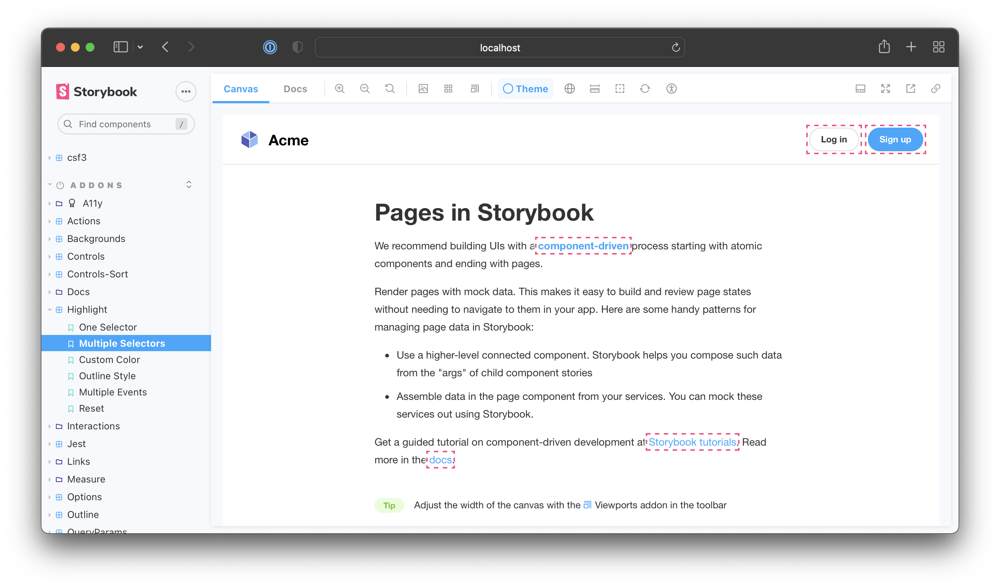

Storybook's [Highlight](https://storybook.js.org/addons/@storybook/addon-highlight/) addon is a helpful tool for visually debugging your components, allowing you to highlight specific DOM nodes within your story when used as a standalone addon or enhancing other addons such as the [Accessibility addon](https://storybook.js.org/addons/@storybook/addon-a11y/) to inform you of accessibility issues within your components.

## Highlighting DOM Elements

To highlight DOM elements with the addon, you'll need to emit the `HIGHLIGHT` event from within a story or an addon. The event payload must contain an `elements` property assigned to an array of selectors matching the elements you want to highlight. For example:

<!-- prettier-ignore-start -->

<CodeSnippets
  paths={[
    'react/component-story-highlight-addon.js.mdx',
    'react/component-story-highlight-addon.ts.mdx',
    'angular/component-story-highlight-addon.ts.mdx',
    'vue/component-story-highlight-addon.js.mdx',
    'vue/component-story-highlight-addon.ts.mdx',
    'web-components/component-story-highlight-addon.js.mdx',
    'web-components/component-story-highlight-addon.ts.mdx',
  ]}
/>

<!-- prettier-ignore-end -->

<Callout variant="info" icon="💡">

We recommend choosing the most specific selector possible to avoid highlighting elements other addons use. This is because the addon tries to match selectors against the entire DOM tree.

</Callout>

### Reset highlighted elements

Out of the box, Storybook automatically removes highlighted elements when transitioning between stories. However, if you need to clear them manually, you can emit the `RESET_HIGHLIGHT` event from within a story or an addon. For example:

<!-- prettier-ignore-start -->

<CodeSnippets
  paths={[
    'react/addon-highlight-reset.js.mdx',
    'react/addon-highlight-reset.ts.mdx',
    'angular/addon-highlight-reset.ts.mdx',
    'vue/addon-highlight-reset.js.mdx',
    'vue/addon-highlight-reset.ts.mdx',
    'web-components/addon-highlight-reset.js.mdx',
    'web-components/addon-highlight-reset.ts.mdx',
  ]}
/>

<!-- prettier-ignore-end -->

<Callout variant="info">

The `emit` function derived from the `useChannel` API hook creates a communication channel in Storybook's UI to listen for events and update the UI accordingly. The Highlight addon uses this channel to listen to custom events and update the highlighted elements (if any) accordingly.

</Callout>

## Customize style

By default, the addon applies a standard style to the highlighted elements you've enabled for the story. However, you can enable your custom style by extending the payload object and providing a `color` and/or `style` properties. For example:

<!-- prettier-ignore-start -->

<CodeSnippets
  paths={[
    'react/highlight-addon-custom-style.js.mdx',
    'react/highlight-addon-custom-style.ts.mdx',
    'angular/highlight-addon-custom-style.ts.mdx',
    'vue/highlight-addon-custom-style.js.mdx',
    'vue/highlight-addon-custom-style.ts.mdx',
    'web-components/highlight-addon-custom-style.js.mdx',
    'web-components/highlight-addon-custom-style.ts.mdx',
  ]}
/>

<!-- prettier-ignore-end -->