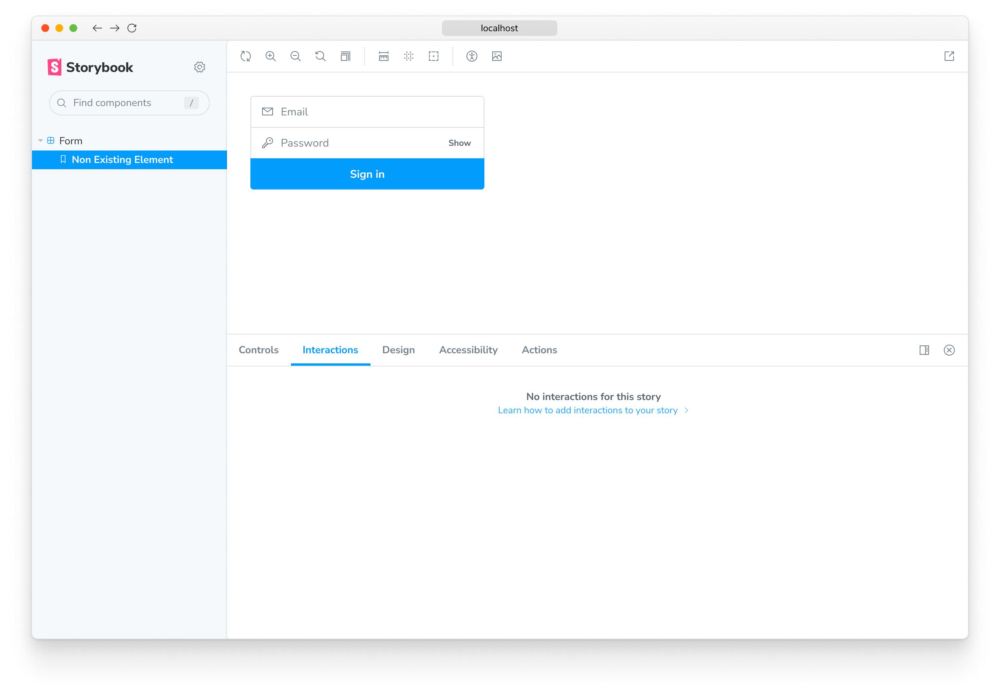

The [`play`](../writing-stories/play-function.md) function in Storybook allows you to simulate user interactions to run after a story renders. With the [Interactions](https://storybook.js.org/addons/@storybook/addon-interactions/) addon, you have a way to visualize and debug these interactions.

## Play function for interactions

Stories isolate and capture component states in a structured manner. While developing a component, you can quickly cycle through the stories to verify the look and feel. Each story specifies all the inputs required to reproduce a specific state. You can even mock context and API calls, allowing you to handle most use cases of a component. But what about states that require user interaction?

For example, clicking a button to open/close a dialog box, dragging a list item to reorder it, or filling out a form to check for validation errors. To test those behaviors, you have to interact with the components as a user would. Interactive stories enable you to automate these interactions using a play function. They are small snippets of code that run once the story finishes rendering, emulating the exact steps a user would take to interact with the component.

### Powered by Testing Library and Jest

The interactions are written using a Storybook-instrumented version of [Testing Library](https://testing-library.com/) and [Jest](https://jestjs.io/). That gives you a familiar developer-friendly syntax to interact with the DOM and make assertions, but with extra telemetry to help with debugging.

## Set up the interactions addon

By default, the [`@storybook/addon-interactions`](https://storybook.js.org/addons/@storybook/addon-interactions/) is already installed and configured if you're adding Storybook for new projects. If you're migrating from a previous version of Storybook, you'll need to install it manually.

Run the following command to install the interactions addon and related dependencies.

<!-- prettier-ignore-start -->

<CodeSnippets
  paths={[
    'common/storybook-addon-interactions-addon-full-install.yarn.js.mdx',
    'common/storybook-addon-interactions-addon-full-install.npm.js.mdx',
    'common/storybook-addon-interactions-addon-full-install.pnpm.js.mdx',
  ]}
/>

<!-- prettier-ignore-end -->

Next, update [`.storybook/main.js|ts`](../configure/overview.md#configure-story-rendering) to the following:

<!-- prettier-ignore-start -->

<CodeSnippets
  paths={[
    'common/storybook-interactions-addon-registration.js.mdx',
    'common/storybook-interactions-addon-registration.ts.mdx',
  ]}
/>

<!-- prettier-ignore-end -->

💡 Make sure to list `@storybook/addon-interactions` **after** the [`@storybook/addon-essentials`](./introduction.md) addon (or the [`@storybook/addon-actions`](./actions.md) if you've installed it individually).

Now when you run Storybook, the Interactions addon will be enabled.

## Write an interaction test

Interactions run as part of the `play` function of your stories. We rely on Testing Library to do the heavy lifting.

Make sure to import the Storybook wrappers for Jest and Testing Library rather than importing Jest and Testing Library directly.

<!-- prettier-ignore-start -->

<CodeSnippets
  paths={[
    'angular/storybook-interactions-play-function.ts.mdx',
    'web-components/storybook-interactions-play-function.js.mdx',
    'web-components/storybook-interactions-play-function.ts.mdx',
    'common/storybook-interactions-play-function.js.mdx',
    'common/storybook-interactions-play-function.ts.mdx',
  ]}
  usesCsf3
  csf2Path="essentials/interactions#snippet-storybook-interactions-play-function"
/>

<!-- prettier-ignore-end -->

The above example uses the `canvasElement` to scope your element queries to the current story. It's essential if you want your play functions to eventually be compatible with Storybook Docs, which renders multiple components on the same page. Additionally, the `step` function can be used to create labeled groups of interactions.

While you can refer to the [Testing Library documentation](https://testing-library.com/docs/) for details on how to use it, there's an important detail that's different when using the Storybook wrapper: **method invocations must be `await`-ed**. It allows you to step back and forth through your interactions using the debugger.

Any `args` that have been marked as an Action, either using the [argTypes annotation](./actions.md#action-argtype-annotation) or the [argTypesRegex](./actions.md#automatically-matching-args), will be automatically converted to a [Jest mock function](https://jestjs.io/docs/mock-function-api) (spy). This allows you to make assertions about calls to these functions.

ℹ️ To mock functions in your Storybook stories for reliable and isolated component testing, use the `jest` import from `@storybook/jest`. This allows you to avoid configuring Jest globally in your project.

