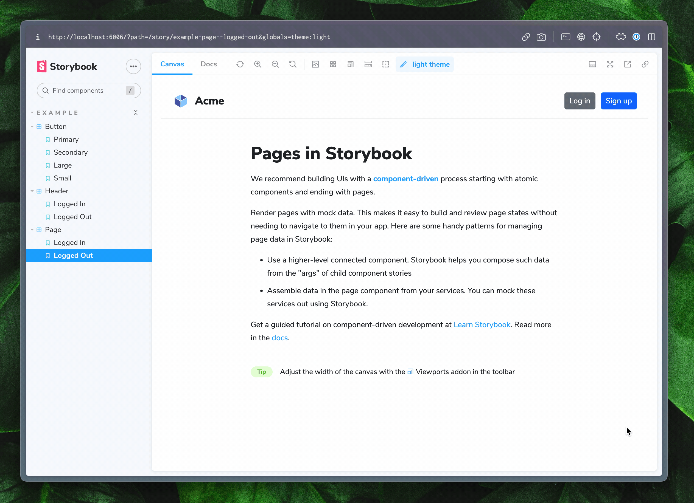

Storybook's [Themes](https://github.com/storybookjs/storybook/tree/next/code/addons/themes) addon allows you to switch between multiple themes for your components inside of the preview in [Storybook](https://storybook.js.org).

## Theme decorators

To make your themes accessible to your stories, `@storybook/addon-themes` exposes three [decorators](https://storybook.js.org/docs/writing-stories/decorators) for different methods of theming.

### JSX providers

For libraries that expose themes to components through providers, such as [Material UI](https://storybook.js.org/recipes/@mui/material/), [Styled-components](https://storybook.js.org/recipes/styled-components/), and [Emotion](https://storybook.js.org/recipes/@emotion/styled/), use the `withThemeFromJSXProvider`.

<!-- prettier-ignore-start -->

<CodeSnippets
  paths={[
    'common/storybook-addon-themes-jsx-provider-decorator.js.mdx',
    'common/storybook-addon-themes-jsx-provider-decorator.ts.mdx',
  ]}
/>

<!-- prettier-ignore-end -->

### CSS classes

For libraries that rely on CSS classes on a parent element to determine the theme, you can use the `withThemeByClassName` decorator.

<!-- prettier-ignore-start -->

<CodeSnippets
  paths={[
    'common/storybook-addon-themes-classname-decorator.js.mdx',
    'common/storybook-addon-themes-classname-decorator.ts.mdx',
  ]}
/>

<!-- prettier-ignore-end -->

### Data attributes

For libraries that rely on data attributes on a parent element to determine the theme, you can use the `withThemeByDataAttribute` decorator.

<!-- prettier-ignore-start -->

<CodeSnippets
  paths={[
    'common/storybook-addon-themes-data-attribute-decorator.js.mdx',
    'common/storybook-addon-themes-data-attribute-decorator.ts.mdx',
  ]}
/>

<!-- prettier-ignore-end -->
