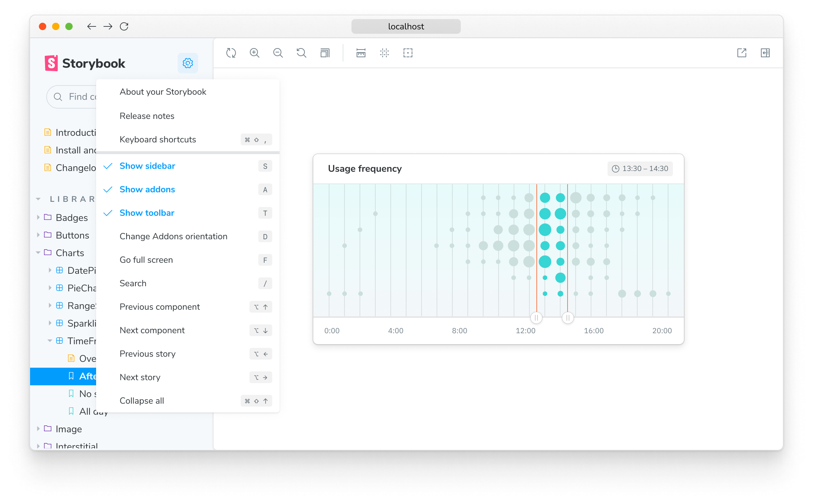
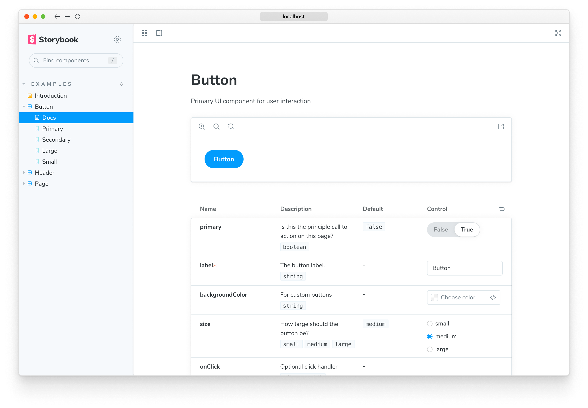
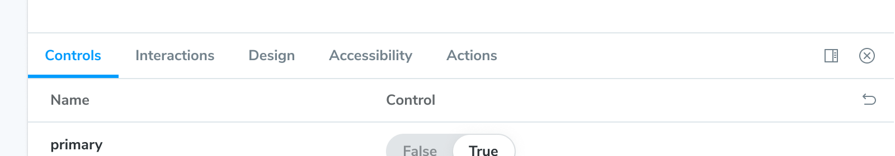
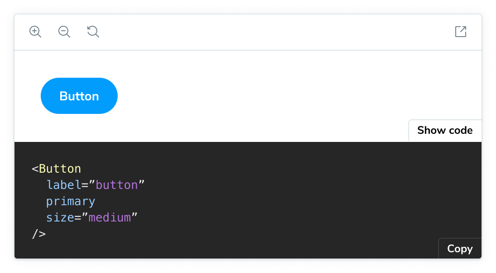

Last chapter, we learned that stories correspond with discrete component states. This chapter demonstrates how to use Storybook as a workshop for building components.

## Sidebar and Canvas

A `*.stories.js` file defines all the stories for a component. Each story has a corresponding sidebar item. When you click on a story, it renders in the Canvas an isolated preview iframe.

<video autoPlay muted playsInline loop>
  <source
    src="example-browse-all-stories-optimized.mp4"
    type="video/mp4"
  />
</video>

Navigate between stories by clicking on them in the sidebar. Try the sidebar search to find a story by name.

Or use keyboard shortcuts. Click on the Storybook's menu to see the list of shortcuts available.

## Toolbar

Storybook ships with time-saving tools built-in. The toolbar contains tools that allow you to adjust how the story renders in the Canvas:

- 🔍 Zooming visually scales the component so you can check the details.
- 🖼 Background changes the rendered background behind your component so you can verify how your component renders in different visual contexts.
- 📐 Grid renders your component on top of a grid layout so you can verify if your component is aligned correctly.
- 📏 Measure toggles a measurement overlay to help you inspect the dimensions of components.
- 🎚️ Outline displays the component's bounding box so you can verify if your component is positioned correctly.
- 📱 Viewport renders the component in a variety of dimensions and orientations. It’s ideal for checking the responsiveness of components.

<video autoPlay muted playsInline loop>
  <source
    src="toolbar-walkthrough-optimized.mp4"
    type="video/mp4"
  />
</video>

The [“Docs”](../writing-docs/introduction.md) page displays auto-generated documentation for components (inferred from the source code). Usage documentation is helpful when sharing reusable components with your team, for example, in an application.

The toolbar is customizable. You can use [globals](../essentials/toolbars-and-globals.md) to quickly toggle themes and languages. Or install Storybook toolbar [addons](../configure/storybook-addons.md) from the community to enable advanced workflows.

## Addons

Addons are plugins that extend Storybook's core functionality. You can find them in the addons panel, a reserved place in the Storybook UI below the Canvas. Each tab shows the generated metadata, logs, or static analysis for the selected story by the addon.

- **Controls** allows you to interact with a component’s args (inputs) dynamically. Experiment with alternate configurations of the component to discover edge cases.
- **Actions** help you verify interactions produce the correct outputs via callbacks. For instance, if you view the “Logged In” story of the `Header` component, we can verify that clicking the “Log out” button triggers the `onLogout` callback, which would be provided by the component that made use of the Header.
- **Interactions** provides a helpful user interface for debugging [interaction tests](../writing-tests/interaction-testing.md) with the `play` function.

<video autoPlay muted playsInline loop>
  <source
    src="addons-walkthrough-optimized.mp4"
    type="video/mp4"
  />
</video>

Storybook is extensible. Our rich ecosystem of addons helps you test, document, and optimize your stories. You can also create an addon to satisfy your workflow requirements. Read more in the [addons section](../addons/introduction.md).

In the next chapter, we'll get your components rendering in Storybook so you can use it to supercharge component development.

## Use stories to build UIs

When building apps, one of the biggest challenges is to figure out if a piece of UI already exists in your codebase and how to use it for the new feature you're building.

Storybook catalogues all your components and their use cases. Therefore, you can quickly browse it to find what you're looking for.

Here's what the workflow looks like:

- 🗃 Use the sidebar to find a suitable component
- 👀 Review its stories to pick a variant that suits your needs
- 📝 Copy/paste the story definition into your app code and wire it up to data

You can access the story definition from the stories file or make it available in your published Storybook using the [Storysource addon](https://storybook.js.org/addons/@storybook/addon-storysource/) or the [Docs addon](../api/doc-block-source).

