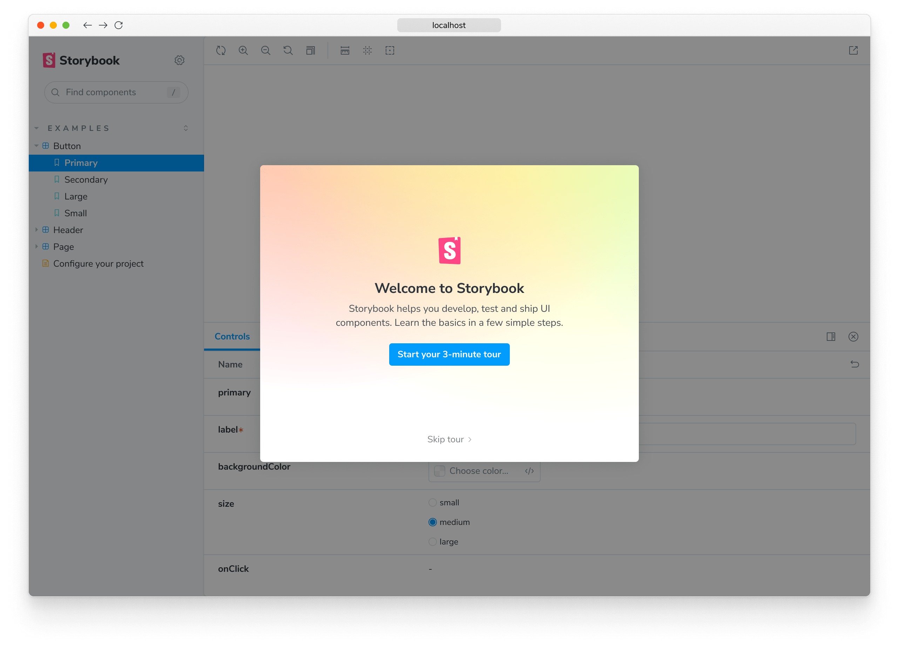

Use the Storybook CLI to install it in a single command. Run this inside your _existing project’s_ root directory:

<!-- prettier-ignore-start -->

<CodeSnippets
  paths={[
   'common/init-command.npx.js.mdx',
   'common/init-command.yarn.js.mdx',
   'common/init-command.pnpm.js.mdx',
  ]}
/>

<!-- prettier-ignore-end -->

<code>storybook init</code> is not made for empty projects

Storybook needs to be installed into a project that is already set up with a framework. It will not work on an empty project. There are many ways to bootstrap an app in a given framework, including:

- 📦 [Create an Angular Workspace](https://angular.io/cli/new)
- 📦 [Create React App](https://reactjs.org/docs/create-a-new-react-app.html)
- 📦 [Create a Vue App](https://vuejs.org/guide/quick-start.html)
- 📦 [Ember CLI](https://guides.emberjs.com/release/getting-started/quick-start/)
- 📦 [Vite CLI](https://vitejs.dev/guide/#scaffolding-your-first-vite-project)
- Or any other tooling available.

Storybook will look into your project's dependencies during its install process and provide you with the best configuration available.

The command above will make the following changes to your local environment:

- 📦 Install the required dependencies.
- 🛠 Setup the necessary scripts to run and build Storybook.
- 🛠 Add the default Storybook configuration.
- 📝 Add some boilerplate stories to get you started.
- 📡 Set up telemetry to help us improve Storybook. Read more about it [here](../configure/telemetry.md).

<YouTubeCallout id="CtfU1UnizHU" title="New Storybook" style={{ marginTop: '1em' }} />

<IfRenderer renderer='react'>

## Run the Setup Wizard

If all goes well, you should see a setup wizard that will help you get started with Storybook introducing you to the main concepts and features, including how the UI is organized, how to write your first story, and how to test your components' response to various inputs utilizing [controls](../essentials/controls).

If you skipped the wizard, you can always run it again by adding the `?path=/onboarding` query parameter to the URL of your Storybook instance, provided that the example stories are still available.

</IfRenderer>

## Start Storybook

Storybook comes with a built-in development server featuring everything you need for project development. Depending on your system configuration, running the `storybook` command will start the local development server, output the address for you, and automatically open the address in a new browser tab where a welcome screen greets you.

<!-- prettier-ignore-start -->

<CodeSnippets
  paths={[
    'angular/storybook-run-dev.with-builder.js.mdx',
    'common/storybook-run-dev.npm.js.mdx',
    'common/storybook-run-dev.yarn.js.mdx',
    'common/storybook-run-dev.pnpm.js.mdx',
  ]}
/>

<!-- prettier-ignore-end -->

There are some noteworthy items here:

- A collection of useful links for more in-depth configuration and customization options you have at your disposal.
- A second set of links for you to expand your Storybook knowledge and get involved with the ever-growing Storybook community.
- A few example stories to get you started.

<h4 id="troubleshooting">Troubleshooting</h4>

Below are some of the most common installation issues and instructions on how to solve them.

<!-- prettier-ignore-start -->

<FeatureSnippets
  paths={[
   'get-started/installation-problems/angular.mdx',
   'get-started/installation-problems/ember.mdx',
   'get-started/installation-problems/html.mdx',
   'get-started/installation-problems/preact.mdx',
   'get-started/installation-problems/react.mdx',
   'get-started/installation-problems/svelte.mdx',
   'get-started/installation-problems/vue.mdx',
   'get-started/installation-problems/web-components.mdx',
   'get-started/installation-problems/qwik.mdx',
   'get-started/installation-problems/solid.mdx',
  ]}
/>

<!-- prettier-ignore-end -->

<Callout variant="info">

Storybook collects completely anonymous data to help us improve user experience. Participation is optional, and you may [opt-out](../configure/telemetry.md#how-to-opt-out) if you'd not like to share any information.

</Callout>

If all else fails, try asking for [help](https://storybook.js.org/community#support)

<IfRenderer renderer='react'>

Now that you have successfully installed Storybook and understood how it works, let's continue where you left off in the [setup wizard](#run-the-setup-wizard) and delve deeper into writing stories.

</IfRenderer>

<IfRenderer renderer={['angular', 'vue', 'web-components', 'ember', 'html', 'svelte', 'preact', 'qwik','solid' ]}>

Now that you installed Storybook successfully, let’s take a look at a story that was written for us.

</IfRenderer>
