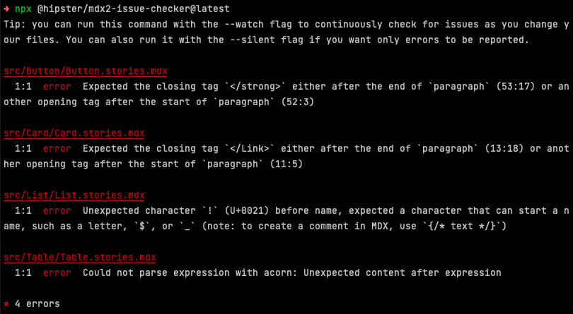
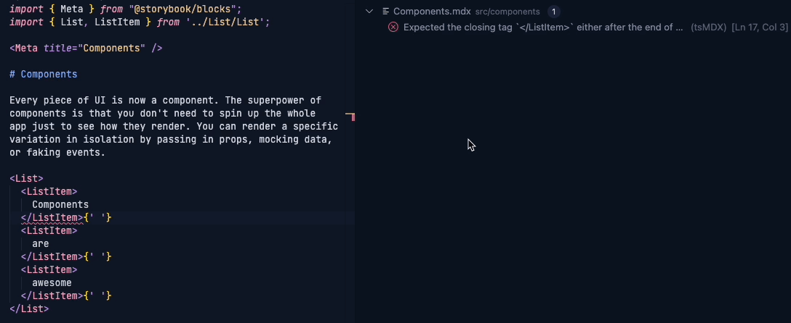

Storybook 7 is our first major release in over 2 years. A lot has changed during that time, so this is a big one. This guide is meant to help you **upgrade from Storybook 6.x to 7.0** successfully!

## Major breaking changes

The rest of this guide will help you upgrade successfully, either automatically or manually. But first, we’ve accumulated a lot of [breaking changes](https://github.com/storybookjs/storybook/blob/next/MIGRATION.md#70-breaking-changes) in Storybook 7. Here are the most impactful changes you should know about before you go further:

- [Webpack4 support discontinued](https://github.com/storybookjs/storybook/blob/next/MIGRATION.md#webpack4-support-discontinued)
- [IE11 support discontinued](https://github.com/storybookjs/storybook/blob/next/MIGRATION.md#modern-browser-support)
- [Minimum supported version of node is 16](https://github.com/storybookjs/storybook/blob/next/MIGRATION.md#dropped-support-for-node-15-and-below)
- [Babel mode v7 exclusively](https://github.com/storybookjs/storybook/blob/next/MIGRATION.md#babel-mode-v7-exclusively)
- [Start and build CLI binaries removed](https://github.com/storybookjs/storybook/blob/next/MIGRATION.md#start-storybook--build-storybook-binaries-removed)
- [Some community addons might not work yet](https://github.com/storybookjs/storybook/blob/next/MIGRATION.md#specific-instructions-for-addon-users)

If any of these apply to your project, please read through the [full migration notes](https://github.com/storybookjs/storybook/blob/next/MIGRATION.md#from-version-65x-to-700) before continuing. If any of these new requirements or changes do not fit your project, you should probably stick with Storybook 6.x.

## Automatic upgrade

To upgrade your Storybook:

<!-- prettier-ignore-start -->

<CodeSnippets
  paths={[
    'common/storybook-upgrade.npm.js.mdx',
    'common/storybook-upgrade.pnpm.js.mdx',
    'common/storybook-upgrade.yarn.js.mdx'
  ]}
/>

<!-- prettier-ignore-end -->

This will:

1. Upgrade your Storybook dependencies to the latest version
2. Run a collection of _automigrations_, which will:
   - Check for common upgrade tasks
   - Explain the necessary changes with links to more information
   - Ask for approval, then perform the task on your behalf

To add Storybook to a project that isn’t currently using Storybook:

<!-- prettier-ignore-start -->

<CodeSnippets
  paths={[
    'common/init-command.npx.js.mdx',
    'common/init-command.pnpm.js.mdx',
    'common/init-command.yarn.js.mdx'
  ]}
/>

<!-- prettier-ignore-end -->

This will:

1. Figure out which renderer (React, Vue, Angular, Web Components), builder (Webpack, Vite), or meta-framework (Next.js, SvelteKit) you’re using
2. Install Storybook 7 and auto-configure it to mirror project settings

## Manual migrations

In addition to the automated upgrades above, there are manual migrations that might be required to get Storybook 7 working in your project. We’ve tried to minimize this list to make it easier to upgrade. These include:

- Upgrade MDX1 to MDX2
- `storiesOf` support discontinued by default

### Upgrade MDX1 to MDX2

Storybook 7 uses MDX2 by default for rendering [docs](./writing-docs/index.md). The upgrade from MDX1 to MDX2 is not fully automated, due to the large number of changes between versions. Fortunately, we have some tips to help make it a lot easier.

#### Automatically detect MDX2 errors with a CLI tool

If your project contains MDX files, run the following command before starting up Storybook:

```sh
npx @hipster/mdx2-issue-checker
```

This will go through every MDX file in the current working directory, and show you which files have errors:



#### Fix MDX2 errors iteratively

The CLI only shows the first error per file, so you might need to run the checker iteratively. One way to streamline this process if you use VS Code is to:

1. Install the [MDX VS Code extension](https://marketplace.visualstudio.com/items?itemName=unifiedjs.vscode-mdx)
2. Enable experimental IntelliSense support for MDX files in your user settings: `"mdx.experimentalLanguageServer": true`

This shows the errors visually in your editor, which speeds things up a lot. Here's what it looks like to fix multiple errors in a file using the extension:



#### MDX1 as fallback

If, for some reason, you are unable to get MDX2 working, we’ve implemented legacy MDX1 support as a last resort. MDX1 is deprecated and opt-in, and we recommend against it unless you really need it.

To use MDX1:

1. Install `@storybook/mdx1-csf` as a dev dependency
2. Add the `legacyMdx1` feature flag to your `.storybook/main.js`:

<!-- prettier-ignore-start -->

<CodeSnippets
  paths={[
    'common/main-config-features-legacy-mdx-1.js.mdx',
    'common/main-config-features-legacy-mdx-1.ts.mdx'
  ]}
/>

<!-- prettier-ignore-end -->

### storiesOf support discontinued by default

If you use Storybook’s legacy `storiesOf` API, it is no longer supported by default in Storybook 7.

We recommend you upgrade your `storiesOf` stories to [Component Story Format (CSF)](https://storybook.js.org/blog/storybook-csf3-is-here/). To do so, please see our [optional migration instructions below](#storiesof-to-csf).

If you can’t upgrade to CSF, or want to get your project working with Storybook 7 before putting in the time to upgrade, you can opt out of on-demand story loading. This legacy mode has a variety of performance implications, but is a convenient stop-gap solution.

To opt out, add the `storyStoreV7` feature flag in `.storybook/main.js`:

<!-- prettier-ignore-start -->

<CodeSnippets
  paths={[
    'common/main-config-features-story-store-v7.js.mdx',
    'common/main-config-features-story-store-v7.ts.mdx'
  ]}
/>

<!-- prettier-ignore-end -->

For more information on this change, see the [migration notes](https://github.com/storybookjs/storybook/blob/next/MIGRATION.md#storystorev7-enabled-by-default).

## Troubleshooting

The automatic upgrade should get your Storybook into a working state. If you encounter an error running Storybook after upgrading, here’s what to do:

1. If you’re running `storybook` with the `dev` command, try using the `build` command instead. Sometimes `build` errors are more legible than `dev` errors!
2. Check [the full migration notes](https://github.com/storybookjs/storybook/blob/next/MIGRATION.md#from-version-65x-to-700), which contains an exhaustive list of noteworthy changes in Storybook 7. Many of these are already handled by automigrations when you upgrade, but not all are. It’s also possible that you’re experiencing a corner case that we’re not aware of.
3. Search [Storybook issues on GitHub](https://github.com/storybookjs/storybook/issues). If you’re seeing a problem, there’s a good chance other people are too. If so, upvote the issue, try out any workarounds described in the comments, and comment back if you have useful info to contribute.
4. If there’s no existing issue, you can [file one](https://github.com/storybookjs/storybook/issues/new/choose), ideally with a reproduction attached. We’ll be on top of Storybook 7 issues as we’re stabilizing the release.
5. If you prefer a more interactive medium, try out the `#prerelease` forum in the [Storybook Discord](https://discord.gg/storybook). We have Storybook maintainers and a large community of users who should be able to give you a hand.

If you prefer to debug yourself, here are a few useful things you can do to help narrow down the problem:

1. Try removing all addons that are not in the `@storybook` npm namespace. Community addons that work well with 6.x might not yet be compatible with 7.0, and this is the fastest way to isolate that possibility. If you find an addon that needs to be upgraded to work with Storybook 7, please post an issue on the addon’s repository, or better yet, a PR to upgrade it!
2. Another debugging technique is to bisect to older prerelease versions of Storybook to figure out which release broke your Storybook. For example, assuming that the current prerelease of Storybook is `7.0.0-beta.56`, you could set the version to `7.0.0-alpha.0` in your `package.json` and reinstall to verify that it still works (alpha.0 should be nearly identical to `6.5.x`). If it works, you could then try `7.0.0-beta.0`, then `7.0.0-beta.28` and so forth. Once you’ve isolated the bad release, read through its [CHANGELOG](https://github.com/storybookjs/storybook/blob/next/CHANGELOG.md) entry and perhaps there’s a change that jumps out as the culprit. If you find the problem, please submit an issue or PR to the Storybook repo and we’ll do our best to take care of it quickly.

## Optional migrations

In addition to the automigrations and manual migrations above, there are also optional migrations that you should consider. These are things that we’ve deprecated in Storybook 7 (but remain backwards compatible), or best practices that should help you be more productive in the future.

These include:

- Upgrade to Component Story Format v3 (CSF3), the latest iteration of our example format
- Upgrade from the legacy storiesOf API to Component Story Format
- Upgrade from `.stories.mdx` files to pure MDX and Component Story Format
- Upgrade from Storybook 6 recipe “CSF stories with arbitrary MDX”

### CSF2 to CSF3

We published a [detailed post about CSF3](https://storybook.js.org/blog/storybook-csf3-is-here/) including all of its benefits and migration steps.

If you want to just skip to the migration, we provide a codemod for your convenience which should automatically make the code changes for you (make sure to update the glob to fit your files):

```sh
npx storybook@latest migrate csf-2-to-3 --glob="src/**/*.stories.js"
```

### storiesOf to CSF

Storybook 7's architecture is focused on performance and needs code that is statically analyzable. For that reason, it does not work with `storiesOf`. We provide a codemod which, in most cases, should automatically make the code changes for you (make sure to update the glob to fit your files):

```sh
npx storybook@latest migrate storiesof-to-csf --glob="src/**/*.stories.tsx"
```

### .stories.mdx to MDX+CSF

Storybook 7 provides a cleaner [docs](./writing-docs/index.md) that defines manual documentation in pure MDX and stories in CSF, rather than the previous `.stories.mdx` hybrid approach, which is now deprecated. You can automatically convert your files using the following codemod (make sure to update the glob to fit your files):

```sh
npx storybook@latest migrate mdx-to-csf --glob "src/**/*.stories.mdx"
```

You’ll also need to update your `stories` glob in `.storybook/main.js` to include the newly created `.mdx` and `.stories.js` files if it doesn’t already.

**NOTE:** this migration supports the Storybook 6 [“CSF stories with MDX docs”](https://github.com/storybookjs/storybook/blob/6e19f0fe426d58f0f7981a42c3d0b0384fab49b1/code/addons/docs/docs/recipes.md#csf-stories-with-mdx-docs) recipe.

### Storybook 6 recipe “CSF stories with arbitrary MDX”

Storybook 6 had a second recipe, [“CSF stories with arbitrary MDX”](https://github.com/storybookjs/storybook/blob/6e19f0fe426d58f0f7981a42c3d0b0384fab49b1/code/addons/docs/docs/recipes.md#csf-stories-with-arbitrary-mdx). This recipe is still supported in Storybook 7, but the new recommendation is cleaner & more future proof. Upgrade manually using the following example:

#### Before

```mdx
// Button.mdx

import { Story } from '@storybook/addon-docs';

# Story embed

<Story id="button--basic" />
```

```js
// Button.stories.js

import { Button } from './Button';
import mdx from './Button.mdx';

export default {
  parameters: { docs: { page: mdx } },
  component: Button,
};
```

```js
// .storybook/main.js

module.exports = {
  stories: ['../src/**.stories.@(js|jsx|mjs|ts|tsx)'],
};
```

#### After

Your MDX files should be updated to reference the CSF story export, which is safer and cleaner than referencing the string ID:

<!-- prettier-ignore-start -->
```mdx
{/* Button.mdx */}

{/* Note the new package we import from */}
import { Story } from '@storybook/blocks';
import * as ButtonStories from './Button.stories';

# Story embed

<Story of={ButtonStories.Basic} />
```
<!-- prettier-ignore-end -->

You should also remove the MDX imports from your story files:

```js
// Button.stories.js

import { Button } from './Button';

export default {
  component: Button,
};
```

Finally, you’ll need to add the MDX files to `.storybook/main.js` so that they are indexed:

```js
// .storybook/main.js

module.exports = {
  stories: ['../src/**.mdx', '../src/**.stories.@(js|jsx|mjs|ts|tsx)'],
};
```
