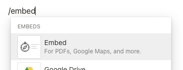
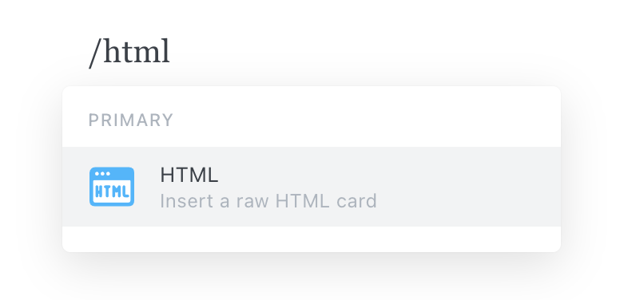

Embed stories to showcase your work to teammates and the developer community at large. In order to use embeds, your Storybook must be published and publicly accessible.

Storybook supports `<iframe>` embeds out of the box. If you use Chromatic to [publish Storybook](./publish-storybook.md#publish-storybook-with-chromatic), you can also embed stories in Notion, Medium, and countless other platforms that support the oEmbed standard.

## Embed a story with the toolbar

Embed a story with the toolbar, and paste the published story URL. For example:

<!-- prettier-ignore-start -->

```js
// oEmbed
https://5ccbc373887ca40020446347-wtuhidckxo.chromatic.com/?path=/story/shadowboxcta--default

// iframe embed
<iframe
  src="https://5ccbc373887ca40020446347-wtuhidckxo.chromatic.com/?path=/story/shadowboxcta--default&full=1&shortcuts=false&singleStory=true"
  width="800"
  height="260"
></iframe>
```

<!-- prettier-ignore-end -->

<br/>

<iframe src="https://5ccbc373887ca40020446347-wtuhidckxo.chromatic.com/?path=/story/shadowboxcta--default&full=1&shortcuts=false&singleStory=true" width="800" height="260"></iframe>

## Embed a story without the toolbar

To embed a plain story without Storybook's toolbar, click the "open canvas in new tab" icon in the top-right corner of Storybook to get the canvas URL. For example:

<!-- prettier-ignore-start -->

```js
// oEmbed
https://5ccbc373887ca40020446347-wtuhidckxo.chromatic.com/iframe.html?id=/story/shadowboxcta--default&viewMode=story

// iframe embed
 <iframe
  src="https://5ccbc373887ca40020446347-wtuhidckxo.chromatic.com/iframe.html?id=shadowboxcta--default&viewMode=story&shortcuts=false&singleStory=true"
  width="800"
  height="200"
></iframe>
```
<!-- prettier-ignore-end -->

<br/>

<iframe src="https://5ccbc373887ca40020446347-wtuhidckxo.chromatic.com/iframe.html?id=shadowboxcta--default&viewMode=story&shortcuts=false&singleStory=true" width="800" height="200"></iframe>

## Embed documentation

Embed a documentation page by replacing `viewMode=story` with the uniquely auto-generated documentation entry for the story.

<!-- prettier-ignore-start -->

```js
// oEmbed
https://5ccbc373887ca40020446347-wtuhidckxo.chromatic.com/iframe.html?id=shadowboxcta--docs&viewMode=docs&shortcuts=false&singleStory=true

// iframe embed
 <iframe
  src="https://5ccbc373887ca40020446347-wtuhidckxo.chromatic.com/iframe.html?id=shadowboxcta--docs&viewMode=docs&shortcuts=false&singleStory=true"
  width="800"
  height="400"
></iframe>
```

<!-- prettier-ignore-end -->

<br/>

<iframe src="https://5ccbc373887ca40020446347-wtuhidckxo.chromatic.com/iframe.html?id=shadowboxcta--docs&viewMode=docs&shortcuts=false&singleStory=true" width="800" height="400"></iframe>

## Embed stories on other platforms

Every platform has different levels of embed support. Check the documentation of your service to see how they recommend embedding external content.

<details>

<summary>How to embed in Medium</summary>

Paste the Storybook URL into your Medium article, then press Enter. The embed will automatically resize to fit the story's height.

While editing an article, Medium renders all embeds non-interactive. Once your article is published, it will become interactive. [Preview a demo on Medium](https://medium.com/@ghengeveld/embedding-storybook-on-medium-ce8a280c03ad).

<video autoPlay muted playsInline loop>
  <source
    src="embed-medium-optimized.mp4"
    type="video/mp4"
  />
</video>

</details>

<details>

<summary>How to embed in Notion</summary>

In your Notion document, type /embed, press Enter, and paste the story URL as the embed link. You can resize the embed as necessary.



</details>

<details>

<summary>How to embed in Ghost</summary>

Type `/html` in your Ghost post, press Enter and paste the iframe URL. You can resize the embed via the width and height properties as required.



</details>
