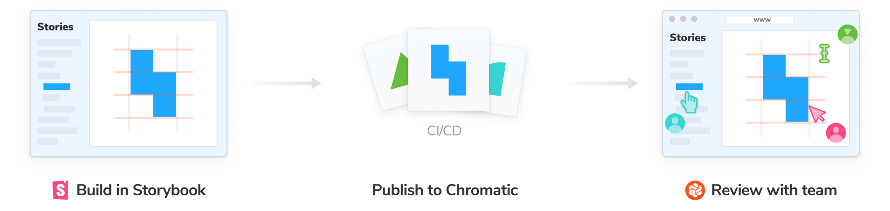
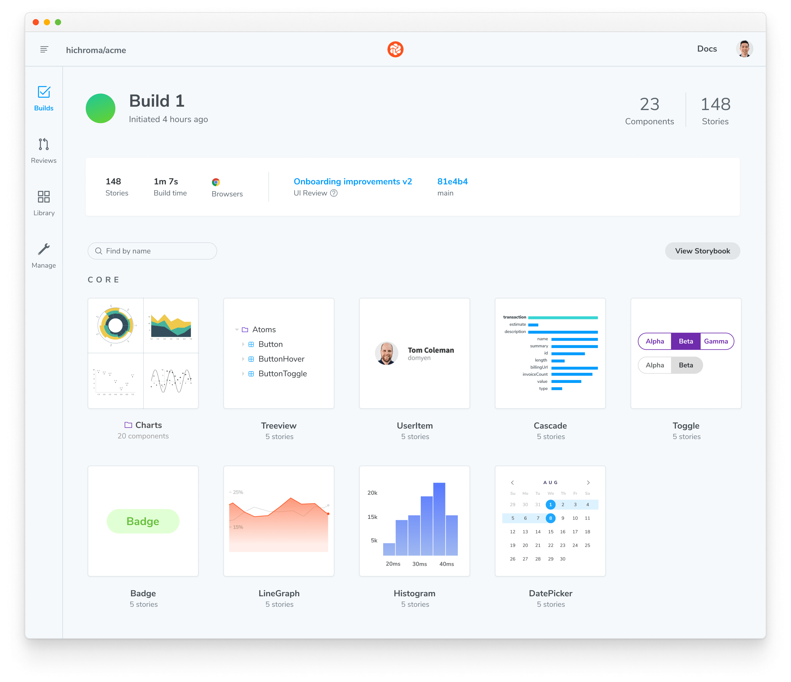
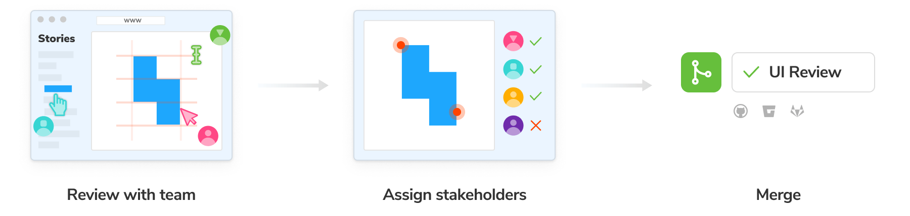
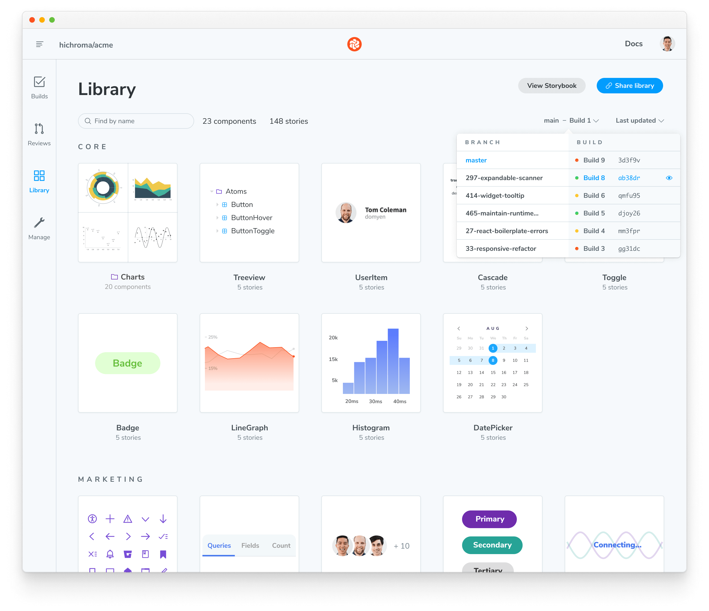

<YouTubeCallout id="zhrboql8UuU" title="How to Test UI AUTOMATICALLY — Storybook and Chromatic" />

Teams publish Storybook online to review and collaborate on works in progress. That allows developers, designers, PMs, and other stakeholders to check if the UI looks right without touching code or requiring a local dev environment.

<video autoPlay muted playsInline loop>
  <source
    src="storybook-workflow-publish.mp4"
    type="video/mp4"
  />
</video>

## Build Storybook as a static web application

First, we'll need to build Storybook as a static web application. The functionality is already built-in and pre-configured for most supported frameworks. Others require a bit of customization (e.g., Angular). Run the following command inside your project's root directory:

<!-- prettier-ignore-start -->

<CodeSnippets
  paths={[
    'angular/custom-build-script-production.script-for-builder.js.mdx',
    'angular/build-storybook-production-mode.with-builder.js.mdx',
    'common/build-storybook-production-mode.yarn.js.mdx',
    'common/build-storybook-production-mode.npm.js.mdx',
    'common/build-storybook-production-mode.pnpm.js.mdx',
  ]}
/>

<!-- prettier-ignore-end -->

<Callout variant="info" icon="💡">

You can provide additional flags to customize the command. Read more about the flag options [here](../api/cli-options.md).

</Callout>

Storybook will create a static web application capable of being served by any web server. Preview it locally by running the following command:

<!-- prettier-ignore-start -->

<CodeSnippets
  paths={[
    'common/preview-storybook-production-mode.npm.js.mdx',
    'common/preview-storybook-production-mode.pnpm.js.mdx',
  ]}
/>

<!-- prettier-ignore-end -->

### Customizing the build for performance

By default, Storybook's production build will encapsulate all stories and documentation into the production bundle. This is ideal for small projects but can cause performance issues for larger projects or when decreased build times are a priority (e.g., testing, CI/CD). If you need, you can customize the production build with the [`test` option](../api/main-config-build.md#test) in your `main.js|ts` configuration file and adjust your build script to enable the optimizations with the `--test` [flag](../api/cli-options.md#build).

<!-- prettier-ignore-start -->

<CodeSnippets
  paths={[
    'common/storybook-build-test-flag.yarn.js.mdx',
    'common/storybook-build-test-flag.npm.js.mdx',
    'common/storybook-build-test-flag.pnpm.js.mdx',
  ]}
/>

<!-- prettier-ignore-end -->

## Publish Storybook with Chromatic

Once you've built your Storybook as a static web application, you can publish it to your web host. We recommend [Chromatic](https://www.chromatic.com/?utm_source=storybook_website&utm_medium=link&utm_campaign=storybook), a free publishing service made for Storybook that documents, versions, and indexes your UI components securely in the cloud.



To get started, sign up with your GitHub, GitLab, Bitbucket, or email and generate a unique _project-token_ for your project.

Next, install the [Chromatic CLI](https://www.npmjs.com/package/chromatic) package from npm:

<!-- prettier-ignore-start -->

<CodeSnippets
  paths={[
    'common/chromatic-install.yarn.js.mdx',
    'common/chromatic-install.npm.js.mdx',
  ]}
/>

<!-- prettier-ignore-end -->

Run the following command after the package finishes installing. Make sure that you replace `your-project-token` with your own project token.

```shell
npx chromatic --project-token=<your-project-token>
```

When Chromatic finishes, you should have successfully deployed your Storybook. Preview it by clicking the link provided (i.e., https://random-uuid.chromatic.com).

```shell
Build 1 published.

View it online at https://www.chromatic.com/build?appId=...&number=1.
```



### Setup CI to publish automatically

Configure your CI environment to publish your Storybook and [run Chromatic](https://www.chromatic.com/docs/ci?utm_source=storybook_website&utm_medium=link&utm_campaign=storybook) whenever you push code to a repository. Let's see how to set it up using GitHub Actions.

In your project's root directory, add a new file called `chromatic.yml` inside the `.github/workflows` directory:

<!-- prettier-ignore-start -->

<CodeSnippets
  paths={[
    'common/chromatic-github-action.js.mdx',
  ]}
/>

<!-- prettier-ignore-end -->

<Callout variant="info" icon="💡">

Secrets are secure environment variables provided by GitHub so that you don't need to hard code your `project-token`. Read the [official documentation](https://docs.github.com/en/actions/security-guides/encrypted-secrets#creating-encrypted-secrets-for-a-repository) to learn how to configure them.

</Callout>

Commit and push the file. Congratulations, you've successfully automated publishing your Storybook. Now whenever you open a PR you’ll get a handy link to your published Storybook in your PR checks.


### Review with your team

Publishing Storybook as part of the development process makes it quick and easy to [gather team feedback](https://storybook.js.org/tutorials/design-systems-for-developers/react/en/review/).

A common method to ask for review is to paste a link to the published Storybook in a pull request or Slack.

If you publish your Storybook to Chromatic, you can use the [UI Review](https://www.chromatic.com/features/publish?utm_source=storybook_website&utm_medium=link&utm_campaign=storybook) feature to automatically scan your PRs for new and updated stories. That makes it easy to identify what changed and give feedback.



### Versioning and history

When you publish Storybook, you also get component history and versioning down to the commit. That's useful during implementation review for comparing components between branches/commits to past versions.



## Publish Storybook to other services

Since Storybook is built as a static web application, you can also publish it to any web host, including [GitHub Pages](https://docs.github.com/en/pages), [Netlify](https://www.netlify.com/), [AWS S3](https://aws.amazon.com/s3/), and more. However, features such as [Composition](./storybook-composition.md), [embedding stories](./embed.md), history, versioning, and assets may require tighter integration with Storybook APIs and secure authentication. If you want to know more about headers, you can refer to the [Migration guide](https://github.com/storybookjs/storybook/blob/main/MIGRATION.md#deploying-build-artifacts). Additionally, if you want to learn about the Component Publishing Protocol (CPP), you can find more information below.

### GitHub Pages

To deploy Storybook on GitHub Pages, use the community-built [Deploy Storybook to GitHub Pages](https://github.com/bitovi/github-actions-storybook-to-github-pages) Action. To enable it, create a new workflow file inside your `.github/workflows` directory with the following content:

<!-- prettier-ignore-start -->

<CodeSnippets
  paths={[
    'common/ghp-github-action.yml.mdx',
  ]}
/>

<!-- prettier-ignore-end -->

<Callout variant="info">

The GitHub Pages Action requires additional configuration options to customize the deployment process. Refer to the [official documentation](https://github.com/marketplace/actions/deploy-storybook-to-github-pages) for more information.

</Callout>

<details>

<summary><h2>Component Publishing Protocol (CPP)</h2></summary>

Storybook can communicate with services that host built Storybooks online. This enables features such as [Composition](./storybook-composition.md). We categorize services via compliance with the "Component Publishing Protocol" (CPP) with various levels of support in Storybook.

### CPP level 1

This level of service serves published Storybooks and makes the following available:

- Versioned endpoints, URLs that resolve to different published Storybooks depending on a `version=x.y.z` query parameter (where `x.y.z` is the released version of the package).
- Support for `/index.json` (formerly `/stories.json`) endpoint, which returns a list of stories and their metadata.
- Support for `/metadata.json` and the `releases` field.

Example: [Chromatic](https://www.chromatic.com/?utm_source=storybook_website&utm_medium=link&utm_campaign=storybook)

### CPP level 0

This level of service can serve published Storybooks but has no further integration with Storybook’s APIs.

Examples: [Netlify](https://www.netlify.com/), [S3](https://aws.amazon.com/en/s3/)

</details>

## Search engine optimization (SEO)

If your Storybook is publicly viewable, you may wish to configure how it is represented in search engine result pages.

### Description

You can provide a description for search engines to display in the results listing, by adding the following to the `manager-head.html` file in your config directory:

<!-- prettier-ignore-start -->

<CodeSnippets
  paths={[
    'common/seo-description.html.mdx',
  ]}
/>

<!-- prettier-ignore-end -->

### Preventing your Storybook from being crawled

You can prevent your published Storybook from appearing in search engine results by including a noindex meta tag, which you can do by adding the following to the `manager-head.html` file in your config directory:

<!-- prettier-ignore-start -->

<CodeSnippets
  paths={[
    'common/seo-noindex.html.mdx',
  ]}
/>

<!-- prettier-ignore-end -->
