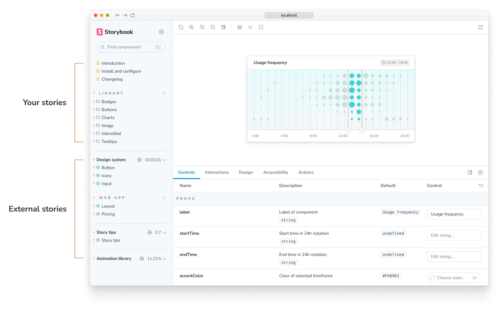
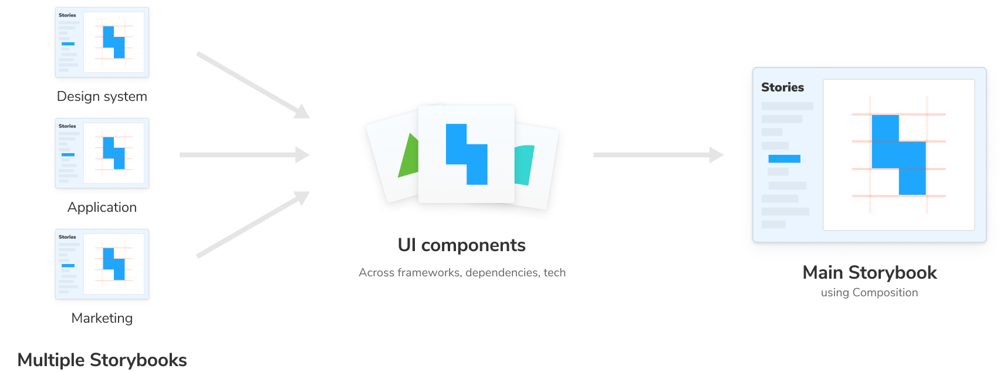

Composition allows you to browse components from any Storybook accessible via URL inside your local Storybook. You can compose any [Storybook published online](./publish-storybook.md) or running locally no matter the view layer, tech stack, or dependencies.



You’ll see the composed Storybook’s stories in the sidebar alongside your own. This unlocks common workflows that teams often struggle with:

- 👩‍💻 UI developers can quickly reference prior art without switching between Storybooks.
- 🎨 Design systems can expand adoption by composing themselves into their users’ Storybooks.
- 🛠 Frontend platform can audit how components are used across projects.
- 📚 View multiple Storybooks with different tech stacks in one place



## Compose published Storybooks

In your [`.storybook/main.js`](../configure/index.md#configure-story-rendering) file add a `refs` field with information about the reference Storybook. Pass in a URL to a statically built Storybook.

<!-- prettier-ignore-start -->

<CodeSnippets
  paths={[
    'common/main-config-refs.js.mdx',
    'common/main-config-refs.ts.mdx',
  ]}
/>

<!-- prettier-ignore-end -->

<Callout variant="info" icon="💡">

Limitation: Addons in composed Storybooks will not work as they normally do in a non-composed Storybook.

</Callout>

## Compose local Storybooks

You can also compose multiple Storybooks that are running locally. For instance, if you have a React Storybook and an Angular Storybook running on different ports, you can update your configuration file (i.e., `.storybook/main.js`) and reference them;

<!-- prettier-ignore-start -->

<CodeSnippets
  paths={[
    'common/storybook-main-ref-local.js.mdx',
    'common/storybook-main-ref-local.ts.mdx',
  ]}
/>

<!-- prettier-ignore-end -->

Adding this configuration will combine React and Angular Storybooks into your current one. You’ll see the changes being applied automatically when either of these changes. Enabling you to develop both frameworks in sync.

## Compose Storybooks per environment

You can also compose Storybooks based on the current development environment (e.g., development, staging, production). For instance, if the project you're working on already has a published Storybook but also includes a version with cutting-edge features not yet released, you can adjust the composition based on that. For example:

<!-- prettier-ignore-start -->

<CodeSnippets
  paths={[
    'common/main-config-refs-with-function.js.mdx',
    'common/main-config-refs-with-function.ts.mdx',
  ]}
/>

<!-- prettier-ignore-end -->

<Callout variant="info" icon="💡">

Similar to the other fields available in Storybook’s configuration file, the `refs` field can also be a function that accepts a config parameter containing Storybook’s configuration object. Check the [Webpack documentation](../builders/webpack.md#override-the-default-configuration) to learn more about it.

</Callout>

## Improve your Storybook composition

So far, we've seen how we can use composition with local or published Storybooks. As your Storybook will grow in time with your stories or through composition with other Storybooks, you can optimize the deployment process using various methods.

### With feature flags

If you're using Storybook 6.4, or higher, you can optimize your composition via the `buildStoriesJson` feature flag, allowing you to generate `index.json` and `stories.json` files with the required information, providing you with a seamless integration without the need for additional dependencies. For example:

<!-- prettier-ignore-start -->

<CodeSnippets
  paths={[
    'common/main-config-features-build-stories-json.js.mdx',
    'common/main-config-features-build-stories-json.ts.mdx',
  ]}
/>

<!-- prettier-ignore-end -->

<Callout variant="info" icon="💡">

If you already enabled automatic code splitting via the [`storyStoreV7`](https://storybook.js.org/docs/builders/webpack#code-splitting), you won't need this flag as it will automatically generate the `index.json` file.

</Callout>

When you compose a Storybook featuring this flag, it will use the information retrieved from the file to populate the UI with your composed Storybook stories automatically. Here's an example of the output generated by the `index.json` file:

<!-- prettier-ignore-start -->

<CodeSnippets
  paths={[
    'common/storybook-storiesjsonflag-result.json.mdx',
  ]}
/>

<!-- prettier-ignore-end -->

### With the CLI

If you're working with an outdated Storybook version or have a project-specific requirement that prevents you from enabling the `buildStoriesJson` feature flag. In that case, you can use Storybook's CLI to automatically generate the `index.json` file when you deploy your Storybook. For example:

```shell
npx storybook extract
```

<Callout variant="info" icon="💡">

`storybook extract` uses [Puppeteer](https://www.npmjs.com/package/puppeteer), which downloads and installs Chromium. Set the environment `SB_CHROMIUM_PATH` to configure your local Chromium installation.

</Callout>

Although a good approach to improve composition, it comes with a cost, as it will require an additional dependency being added and increased build times. Once it finishes executing, it will generate an `index.json` file in the default build directory (`storybook-static`) with the information related to your Storybook. Here’s an example of the file contents:

<!-- prettier-ignore-start -->

<CodeSnippets
  paths={[
    'common/storybook-extract-result.json.mdx',
  ]}
/>

<!-- prettier-ignore-end -->

Linking to a Storybook deployed using this approach will yield all the stories and other relevant information displayed in the UI.

If you need, you can also add additional arguments to this command. For instance, if you want to generate the `index.json` file into a custom directory, you can use the following:

```shell
npx storybook extract my-built-storybook-directory my-other-directory/index.json
```

When executed, it will look up a built Storybook in the `my-built-storybook-directory` and create the `index.json` file in the `my-other-directory` with all the necessary information.

<Callout variant="info" icon="💡">

If you need to use the arguments, you’ll need to include both of them, or the command will fail.

</Callout>
