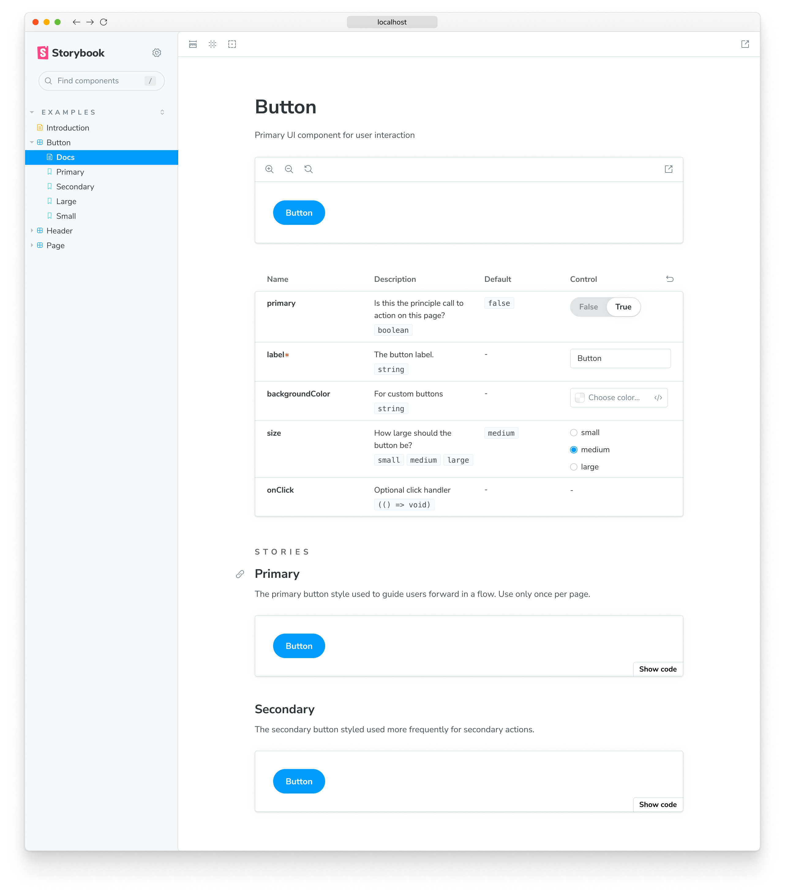

<YouTubeCallout id="BLUmt0j7OLY" title="INSTANT documentation with Storybook 7 AUTODOCS" />

Storybook Autodocs is a powerful tool that can help you quickly generate comprehensive documentation for your UI components. By leveraging Autodocs, you're transforming your stories into living documentation which can be further extended with [MDX](./mdx.md) and [Doc Blocks](./doc-blocks.md) to provide a clear and concise understanding of your components' functionality.

## Setup automated documentation

To enable auto-generated documentation for your stories, you'll need to add the `tags` configuration property to the story's default export. For example:

<!-- prettier-ignore-start -->

<CodeSnippets
  paths={[
    'react/button-story-auto-docs.js.mdx',
    'react/button-story-auto-docs.ts.mdx',
    'vue/button-story-auto-docs.js.mdx',
    'vue/button-story-auto-docs.ts.mdx',
    'angular/button-story-auto-docs.ts.mdx',
    'svelte/button-story-auto-docs.js.mdx',
    'web-components/button-story-auto-docs.js.mdx',
    'web-components/button-story-auto-docs.ts.mdx',
  ]}
/>

<!-- prettier-ignore-end -->

Once the story loads, Storybook infers the relevant metadata (e.g., [`args`](../writing-stories/args.md), [`argTypes`](../api/argtypes.md), [`parameters`](../writing-stories/parameters.md)) and automatically generates a documentation page with this information positioned at the root-level of your component tree in the sidebar.

### Configure

By default, Storybook offers zero-config support for documentation and automatically sets up a documentation page for each story enabled via the `tags` configuration property. However, you can extend your Storybook configuration file (i.e., `.storybook/main.js|ts|cjs`) and provide additional options to control how documentation gets created. Listed below are the available options and examples of how to use them.

<!-- prettier-ignore-start -->

<CodeSnippets
  paths={[
    'common/storybook-auto-docs-full-config.js.mdx',
    'common/storybook-auto-docs-full-config.ts.mdx',
  ]}
/>

<!-- prettier-ignore-end -->

| Option        | Description                                                                                                                                                                                                                                                                                                              |
| ------------- | ------------------------------------------------------------------------------------------------------------------------------------------------------------------------------------------------------------------------------------------------------------------------------------------------------------------------ |
| `autodocs`    | Configures auto-generated documentation pages. Available options: `true`, `false`,`tag` (default). `true`/`false` enable/disable autodocs globally. `tag` allows you to opt in per component by adding the `tags: ['autodocs']` annotation in the component's default export.   Default: `docs: { autodocs: 'tag' }` |
| `defaultName` | Renames the auto-generated documentation page  Default: `docs: { defaultName: 'Documentation' }`                                                                                                                                                                                                                     |

### Write a custom template

<YouTubeCallout id="q8SY4yyNE6Q" title="Custom Autodocs with Storybook 7 Docs Page | Quick Tips" />

To replace the default documentation template used by Storybook, you can extend your UI configuration file (i.e., `.storybook/preview.js|ts`) and introduce a `docs` [parameter](./doc-blocks.md#customizing-the-automatic-docs-page). This parameter accepts a `page` function that returns a React component, which you can use to generate the required template. For example:

<!-- prettier-ignore-start -->

<CodeSnippets
  paths={[
    'common/storybook-preview-auto-docs-custom-template-function.js.mdx',
    'common/storybook-preview-auto-docs-custom-template-function.ts.mdx',
  ]}
/>

<!-- prettier-ignore-end -->

<Callout variant="info" icon="💡">

Internally, Storybook uses a similar implementation to generate the default template. See the Doc Blocks [API reference](./doc-blocks.md#available-blocks) to learn more about how Doc Blocks work.

</Callout>

Going over the code snippet in more detail. When Storybook starts up, it will override the default template with the custom one composed of the following:

1. A header with the component's metadata retrieved by the `Title`, `Subtitle`, and `Description` Doc Blocks.
2. The first story defined in the file via the `Primary` Doc Block with a handy set of UI controls to zoom in and out of the component.
3. An interactive table with all the relevant [`args`](../writing-stories/args.md) and [`argTypes`](../api/argtypes.md) defined in the story via the `Controls` Doc Block.
4. A overview of the remaining stories via the `Stories` Doc Block.

#### With MDX

You can also use MDX to generate the documentation template. This is useful in non-React projects where JSX-handling is not configured. Normally, when you create an MDX file in your project, it is treated as normal documentation. To indicate that an MDX file is a documentation template, supply the `isTemplate` property to its [`Meta`](../api/doc-block-meta.md) Doc Block. For example:

<!-- prettier-ignore-start -->

<CodeSnippets
  paths={[
    'common/storybook-mdx-template-with-prop.mdx.mdx',
  ]}
/>

<!-- prettier-ignore-end -->

Then you can use it in your `.storybook/preview.js` or an individual story file by importing it:

<!-- prettier-ignore-start -->

<CodeSnippets
  paths={[
    'common/storybook-preview-auto-docs-custom-mdx-template.js.mdx',
  ]}
/>

<!-- prettier-ignore-end -->

<Callout variant="info" icon="💡">

If you only need to override the documentation page for a single component, we recommend creating an MDX file and referencing it directly via the `<Meta of={} />` Doc Block.

</Callout>

### Generate a table of contents

Storybook's auto-generated documentation pages can be quite long and difficult to navigate. To help with this, you can enable the table of contents feature to provide a quick overview of the documentation page and allow users to jump to a specific section. To enable it, extend your Storybook UI configuration file (i.e., `.storybook/preview.js`) and provide a `docs` [parameter](../writing-stories/parameters.md#global-parameters) with a `toc` property.

<!-- prettier-ignore-start -->

<CodeSnippets
  paths={[
    'common/storybook-preview-enable-toc.js.mdx',
    'common/storybook-preview-enable-toc.ts.mdx',
  ]}
/>

<!-- prettier-ignore-end -->

### Configure the table of contents

By default, the table of contents on the documentation page will only show the `h3` headings that are automatically generated. However, if you want to customize the table of contents, you can add more parameters to the `toc` property. The following options and examples of how to use them are available.

| Option                | Description                                                                                                                                          |
| --------------------- | ---------------------------------------------------------------------------------------------------------------------------------------------------- |
| `contentsSelector`    | Defines the container's CSS selector for search for the headings   `toc: { contentsSelector: '.sbdocs-content' }`                                |
| `disable`             | Hides the table of contents for the documentation pages   `toc: { disable: true }`                                                               |
| `headingSelector`     | Defines the list of headings to feature in the table of contents   `toc: { headingSelector: 'h1, h2, h3' }`                                      |
| `ignoreSelector`      | Configures the table of contents to ignore specific headings or stories   `toc: { ignoreSelector: 'h2' }`                                        |
| `title`               | Defines a title caption for the table of contents.  Accepts one of: `string`, `null`, React element   `toc: { title: 'Table of Contents' }`  |
| `unsafeTocbotOptions` | Provides additional [`TocBot`](https://tscanlin.github.io/tocbot/) configuration options   `toc: { unsafeTocbotOptions: { orderedList: true } }` |

<Callout variant="info">

The `contentsSelector`, `headingSelector`, and `ignoreSelector` properties allow additional customization. For more information on using them, see the [`Tocbot` documentation](https://tscanlin.github.io/tocbot/).

</Callout>

<!-- prettier-ignore-start -->

<CodeSnippets
  paths={[
    'common/storybook-preview-custom-toc.js.mdx',
    'common/storybook-preview-custom-toc.ts.mdx',
  ]}
/>

<!-- prettier-ignore-end -->

#### Component-level configuration

If you want to customize the table of contents for a specific story, you can include a `toc` property in the story's default export and provide the required [configuration](#configure-the-table-of-contents). For example, if you need to hide the table of contents for a specific story, adjust your story as follows:

<!-- prettier-ignore-start -->

<CodeSnippets
  paths={[
    'angular/my-component-disable-toc.ts.mdx',
    'web-components/my-component-disable-toc.js.mdx',
    'web-components/my-component-disable-toc.ts.mdx',
    'common/my-component-disable-toc.js.mdx',
    'common/my-component-disable-toc.ts.mdx',
  ]}
/>

<!-- prettier-ignore-end -->

### Customize component documentation

Creating automated documentation with Storybook's Autodocs provides you with the starting point to build a sustainable documentation pattern. Nevertheless, it may not be suited for every case, and you may want to extend it and provide additional information. We recommend combining [MDX](./mdx.md) alongside Storybook's [Doc Blocks](./doc-blocks.md) for such cases to author your documentation.

## Advanced configuration

### Customize the Docs Container

The Docs Container is the component that wraps up the documentation page. It's responsible for rendering the documentation page in Storybook's UI. You can customize it by creating your own component and updating your Storybook UI configuration file (i.e., `.storybook/preview.js`) to reference it.

<!-- prettier-ignore-start -->

<CodeSnippets
  paths={[
    'common/storybook-preview-auto-docs-custom-docs-container.js.mdx',
    'common/storybook-preview-auto-docs-custom-docs-container.ts.mdx',
  ]}
/>

<!-- prettier-ignore-end -->

### Override the default theme

By default, Storybook provides two themes for the UI: `light` and `dark`. If you need to customize the theme used by the documentation to match the existing one, you can update your Storybook UI configuration file (i.e., `.storybook/preview.js`) and apply it.

<!-- prettier-ignore-start -->

<CodeSnippets
  paths={[
    'common/storybook-preview-auto-docs-override-theme.js.mdx',
    'common/storybook-preview-auto-docs-override-theme.ts.mdx',
  ]}
/>

<!-- prettier-ignore-end -->

### Working with custom MDX components

Out of the box, Storybook has a set of components that you can use to customize your documentation page. If you're working with a design system or component library and wish to add them to your documentation page, you can override the `MDXProvider` component inherited from `@mdx-js/react` with your own. However, there's a caveat to this, the component replacement will only have an impact if you're writing documentation using Markdown syntax (e.g., `#` for headings). Native HTML elements, such as `<h1>`, will not be replaced with your custom implementation.

<!-- prettier-ignore-start -->

<CodeSnippets
  paths={[
    'common/storybook-preview-auto-docs-override-mdx-container.js.mdx',
    'common/storybook-preview-auto-docs-override-mdx-container.ts.mdx',
  ]}
/>

<!-- prettier-ignore-end -->

<Callout variant="info" icon="💡">

This is not a Storybook issue but a breaking change introduced with MDX 2. For more information on this and other breaking changes, see our [MDX documentation](./mdx.md#breaking-changes).

</Callout>

## Troubleshooting

### The table of contents doesn't render as expected

When using Autodocs's table of contents, you may encounter situations where it appears differently than expected. To help you resolve these problems, we have compiled a list of possible scenarios that may cause issues. If you've run into any of the items listed below and you're interested in helping us improve the support for this feature, we encourage you to reach out to the maintainers using the default communication channels (e.g., [Discord server](https://discord.com/channels/486522875931656193/570426522528382976), [GitHub issues](https://github.com/storybookjs/storybook/issues)).

#### With simple documentation pages

If you have a documentation page with only one matching heading and create a table of contents for it, the table of contents will not be hidden by default. A potential solution for this issue would be to add a second heading or turn it off entirely.

#### With small screens

If the screen width is less than 1200px, the table of contents will be hidden by default. Currently, there's no built-in solution for this issue that doesn't impact the documentation page's style compatibility.

#### With MDX

If you're writing [unattached documentation](./mdx.md#writing-unattached-documentation) using MDX, you cannot customize the table of contents primarily due to the lack of support for defining parameters based on the current implementation. As a result, the table of contents will always revert to the default [configuration](#configure-the-table-of-contents) provided globally.

### The auto-generated documentation is not showing up in a monorepo setup

Out of the box, Storybook's Autodocs feature is built to generate documentation for your stories automatically. Nevertheless, if you're working with a monorepo setup (e.g., [`Yarn Workspaces`](https://yarnpkg.com/features/workspaces), [`pnpm Workspaces`](https://pnpm.io/workspaces)), you may run into issues where part of the documentation may not be generated for you. To help you troubleshoot those issues, we've prepared some recommendations that might help you.

Update your import statements to reference the component directly instead of the package's root. For example:

<!-- prettier-ignore-start -->

<CodeSnippets
  paths={[
    'common/storybook-fix-imports-autodocs-monorepo.js.mdx',
    'common/storybook-fix-imports-autodocs-monorepo.ts.mdx',
  ]}
/>

<!-- prettier-ignore-end -->

Additionally, if you're developing using TypeScript, you may need to update Storybook's configuration file (i.e., `.storybook/main.js|ts`) to include the following:

<!-- prettier-ignore-start -->

<CodeSnippets
  paths={[
    'common/storybook-main-fix-imports-autodocs-monorepo.js.mdx',
    'common/storybook-main-fix-imports-autodocs-monorepo.ts.mdx',
  ]}
/>

<!-- prettier-ignore-end -->

If you're still encountering issues, we recommend reaching out to the maintainers using the default communication channels (e.g., [Discord server](https://discord.com/channels/486522875931656193/570426522528382976), [GitHub issues](https://github.com/storybookjs/storybook/issues)).

#### Learn more about Storybook documentation

- Autodocs for creating documentation for your stories
- [MDX](./mdx.md) for customizing your documentation
- [Doc Blocks](./doc-blocks.md) for authoring your documentation
- [Publishing docs](./build-documentation.md) to automate the process of publishing your documentation
