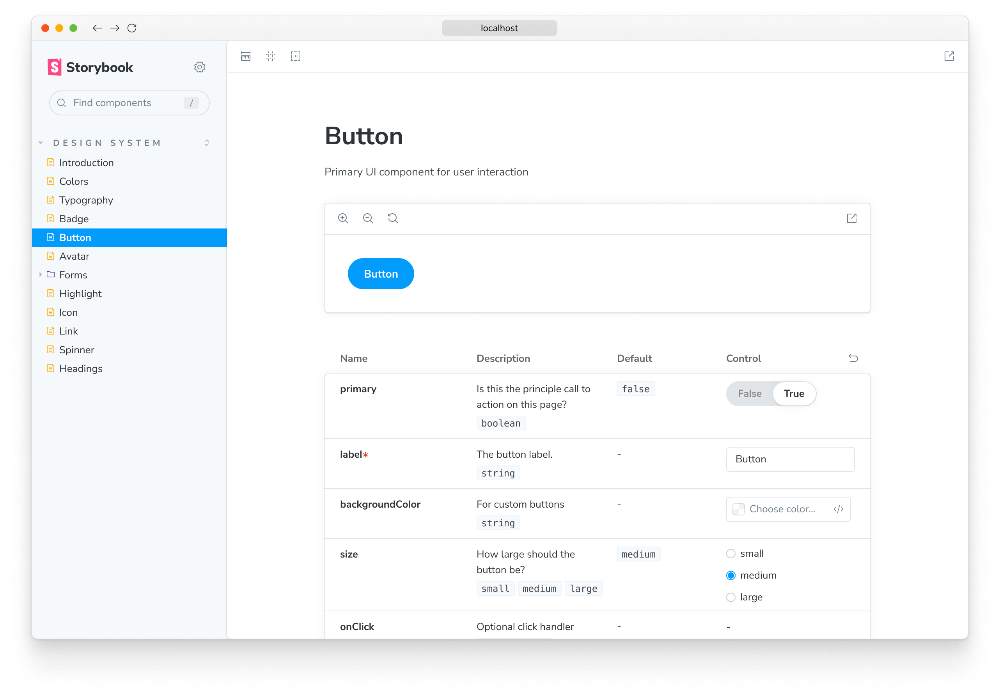

Storybook allows you to create rich and extensive [documentation](./introduction.md) that will help you and any other stakeholder involved in the development process. Out of the box you have the tooling required to not only write it but also to preview it and build it.

## Preview Storybook's documentation

At any point during your development, you can preview the documentation you've written. Storybook allows you to generate a preview of the final documentation when you use the `--docs` flag. We recommend including it in your `package.json` as a new script:

```json
{
  "scripts": {
    "storybook-docs": "storybook dev --docs"
  }
}
```

Depending on your configuration, when you execute the `storybook-docs` script. Storybook will be put into documentation mode and will generate a different build.

It will look for any stories available either in [MDX](./mdx.md) or [CSF](../writing-stories/introduction.md#component-story-format) and based on the documentation you've added it will display it...



There's some caveats to this build mode, as to the normal Storybook build:

- The top level item refers to the primary story for your component.
- Each individual story is now in a flattened display mode, with a different set of icons. This allows focus on the documentation itself.
- Storybook's layout is rendered differently. The toolbar will not be displayed.

## Publish Storybook's documentation

You can also publish your documentation, the same you would [publish](../sharing/publish-storybook.md) your Storybook. You can use the `--docs` flag with `build-storybook` command. We recommend as well including it as a script in your `package.json` file:

```json
{
  "scripts": {
    "build-storybook-docs": "storybook build --docs"
  }
}
```

Based on the configuration you have, when the `build-storybook-docs` script is executed, Storybook once again will be put into documentation mode and will generate a different build and output the documentation into the `storybook-static` folder.

The same caveats mentioned above will apply.

You can use any hosting provider to deploy your documentation, for instance:

- [Vercel](https://vercel.com/)
- [Netlify](https://www.netlify.com/)
- [S3](https://aws.amazon.com/en/s3/)

#### Learn more about Storybook documentation

- [Autodocs](./autodocs.md) for creating documentation for your stories
- [MDX](./mdx.md) for customizing your documentation
- [Doc Blocks](./doc-blocks.md) for authoring your documentation
- Publishing docs to automate the process of publishing your documentation
