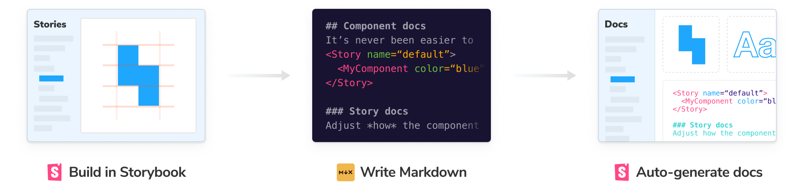
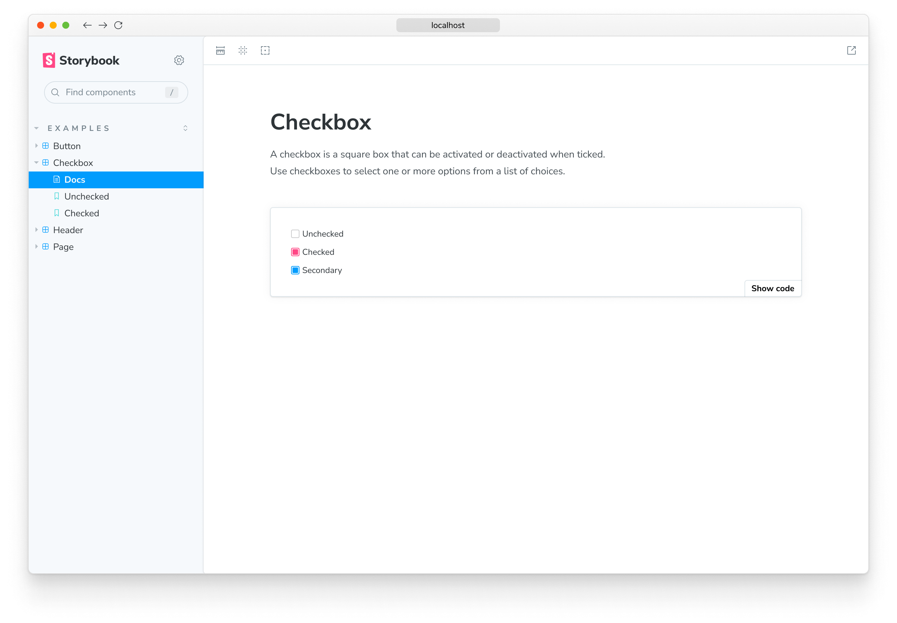
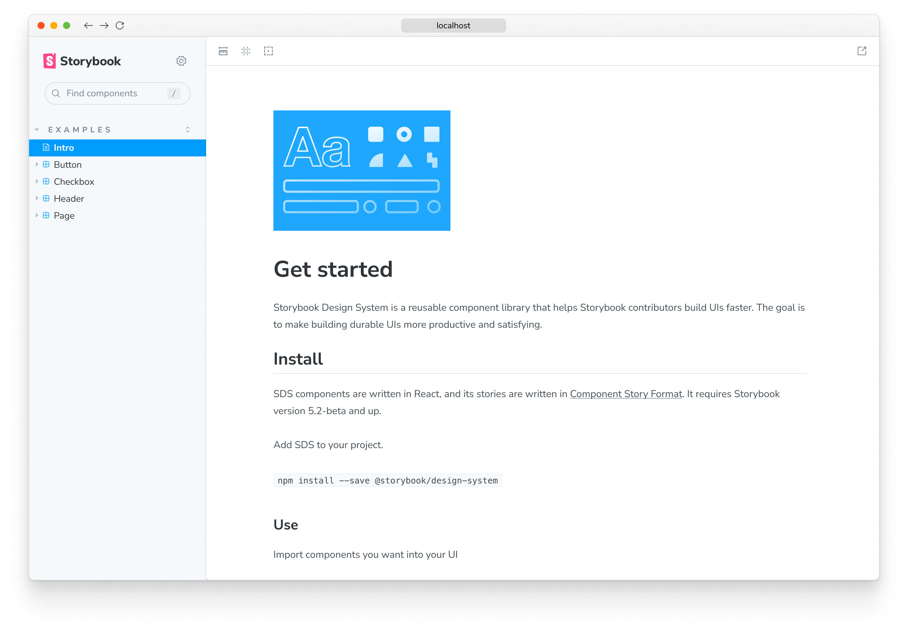
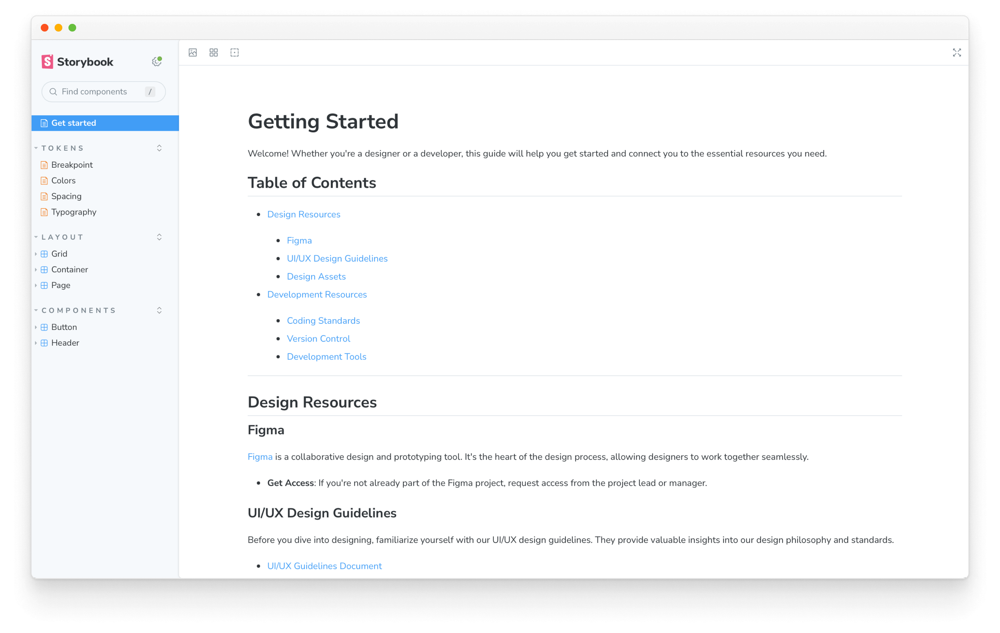
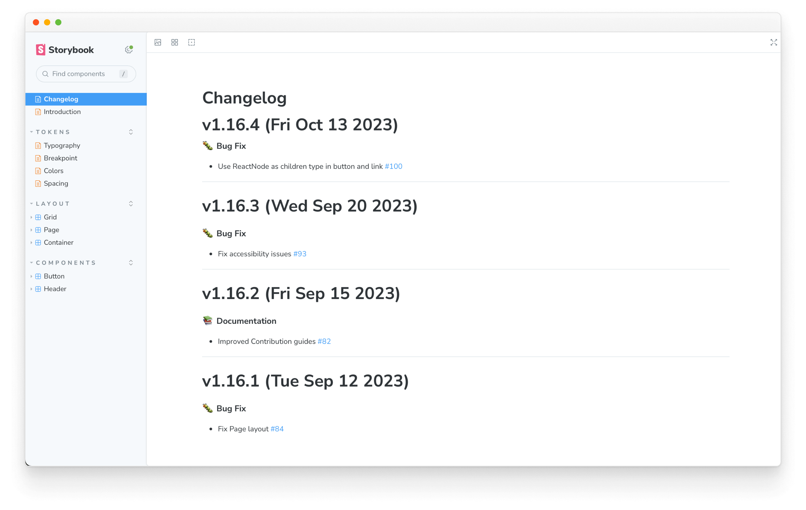

<YouTubeCallout id="YeIvFke5_5Y" title="MDX Storybook Quick Tips" />

[MDX](https://mdxjs.com/) files mix Markdown and Javascript/JSX to create rich interactive documentation. You can use Markdown’s readable syntax (such as `# heading`) for your documentation, include stories defined in [Component Story Format (CSF)](../api/csf.md), and freely embed JSX component blocks at any point in the file. All at once.

In addition, you can write pure documentation pages in MDX and add them to Storybook alongside your stories.



<Callout variant="info">

Writing stories directly in MDX was deprecated in Storybook 7. Please reference the [previous documentation](../../../release-6-5/docs/writing-docs/mdx.md) for guidance on that feature.

</Callout>

## Basic example

Let's start with an example, `Checkbox.mdx`, combining Markdown with a single story.

<!-- prettier-ignore-start -->

<CodeSnippets
  paths={[
    'common/checkbox-story.mdx.mdx',
  ]}
/>

<!-- prettier-ignore-end -->

This MDX file references a story file, `Checkbox.stories.js|ts`, that is written in [Component Story Format (CSF)](../api/csf.md):

<!-- prettier-ignore-start -->

<CodeSnippets
  paths={[
    'angular/checkbox-story-csf.ts.mdx',
    'web-components/checkbox-story-csf.js.mdx',
    'web-components/checkbox-story-csf.ts.mdx',
    'common/checkbox-story-csf.js.mdx',
    'common/checkbox-story-csf.ts.mdx',
  ]}
  usesCsf3
  csf2Path="writing-docs/mdx#snippet-checkbox-story-csf"
/>

<!-- prettier-ignore-end -->

And here's how that's rendered in Storybook:



There’s a lot going on here. We're writing Markdown, we're writing JSX, and we're also defining and referencing Storybook stories that are drop-in compatible with the entire Storybook ecosystem.

Let’s break it down.

### MDX and CSF

The first thing you'll notice is that the component documentation is divided into distinct formats: one for writing component stories describing each possible component state and the second one for documenting how to use them. This split leverages the best qualities of each format:

- **CSF** is great for succinctly defining stories (component examples). If you use TypeScript, it also provides type safety and auto-completion.
- **MDX** is great for writing structured documentation and composing it with interactive JSX elements.

<Callout variant="info" icon="💡">

If you’re coming from a previous version of Storybook, you might be accustomed to using MDX both for **documentation** and for defining **stories** in the same `.stories.mdx` file. We’ve deprecated this functionality and plan to remove it in a future version of Storybook. We provide [migration](#automigration) scripts to help you onto the new format.

</Callout>

### Anatomy of MDX

Assuming you’re already familiar with writing stories with [CSF](../writing-stories/index.md), we can dissect the MDX side of things in greater detail.

The document consists of a number of blocks separated by blank lines. Since MDX mixes a few different languages together, it uses those blank lines to help distinguish where one starts, and the next begins. Failing to separate blocks by whitespace can cause (sometimes cryptic) parse errors.

Going through the code blocks in sequence:

<!-- prettier-ignore-start -->

```mdx
{ /* Checkbox.mdx */ }
```

<!-- prettier-ignore-end -->

Comments in MDX are JSX blocks that contain JS comments.

<!-- prettier-ignore-start -->

<CodeSnippets
  paths={[
    'common/storybook-auto-docs-mdx-docs-imports.mdx.mdx',
  ]}
/>

<!-- prettier-ignore-end -->

Imports the components and stories that will be used in the JSX throughout the rest of the file.

<!-- prettier-ignore-start -->

<CodeSnippets
  paths={[
    'common/storybook-auto-docs-mdx-docs-meta-block.mdx.mdx',
  ]}
/>

<!-- prettier-ignore-end -->

<Callout variant="info">

When providing the `of` prop to the `Meta` block, make sure that you're referencing the [**default export**](../api/csf.md#default-export) of the story file and not the component itself to prevent render issues with the generated documentation.

</Callout>

The `Meta` block defines where the document will be placed in the sidebar. In this case, it is adjacent to the Checkbox’s stories. By default, the docs sidebar node is titled `"Docs"`, but this can be customized by passing a `name` prop (e.g., `<Meta of={CheckboxStories} name="Info" />`). If you want to place a docs node at an arbitrary point in the navigation hierarchy, you can use the `title` prop (e.g., `<Meta title="path/to/node" />`).

<!-- prettier-ignore-start -->

<CodeSnippets
  paths={[
    'common/storybook-auto-docs-mdx-docs-definition.mdx.mdx',
  ]}
/>

<!-- prettier-ignore-end -->

MDX2 supports standard markdown ([”commonmark”](https://commonmark.org/)) by default and can be extended to support [GitHub-flavored markdown (GFM)](https://github.github.com/gfm) and other extensions (see [Breaking changes](#breaking-changes), below).

<!-- prettier-ignore-start -->

<CodeSnippets
  paths={[
    'common/storybook-auto-docs-mdx-docs-story.mdx.mdx',
  ]}
/>

<!-- prettier-ignore-end -->

Finally, MDX supports blocks of arbitrary JSX.

In this case, we are leveraging “Doc Blocks”, a library of documentation components designed to work with Storybook stories to show your stories, your component APIs & controls for interacting with your components inside your documentation, among other utilities.

In addition to Doc Blocks, MDX can incorporate arbitrary React components, making it a very flexible documentation system. Suppose you want a stylized list of “dos and don’ts” for your component; you can use off-the-shelf components or write your own.

<!-- prettier-ignore-start -->

<CodeSnippets
  paths={[
    'common/storybook-auto-docs-mdx-docs-dos-donts.mdx.mdx',
  ]}
/>

<!-- prettier-ignore-end -->

### Known limitations

While MDX2 supports a variety of runtimes ([React](https://mdxjs.com/packages/react/), [Preact](https://mdxjs.com/packages/preact/), [Vue](https://mdxjs.com/packages/vue/)), Storybook’s implementation is React-only. That means your documentation is rendered in React, while your stories render in the runtime of your choice (React, Vue, Angular, Web Components, Svelte, etc.).

## Breaking changes

There are many breaking changes if you move from MDX 1 to version 2. As far as we know, all of these are due to changes in the MDX library itself rather than changes to Storybook’s usage. Nevertheless, as an MDX user, you will probably need to update your MDX files as part of the upgrade. MDX has published its own [Migration guide](https://mdxjs.com/migrating/v2/#update-mdx-files). Here, we try to summarize some of the fundamental changes for Storybook users.

### Custom components apply differently

From the MDX migration guide:

> We now “sandbox” components, for lack of a better name. It means that when you pass a component for `h1`, it does get used for `# hi` but not for `<h1>hi</h1>`

This means that the first heading in the following example gets replaced, whereas the second does not. It may not sound like a significant change, but in practice, it is highly disruptive and manifests itself in various ways. Unfortunately, this cannot be automatically converted in a safe way.

<!-- prettier-ignore-start -->

```md
# Some heading

<h1>another heading</h1>
```

<!-- prettier-ignore-end -->

### Lack of GitHub Flavored Markdown (GFM)

Also, from the MDX migration guide:

> We turned off GFM features in MDX by default. GFM extends CommonMark to add autolink literals, footnotes, strikethrough, tables, and task lists. If you do want these features, you can use a plugin. How to do so is described in [our guide on GFM](https://mdxjs.com/guides/gfm/).

In Storybook, you can apply MDX options, including plugins, in the main configuration file:

<!-- prettier-ignore-start -->

<CodeSnippets
paths={[
  'common/storybook-main-config-remark-options.js.mdx',
  'common/storybook-main-config-remark-options.ts.mdx',
]}
/>

<!-- prettier-ignore-end -->

<Callout variant="info" icon="💡">

The [`remark-gfm`](https://github.com/remarkjs/remark-gfm) package isn't provided by default during migration. We recommend installing it as a development dependency if you use its features.

</Callout>

### Automigration

To help you transition to the new version, we've created a migration helper in our CLI. We recommend using it and reaching out to the maintainers using the default communication channels (e.g., [Discord server](https://discord.com/channels/486522875931656193/570426522528382976), [GitHub issues](https://github.com/storybookjs/storybook/issues)) for problems you encounter.

```shell
npx storybook@latest automigrate mdx1to2
```

## Setup custom documentation

In addition, to document your components with MDX, you can also extend it to write other types of content, such as guidelines or best practices on how to use them. To enable custom documentation for your stories with this format, start by updating your Storybook configuration file (i.e., `.storybook/main.js|ts|cjs`).

<!-- prettier-ignore-start -->

<CodeSnippets
  paths={[
    'common/storybook-auto-docs-main-mdx-config.js.mdx',
    'common/storybook-auto-docs-main-mdx-config.ts.mdx',
  ]}
/>

<!-- prettier-ignore-end -->

Create an MDX file to add your custom documentation. Depending on how you want your documentation to render in the UI, you'll need to consider the following use cases.

### Using the `Meta` Doc Block

If you need to match the component documentation to an existing story, you can configure the [`Meta`](../api/doc-block-meta.md) Doc Block to control how the documentation gets rendered. Out of the box, it allows you to define a custom title or a reference to the story you need to document (i.e., via the `of` prop). For example:

<!-- prettier-ignore-start -->

<CodeSnippets
  paths={[
    'common/storybook-auto-docs-baseline-example.custom-title.mdx.mdx',
    'common/storybook-auto-docs-baseline-example.of-prop.mdx.mdx',
  ]}
/>

<!-- prettier-ignore-end -->

### Writing unattached documentation

Suppose you're documenting an existing component and only provide the `Meta` Doc Block without additional props or other blocks. In that case, Storybook will consider it as "unattached" documentation, or in other words, a "documentation-only" page, and it will render it differently in the sidebar navigation menu:

<!-- prettier-ignore-start -->

<CodeSnippets
paths={[
  'common/storybook-auto-docs-mdx-docs-docs-only-page.mdx.mdx',
]}
/>

<!-- prettier-ignore-end -->



### Using the File System

However, providing the `Meta` Doc Block may not be required for certain use cases, such as standalone pages or even as guidelines for testing your components. In that case, you can safely omit it. Storybook will instead rely on the file's physical location to place the documentation in the sidebar, overriding any pre-existent [auto-generated](./autodocs.md) documentation with your own. For example:

<!-- prettier-ignore-start -->

<CodeSnippets
  paths={[
    'common/storybook-auto-docs-custom-file.mdx.mdx',
  ]}
/>

<!-- prettier-ignore-end -->

<Callout variant="info" icon="💡">

If you're overriding an existing auto-generated documentation page enabled via [`tags`](./autodocs.md#setup-automated-docs) configuration property, we recommend removing it to avoid errors.

</Callout>

Once the custom MDX documentation is loaded, Storybook will infer the title and location using the same heuristic rules to generate [auto-title stories](../configure/sidebar-and-urls.md#csf-30-auto-titles) and render it in the sidebar as a `Docs` entry.

#### Working with standalone documentation pages

Writing standalone documentation pages is a common use case that applies not only on a per-component but also on a per-project basis. For example, you might want to document your project's onboarding process with instructions on using it. To do so, you can create a new MDX file containing your documentation using a similar structure and content:

<!-- prettier-ignore-start -->

<CodeSnippets
  paths={[
    'common/storybook-auto-docs-standalone-page.mdx.mdx',
  ]}
/>

<!-- prettier-ignore-end -->



When Storybook loads the documentation, it will infer the placement of the page in the sidebar navigation menu using the file's physical location and render it as a `Docs` entry.

### Fully control custom documentation

Documentation can be expensive to maintain and keep up to date when applied to every project component. To help simplify this process, Storybook provides a set of useful UI components (i.e., Doc Blocks) to help cover more advanced cases. If you need additional content, use them to help create your custom documentation.

<!-- prettier-ignore-start -->

<CodeSnippets
  paths={[
    'common/storybook-auto-docs-starter-example.mdx.mdx',
  ]}
/>

<!-- prettier-ignore-end -->

### Working with multiple components

If you need to document multiple components in a single documentation page, you can reference them directly inside your MDX file. Internally, Storybook looks for the story metadata and composes it alongside your existing documentation. For example:

<!-- prettier-ignore-start -->

<CodeSnippets
  paths={[
    'common/storybook-auto-docs-mdx-file.mdx.mdx',
  ]}
/>

<!-- prettier-ignore-end -->

### Generate documentation from Markdown

If you need to extend your documentation with additional content written in Markdown, you can use the `Markdown` Doc Block to import the available content, and Storybook will render it alongside your existing documentation. For example, if you have a `CHANGELOG.md` file, you can import it and render it in your documentation page as follows:

<!-- prettier-ignore-start -->

<CodeSnippets
  paths={[
    'common/storybook-custom-docs-markdown.mdx.mdx',
  ]}
/>

<!-- prettier-ignore-end -->

<Callout variant="info">

The `Markdown` Doc Block provides additional configuration options to customize the rendering of your documentation. For more information, refer to the [API documentation](../api/doc-block-markdown.md).

</Callout>



### Linking to other stories and pages

Another way to improve documentation is by linking to other stories and pages. Suppose you already have a component story with the following unique identifier, `some--id`, and you want to link it to your documentation page. In that case, you can use the `path` query string to redirect to the documentation entry related to the story:

```md
[Go to specific documentation page](?path=/docs/some--id)
```

Instead, if you need to target a specific documentation section, you can adjust the link to point at it. For example:

```md
[Go to the conclusion of the documentation page](?path=/docs/some--id#conclusion)
```

However, cross-linking documentation isn't restricted to documentation pages. You can adjust the `path` query and supply the story's unique identifier if you need to reference a specific one. For example:

<!--This redirects to the **Canvas** tab of the story: -->

```md
[Go to specific story canvas](?path=/story/some--id)
```

<!--You can also use anchors to target a specific section of a page: -->

<Callout variant="info" icon="💡">

By applying this pattern with the Controls addon, all anchors will be ignored in Canvas based on how Storybook handles URLs to track the args values.

</Callout>

## Troubleshooting

### The MDX documentation doesn't render in my environment

As Storybook relies on MDX 2 to render documentation, some technical limitations may prevent you from migrating to this version. If that's the case, we've prepared a set of instructions to help you transition to this new version.

#### Storybook doesn't create documentation for my component stories

If you run into a situation where Storybook is not able to detect and render the documentation for your component stories, it may be due to a misconfiguration in your Storybook. Check your configuration file (i.e., `.storybook/main.js|ts`) and ensure the `stories` configuration element provides the correct path to your stories location(e.g., `../src/**/*.stories.@(js|jsx|mjs|ts|tsx)`).

#### The documentation doesn't render using `stories.mdx`

Starting with Storybook 7.0, we've deprecated documenting stories with the `.stories.mdx` file extension. If you're still using the `stories.mdx` extension, we recommend [migrating](#automigration) as soon as possible to avoid any issues, as the majority of APIs and [Doc Blocks](./doc-blocks.md) used by Storybook were overhauled to support MDX 2 and the new MDX compiler (e.g., the [`Meta`](../api/doc-block-meta.md) block).

#### MDX 1 fallback

If you're still having issues with MDX documentation, you can enable MDX 1 as a fallback. To do so, you'll need to take some additional steps.

Run the following command to install the required dependency.

<!-- prettier-ignore-start -->

<CodeSnippets
  paths={[
    'common/storybook-fallback-mdx-install.yarn.js.mdx',
    'common/storybook-fallback-mdx-install.npm.js.mdx',
    'common/storybook-fallback-mdx-install.pnpm.js.mdx',
  ]}
/>

<!-- prettier-ignore-end -->

Update your Storybook configuration (in `.storybook/main.js|ts`), and provide the `legacyMdx1` feature flag to enable MDX 1 support.

<!-- prettier-ignore-start -->

<CodeSnippets
  paths={[
    'common/main-config-features-legacy-mdx-1.js.mdx',
    'common/main-config-features-legacy-mdx-1.ts.mdx',
  ]}
/>

<!-- prettier-ignore-end -->

### The migration seems flaky and keeps failing

By default, running the [migration command](#automigration) will try and migrate all existing MDX files in your project according to the MDX 2 specification. However, this might not always be possible, and you might run into issues during the migration. To help you troubleshoot those issues, we've prepared some recommendations that might help you.

Start by running the following command inside your project directory:

```shell
npx @hipster/mdx2-issue-checker
```

<Callout variant="info" icon="💡">

Depending on the volume, you may be required to run the command multiple times to fix all the issues.

</Callout>

When it finishes, it will output the list of files causing issues. You can then use this information to fix the problems manually.

Additionally, if you're working with VSCode, you can add the [MDX extension](https://marketplace.visualstudio.com/items?itemName=unifiedjs.vscode-mdx) and enable MDX experimental support for linting, type checking, and auto-completion by adding the following to your user settings:

```json
{
  "mdx.experimentalLanguageServer": true
}
```

If you're still encountering issues, we recommend reaching out to the maintainers using the default communication channels (e.g., [Discord server](https://discord.com/channels/486522875931656193/570426522528382976), [GitHub issues](https://github.com/storybookjs/storybook/issues)).

#### Learn more about Storybook documentation

- [Autodocs](./autodocs.md) for creating documentation for your stories
- MDX for customizing your documentation
- [Doc Blocks](./doc-blocks.md) for authoring your documentation
- [Publishing docs](./build-documentation.md) to automate the process of publishing your documentation
