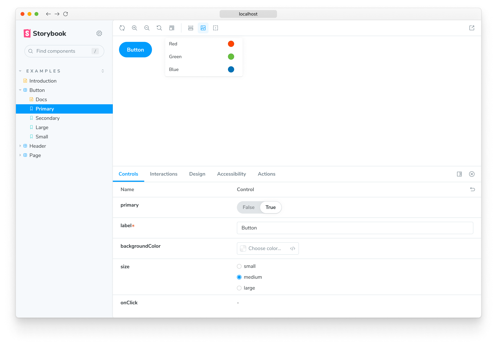

<YouTubeCallout id="P0WHt_L0-2g" title="How to write Storybook stories | Component Story Format" />

A story captures the rendered state of a UI component. It’s a function that returns a component’s state given a set of arguments.

Storybook uses the generic term arguments (args for short) when talking about React’s `props`, Vue’s `props`, Angular’s `@Input`, and other similar concepts.

## Where to put stories

A component’s stories are defined in a story file that lives alongside the component file. The story file is for development-only, and it won't be included in your production bundle.

```
Button.js | ts | jsx | tsx | vue | svelte
Button.stories.js | ts | jsx | tsx
```

## Component Story Format

We define stories according to the [Component Story Format](../api/csf.md) (CSF), an ES6 module-based standard that is easy to write and portable between tools.

The key ingredients are the [default export](https://developer.mozilla.org/en-US/docs/Web/JavaScript/Reference/Statements/export#Using_the_default_export) that describes the component, and [named exports](https://developer.mozilla.org/en-US/docs/Web/JavaScript/Reference/Statements/export#Using_named_exports) that describe the stories.

### Default export

The _default_ export metadata controls how Storybook lists your stories and provides information used by addons. For example, here’s the default export for a story file `Button.stories.js|ts`:

<!-- prettier-ignore-start -->

<CodeSnippets
  paths={[
    'react/button-story-default-export-with-component.js.mdx',
    'react/button-story-default-export-with-component.ts.mdx',
    'vue/button-story-default-export-with-component.js.mdx',
    'vue/button-story-default-export-with-component.ts.mdx',
    'angular/button-story-default-export-with-component.ts.mdx',
    'svelte/button-story-default-export-with-component.js.mdx',
    'web-components/button-story-default-export-with-component.js.mdx',
    'html/button-story-default-export.js.mdx',
    'html/button-story-default-export.ts.mdx',
    'solid/button-story-default-export-with-component.js.mdx',
    'solid/button-story-default-export-with-component.ts.mdx',
  ]}
/>

<!-- prettier-ignore-end -->

<Callout variant="info">

Starting with Storybook version 7.0, story titles are analyzed statically as part of the build process. The _default_ export must contain a `title` property that can be read statically or a `component` property from which an automatic title can be computed. Using the `id` property to customize your story URL must also be statically readable.

</Callout>

### Defining stories

Use the _named_ exports of a CSF file to define your component’s stories. We recommend you use UpperCamelCase for your story exports. Here’s how to render `Button` in the “primary” state and export a story called `Primary`.

<!-- prettier-ignore-start -->

<CodeSnippets
  paths={[
    'react/button-story.js.mdx',
    'react/button-story.ts.mdx',
    'vue/button-story.js.mdx',
    'vue/button-story.ts.mdx',
    'angular/button-story.ts.mdx',
    'web-components/button-story.js.mdx',
    'web-components/button-story.ts.mdx',
    'svelte/button-story.js.mdx',
    'html/button-story.js.mdx',
    'html/button-story.ts.mdx',
    'solid/button-story.js.mdx',
    'solid/button-story.ts.mdx',
  ]}
  usesCsf3
  csf2Path="writing-stories/#snippet-button-story"
/>

<!-- prettier-ignore-end -->

<IfRenderer renderer='react'>

#### Working with React Hooks

[React Hooks](https://react.dev/reference/react) are convenient helper methods to create components using a more streamlined approach. You can use them while creating your component's stories if you need them, although you should treat them as an advanced use case. We **recommend** [args](./args.md) as much as possible when writing your own stories. As an example, here’s a story that uses React Hooks to change the button's state:

<!-- prettier-ignore-start -->

<CodeSnippets
  paths={[
    'react/button-story.with-hooks.js.mdx',
    'react/button-story.with-hooks.ts.mdx',
  ]}
  usesCsf3
  csf2Path="writing-stories/#snippet-button-story-with-hooks"
/>

<!-- prettier-ignore-end -->

<Callout variant="info" icon="💡">

The recommendation mentioned above also applies to other frameworks, not only React.

</Callout>

</IfRenderer>

<IfRenderer renderer='solid'>

#### Working with Solid Signals

[Solid Signals](https://www.solidjs.com/docs/latest/api#basic-reactivity) are convenient helper methods to create components using a more streamlined approach. You can use them while creating your component's stories if you need them, although you should treat them as an advanced use case. We **recommend** [args](./args.md) as much as possible when writing your own stories. As an example, here’s a story that uses Solid Signals to change the button's state:

<!-- prettier-ignore-start -->

<CodeSnippets
  paths={[
    'solid/button-story.with-hooks.js.mdx',
    'solid/button-story.with-hooks.ts.mdx',
  ]}
  usesCsf3
  csf2Path="writing-stories/#snippet-button-story-with-hooks"
/>

<!-- prettier-ignore-end -->

<Callout variant="info" icon="💡">

The recommendation mentioned above also applies to other frameworks, not only Solid.

</Callout>

</IfRenderer>

### Rename stories

You can rename any particular story you need. For instance, to give it a more accurate name. Here's how you can change the name of the `Primary` story:

<!-- prettier-ignore-start -->

<CodeSnippets
  paths={[
    'react/button-story-rename-story.js.mdx',
    'react/button-story-rename-story.ts.mdx',
    'vue/button-story-rename-story.js.mdx',
    'vue/button-story-rename-story.ts.mdx',
    'angular/button-story-rename-story.ts.mdx',
    'web-components/button-story-rename-story.js.mdx',
    'web-components/button-story-rename-story.ts.mdx',
    'svelte/button-story-rename-story.js.mdx',
    'html/button-story-rename-story.js.mdx',
    'html/button-story-rename-story.ts.mdx',
    'solid/button-story-rename-story.js.mdx',
    'solid/button-story-rename-story.ts.mdx',
  ]}
  usesCsf3
  csf2Path="writing-stories/#snippet-button-story-rename-story"
/>

<!-- prettier-ignore-end -->

Your story will now be shown in the sidebar with the given text.

## How to write stories

A story is a function that describes how to render a component. You can have multiple stories per component, and the simplest way to create stories is to render a component with different arguments multiple times.

<!-- prettier-ignore-start -->

<CodeSnippets
  paths={[
    'react/button-story-with-emojis.js.mdx',
    'react/button-story-with-emojis.ts.mdx',
    'vue/button-story-with-emojis.js.mdx',
    'vue/button-story-with-emojis.ts.mdx',
    'angular/button-story-with-emojis.ts.mdx',
    'web-components/button-story-with-emojis.js.mdx',
    'web-components/button-story-with-emojis.ts.mdx',
    'svelte/button-story-with-emojis.js.mdx',
    'html/button-story-with-emojis.js.mdx',
    'html/button-story-with-emojis.ts.mdx',
    'solid/button-story-with-emojis.js.mdx',
    'solid/button-story-with-emojis.ts.mdx',
  ]}
  usesCsf3
  csf2Path="writing-stories/#snippet-button-story-with-emojis"
/>

<!-- prettier-ignore-end -->

It's straightforward for components with few stories but can be repetitive with many stories.

### Using args

Refine this pattern by introducing `args` for your component's stories. It reduces the boilerplate code you'll need to write and maintain for each story.

<!-- prettier-ignore-start -->

<CodeSnippets
  paths={[
    'react/button-story-using-args.js.mdx',
    'react/button-story-using-args.ts.mdx',
    'vue/button-story-using-args.2.js.mdx',
    'vue/button-story-using-args.2.ts.mdx',
    'vue/button-story-using-args.3.js.mdx',
    'vue/button-story-using-args.3.ts.mdx',
    'angular/button-story-using-args.ts.mdx',
    'web-components/button-story-using-args.js.mdx',
    'web-components/button-story-using-args.ts.mdx',
    'svelte/button-story-using-args.js.mdx',
    'html/button-story-using-args.js.mdx',
    'html/button-story-using-args.ts.mdx',
    'solid/button-story-using-args.js.mdx',
    'solid/button-story-using-args.ts.mdx',
  ]}
  usesCsf3
  csf2Path="writing-stories/#snippet-button-story-using-args"
/>

<!-- prettier-ignore-end -->

By introducing args into your component's stories, you're not only reducing the amount of code you need to write, but you're also decreasing data duplication, as shown by spreading the `Primary` story's args into the other stories.

What’s more, you can import `args` to reuse when writing stories for other components, and it's helpful when you’re building composite components. For example, if we make a `ButtonGroup` story, we might remix two stories from its child component `Button`.

<!-- prettier-ignore-start -->

<CodeSnippets
  paths={[
    'react/button-group-story.js.mdx',
    'react/button-group-story.ts.mdx',
    'angular/button-group-story.ts.mdx',
    'vue/button-group-story.2.js.mdx',
    'vue/button-group-story.2.ts.mdx',
    'vue/button-group-story.3.js.mdx',
    'vue/button-group-story.3.ts.mdx',
    'web-components/button-group-story.js.mdx',
    'web-components/button-group-story.ts.mdx',
    'svelte/button-group-story.js.mdx',
    'solid/button-group-story.js.mdx',
    'solid/button-group-story.ts.mdx',
  ]}
  usesCsf3
  csf2Path="writing-stories/#snippet-button-group-story"
/>


<!-- prettier-ignore-end -->

When Button’s signature changes, you only need to change Button’s stories to reflect the new schema, and ButtonGroup’s stories will automatically be updated. This pattern allows you to reuse your data definitions across the component hierarchy, making your stories more maintainable.

That’s not all! Each of the args from the story function are live editable using Storybook’s [controls](../essentials/controls.md) panel. It means your team can dynamically change components in Storybook to stress test and find edge cases.

<video autoPlay muted playsInline loop>
  <source
    src="addon-controls-demo-optimized.mp4"
    type="video/mp4"
  />
</video>

Addons can enhance args. For instance, [Actions](../essentials/actions.md) auto-detects which args are callbacks and appends a logging function to them. That way, interactions (like clicks) get logged in the actions panel.

<video autoPlay muted playsInline loop>
  <source
    src="addon-actions-demo-optimized.mp4"
    type="video/mp4"
  />
</video>

### Using the play function

Storybook's `play` function and the [`@storybook/addon-interactions`](https://storybook.js.org/addons/@storybook/addon-interactions) are convenient helper methods to test component scenarios that otherwise require user intervention. They're small code snippets that execute once your story renders. For example, suppose you wanted to validate a form component, you could write the following story using the `play` function to check how the component responds when filling in the inputs with information:

<!-- prettier-ignore-start -->

<CodeSnippets
  paths={[
    'react/login-form-with-play-function.js.mdx',
    'react/login-form-with-play-function.ts.mdx',
    'angular/login-form-with-play-function.ts.mdx',
    'vue/login-form-with-play-function.js.mdx',
    'vue/login-form-with-play-function.ts.mdx',
    'web-components/login-form-with-play-function.js.mdx',
    'web-components/login-form-with-play-function.ts.mdx',
    'svelte/login-form-with-play-function.js.mdx',
    'solid/login-form-with-play-function.js.mdx',
    'solid/login-form-with-play-function.ts.mdx',
  ]}
  usesCsf3
  csf2Path="writing-stories/#snippet-login-form-with-play-function"
/>

Without the help of the `play` function and the `@storybook/addon-interactions`, you had to write your own stories and manually interact with the component to test out each use case scenario possible. 

### Using parameters

Parameters are Storybook’s method of defining static metadata for stories. A story’s parameters can be used to provide configuration to various addons at the level of a story or group of stories.

For instance, suppose you wanted to test your Button component against a different set of backgrounds than the other components in your app. You might add a component-level `backgrounds` parameter:

<!-- prettier-ignore-start -->

<CodeSnippets
  paths={[
    'react/button-story-with-blue-args.js.mdx',
    'react/button-story-with-blue-args.ts.mdx',
    'vue/button-story-with-blue-args.js.mdx',
    'vue/button-story-with-blue-args.ts.mdx',
    'angular/button-story-with-blue-args.ts.mdx',
    'web-components/button-story-with-blue-args.js.mdx',
    'web-components/button-story-with-blue-args.ts.mdx',
    'svelte/button-story-with-blue-args.js.mdx',
    'html/button-story-with-blue-args.js.mdx',
    'html/button-story-with-blue-args.ts.mdx',
    'solid/button-story-with-blue-args.js.mdx',
    'solid/button-story-with-blue-args.ts.mdx',
  ]}
/>

<!-- prettier-ignore-end -->



This parameter would instruct the backgrounds addon to reconfigure itself whenever a Button story is selected. Most addons are configured via a parameter-based API and can be influenced at a [global](./parameters.md#global-parameters), [component](./parameters.md#component-parameters) and [story](./parameters.md#story-parameters) level.

### Using decorators

Decorators are a mechanism to wrap a component in arbitrary markup when rendering a story. Components are often created with assumptions about ‘where’ they render. Your styles might expect a theme or layout wrapper, or your UI might expect specific context or data providers.

A simple example is adding padding to a component’s stories. Accomplish this using a decorator that wraps the stories in a `div` with padding, like so:

<!-- prettier-ignore-start -->

<CodeSnippets
  paths={[
    'react/button-story-component-decorator.js.mdx',
    'react/button-story-component-decorator.ts.mdx',
    'vue/button-story-component-decorator.js.mdx',
    'vue/button-story-component-decorator.ts.mdx',
    'angular/button-story-component-decorator.ts.mdx',
    'web-components/button-story-component-decorator.js.mdx',
    'web-components/button-story-component-decorator.ts.mdx',
    'svelte/button-story-component-decorator.js.mdx',
    'html/button-story-component-decorator.js.mdx',
    'html/button-story-component-decorator.ts.mdx',
    'solid/button-story-component-decorator.js.mdx',
    'solid/button-story-component-decorator.ts.mdx',
  ]}
/>

<!-- prettier-ignore-end -->

Decorators [can be more complex](./decorators.md#context-for-mocking) and are often provided by [addons](../configure/storybook-addons.md). You can also configure decorators at the [story](./decorators.md#story-decorators), [component](./decorators.md#component-decorators) and [global](./decorators.md#global-decorators) level.

## Stories for two or more components

When building design systems or component libraries, you may have two or more components created to work together. For instance, if you have a parent `List` component, it may require child `ListItem` components.

<!-- prettier-ignore-start -->

<CodeSnippets
  paths={[
    'react/list-story-starter.js.mdx',
    'react/list-story-starter.ts.mdx',
    'angular/list-story-starter.ts.mdx',
    'vue/list-story-starter.js.mdx',
    'vue/list-story-starter.ts.mdx',
    'web-components/list-story-starter.js.mdx',
    'web-components/list-story-starter.ts.mdx',
    'html/list-story-starter.js.mdx',
    'html/list-story-starter.ts.mdx',
    'solid/list-story-starter.js.mdx',
    'solid/list-story-starter.ts.mdx',
  ]}
  usesCsf3
  csf2Path="writing-stories/#snippet-list-story-starter"
/>

<!-- prettier-ignore-end -->

In such cases, it makes sense to render a different function for each story:

<!-- prettier-ignore-start -->

<CodeSnippets
  paths={[
    'react/list-story-expanded.js.mdx',
    'react/list-story-expanded.ts.mdx',
    'angular/list-story-expanded.ts.mdx',
    'vue/list-story-expanded.js.mdx',
    'vue/list-story-expanded.ts.mdx',
    'web-components/list-story-expanded.js.mdx',
    'web-components/list-story-expanded.ts.mdx',
    'html/list-story-expanded.js.mdx',
    'html/list-story-expanded.ts.mdx',
    'solid/list-story-expanded.js.mdx',
    'solid/list-story-expanded.ts.mdx',
  ]}
  usesCsf3
  csf2Path="writing-stories/#snippet-list-story-expanded"
/>

<!-- prettier-ignore-end -->

You can also reuse stories from the child `ListItem` in your `List` component. That’s easier to maintain because you don’t have to keep the identical story definitions updated in multiple places.

<!-- prettier-ignore-start -->

<CodeSnippets
  paths={[
    'react/list-story-reuse-data.js.mdx',
    'react/list-story-reuse-data.ts.mdx',
    'angular/list-story-reuse-data.ts.mdx',
    'vue/list-story-reuse-data.2.js.mdx',
    'vue/list-story-reuse-data.2.ts.mdx',
    'vue/list-story-reuse-data.3.js.mdx',
    'vue/list-story-reuse-data.3.ts.mdx',
    'web-components/list-story-reuse-data.js.mdx',
    'web-components/list-story-reuse-data.ts.mdx',
    'html/list-story-reuse-data.js.mdx',
    'html/list-story-reuse-data.ts.mdx',
    'solid/list-story-reuse-data.js.mdx',
    'solid/list-story-reuse-data.ts.mdx',
  ]}
  usesCsf3
  csf2Path="writing-stories/#snippet-list-story-reuse-data"
/>

<!-- prettier-ignore-end -->

<Callout variant="info" icon="💡">

Note that there are disadvantages in writing stories like this as you cannot take full advantage of the args mechanism and composing args as you build even more complex composite components. For more discussion, see the [multi component stories](../writing-stories/stories-for-multiple-components.md) workflow documentation.

</Callout>
