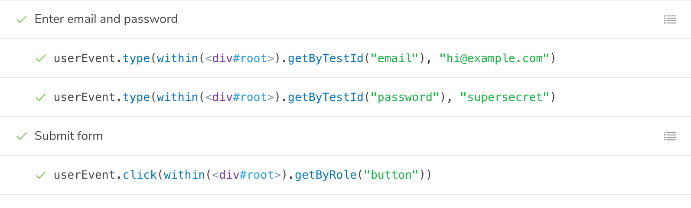
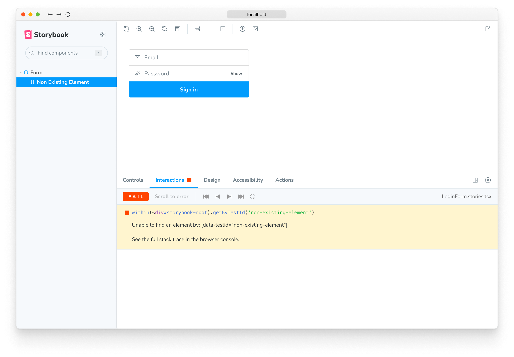
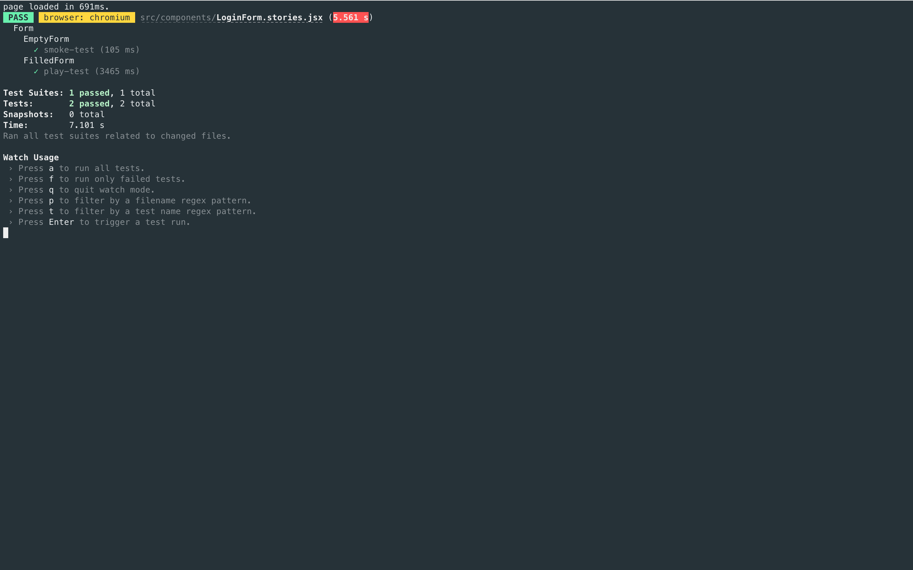

As you build more complex UIs like pages, components become responsible for more than just rendering the UI. They fetch data and manage state. Interaction tests allow you to verify these functional aspects of UIs.

In a nutshell, you start by supplying the appropriate props for the initial state of a component. Then simulate user behavior such as clicks and form entries. Finally, check whether the UI and component state update correctly.

In Storybook, this familiar workflow happens in your browser. That makes it easier to debug failures because you're running tests in the same environment as you develop components: the browser.

<video autoPlay muted playsInline loop>
  <source
    src="component-interaction-testing.mp4"
    type="video/mp4"
  />
</video>

## How does component testing in Storybook work?

You start by writing a [**story**](../writing-stories/introduction.md) to set up the component's initial state. Then simulate user behavior using the **play** function. Finally, use the **test-runner** to confirm that the component renders correctly and that your interaction tests with the **play** function pass. Additionally, you can automate test execution via the [command line](./test-runner.md#cli-options) or in your [CI environment](./test-runner.md#set-up-ci-to-run-tests).

- The [`play`](../writing-stories/play-function.md) function is a small snippet of code that runs after a story finishes rendering. You can use this to test user workflows.
- The test is written using Storybook-instrumented versions of [Jest](https://jestjs.io/) and [Testing Library](https://testing-library.com/).
- [`@storybook/addon-interactions`](https://storybook.js.org/addons/@storybook/addon-interactions/) visualizes the test in Storybook and provides a playback interface for convenient browser-based debugging.
- [`@storybook/test-runner`](https://github.com/storybookjs/test-runner) is a standalone utility—powered by [Jest](https://jestjs.io/) and [Playwright](https://playwright.dev/)—that executes all of your interactions tests and catches broken stories.

## Set up the interactions addon

To enable interaction testing with Storybook, you'll need to take additional steps to set it up properly. We recommend you go through the [test runner documentation](./test-runner.md) before proceeding with the rest of the required configuration.

Run the following command to install the interactions addon and related dependencies.

<!-- prettier-ignore-start -->

<CodeSnippets
  paths={[
    'common/storybook-addon-interactions-addon-full-install.yarn.js.mdx',
    'common/storybook-addon-interactions-addon-full-install.npm.js.mdx',
    'common/storybook-addon-interactions-addon-full-install.pnpm.js.mdx',
  ]}
/>

<!-- prettier-ignore-end -->

Update your Storybook configuration (in `.storybook/main.js|ts`) to include the interactions addon.

<!-- prettier-ignore-start -->

<CodeSnippets
  paths={[
    'common/storybook-interactions-addon-registration.js.mdx',
    'common/storybook-interactions-addon-registration.ts.mdx',
  ]}
/>

<!-- prettier-ignore-end -->

## Write an interaction test

The test itself is defined inside a `play` function connected to a story. Here's an example of how to set up an interaction test with Storybook and the `play` function:

<!-- prettier-ignore-start -->

<CodeSnippets
  paths={[
    'react/login-form-with-play-function.js.mdx',
    'react/login-form-with-play-function.ts.mdx',
    'angular/login-form-with-play-function.ts.mdx',
    'vue/login-form-with-play-function.js.mdx',
    'vue/login-form-with-play-function.ts.mdx',
    'web-components/login-form-with-play-function.js.mdx',
    'web-components/login-form-with-play-function.ts.mdx',
    'svelte/login-form-with-play-function.js.mdx',
    'solid/login-form-with-play-function.js.mdx',
    'solid/login-form-with-play-function.ts.mdx',
  ]}
  usesCsf3
  csf2Path="writing-tests/interaction-testing#snippet-login-form-with-play-function"
/>

<!-- prettier-ignore-end -->

Once the story loads in the UI, it simulates the user's behavior and verifies the underlying logic.

<video autoPlay muted playsInline loop>
  <source
    src="addon-interaction-example-optimized.mp4"
    type="video/mp4"
  />
</video>

### API for user-events

Under the hood, Storybook’s interaction addon mirrors Testing Library’s [`user-events`](https://testing-library.com/docs/user-event/intro/) API. If you’re familiar with [Testing Library](https://testing-library.com/), you should be at home in Storybook.

Below is an abridged API for user-event. For more, check out the [official user-event docs](https://testing-library.com/docs/user-event/utility/).

| User events       | Description                                                                                                                                              |
| ----------------- | -------------------------------------------------------------------------------------------------------------------------------------------------------- |
| `clear`           | Selects the text inside inputs, or textareas and deletes it <br/>`userEvent.clear(await within(canvasElement).getByRole('myinput'));`                    |
| `click`           | Clicks the element, calling a click() function <br/>`userEvent.click(await within(canvasElement).getByText('mycheckbox'));`                              |
| `dblClick`        | Clicks the element twice <br/>`userEvent.dblClick(await within(canvasElement).getByText('mycheckbox'));`                                                 |
| `deselectOptions` | Removes the selection from a specific option of a select element <br/>`userEvent.deselectOptions(await within(canvasElement).getByRole('listbox'),'1');` |
| `hover`           | Hovers an element <br/>`userEvent.hover(await within(canvasElement).getByTestId('example-test'));`                                                       |
| `keyboard`        | Simulates the keyboard events <br/>`userEvent.keyboard(‘foo’);`                                                                                          |
| `selectOptions`   | Selects the specified option, or options of a select element <br/>`userEvent.selectOptions(await within(canvasElement).getByRole('listbox'),['1','2']);` |
| `type`            | Writes text inside inputs, or textareas <br/>`userEvent.type(await within(canvasElement).getByRole('my-input'),'Some text');`                            |
| `unhover`         | Unhovers out of element <br/>`userEvent.unhover(await within(canvasElement).getByLabelText(/Example/i));`                                                |

### Group interactions with the `step` function

For complex flows, it can be worthwhile to group sets of related interactions together using the `step` function. This allows you to provide a custom label that describes a set of interactions:

<!-- prettier-ignore-start -->

<CodeSnippets
  paths={[
    'angular/storybook-interactions-step-function.ts.mdx',
    'web-components/storybook-interactions-step-function.js.mdx',
    'web-components/storybook-interactions-step-function.ts.mdx',
    'common/storybook-interactions-step-function.js.mdx',
    'common/storybook-interactions-step-function.ts.mdx',
  ]}
  usesCsf3
  csf2Path="writing-tests/interaction-testing#snippet-storybook-interactions-step-function"
/>

<!-- prettier-ignore-end -->

This will show your interactions nested in a collapsible group:



### Interactive debugger

If you check your interactions panel, you'll see the step-by-step flow. It also offers a handy set of UI controls to pause, resume, rewind, and step through each interaction.

<video autoPlay muted playsInline loop>
  <source
    src="addon-interactions-playback-controls-optimized.mp4"
    type="video/mp4"
  />
</video>

### Permalinks for reproductions

The `play` function is executed after the story is rendered. If there’s an error, it’ll be shown in the interaction addon panel to help with debugging.

Since Storybook is a webapp, anyone with the URL can reproduce the error with the same detailed information without any additional environment configuration or tooling required.



Streamline interaction testing further by automatically [publishing Storybook](../sharing/publish-storybook.md) in pull requests. That gives teams a universal reference point to test and debug stories.

## Execute tests with the test-runner

Storybook only runs the interaction test when you're viewing a story. Therefore, you'd have to go through each story to run all your checks. As your Storybook grows, it becomes unrealistic to review each change manually. Storybook [test-runner](https://github.com/storybookjs/test-runner) automates the process by running all tests for you. To execute the test-runner, open a new terminal window and run the following command:

<!-- prettier-ignore-start -->

<CodeSnippets
  paths={[
    'common/test-runner-execute.yarn.js.mdx',
    'common/test-runner-execute.npm.js.mdx',
    'common/test-runner-execute.pnpm.js.mdx',
  ]}
/>

<!-- prettier-ignore-end -->



<div class="aside">

💡 If you need, you can provide additional flags to the test-runner. Read the [documentation](./test-runner.md#cli-options) to learn more.

</div>

## Automate

Once you're ready to push your code into a pull request, you'll want to automatically run all your checks using a Continuous Integration (CI) service before merging it. Read our [documentation](./test-runner.md#set-up-ci-to-run-tests) for a detailed guide on setting up a CI environment to run tests.

## Troubleshooting

### The TypeScript types aren't recognized

If you're writing interaction tests with TypeScript, you may run into a situation where the TypeScript types aren't recognized in your IDE. This a known issue with newer package managers (e.g., pnpm, Yarn) and how they hoist dependencies. If you're working with Yarn the process happens automatically and the types should be recognized. However, if you're working with pnpm, you'll need to create a `.npmrc` file in the root of your project and add the following:

```text
// .npmrc
public-hoist-pattern[]=@types*
```

If you're still encountering issues, you can always add the [`@types/testing-library__jest-dom`](https://www.npmjs.com/package/@types/testing-library__jest-dom) package to your project.

---

#### What’s the difference between interaction tests and visual tests?

Interaction tests can be expensive to maintain when applied wholesale to every component. We recommend combining them with other methods like visual testing for comprehensive coverage with less maintenance work.

#### What's the difference between interaction tests and using Jest + Testing Library alone?

Interaction tests integrate Jest and Testing Library into Storybook. The biggest benefit is the ability to view the component you're testing in a real browser. That helps you debug visually, instead of getting a dump of the (fake) DOM in the command line or hitting the limitations of how JSDOM mocks browser functionality. It's also more convenient to keep stories and tests together in one file than having them spread across files.

#### Learn about other UI tests

- [Test runner](./test-runner.md) to automate test execution
- [Visual tests](./visual-testing.md) for appearance
- [Accessibility tests](./accessibility-testing.md) for accessibility
- Interaction tests for user behavior simulation
- [Coverage tests](./test-coverage.md) for measuring code coverage
- [Snapshot tests](./snapshot-testing.md) for rendering errors and warnings
- [End-to-end tests](./stories-in-end-to-end-tests.md) for simulating real user scenarios
- [Unit tests](./stories-in-unit-tests.md) for functionality
