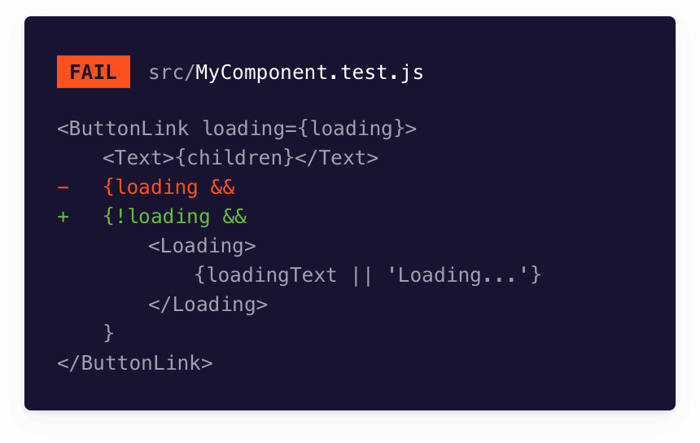
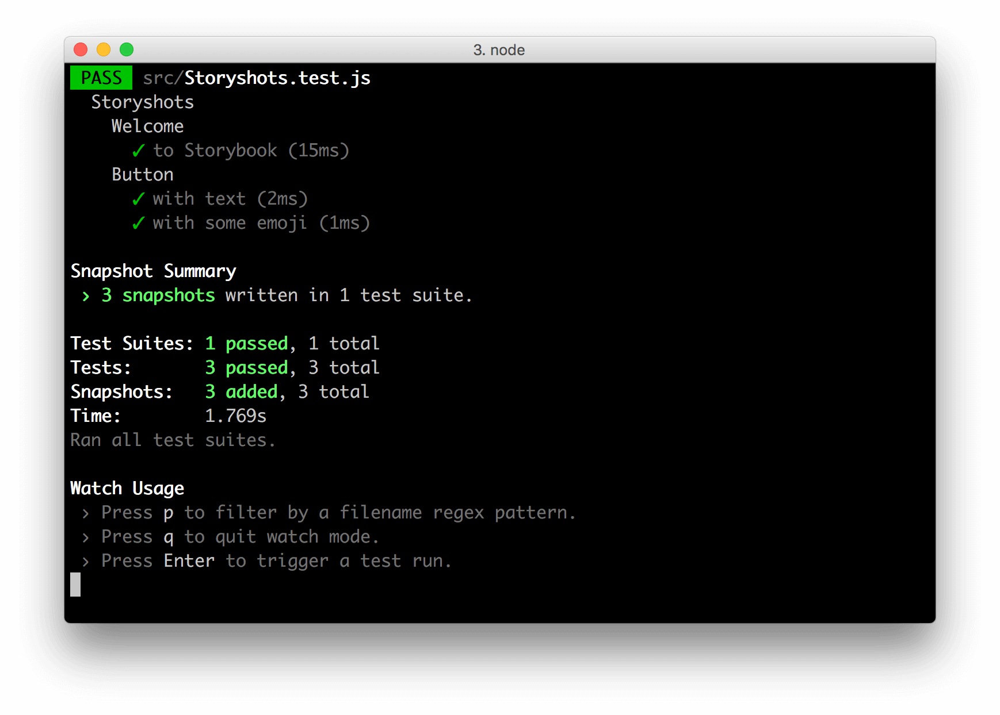
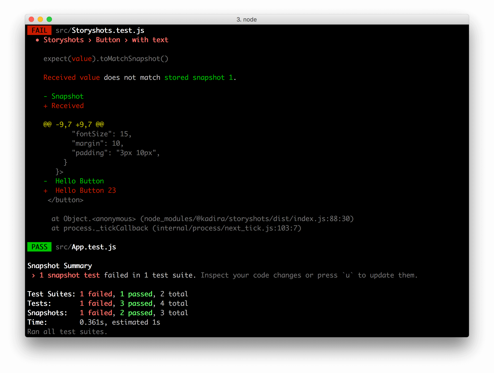

Snapshot tests compare the rendered markup of every story against known baselines. It’s a way to identify markup changes that trigger rendering errors and warnings.

Storybook is a helpful tool for snapshot testing because every story is essentially a test specification. Any time you write or update a story, you get a snapshot test for free.



## Setup Storyshots

[Storyshots](https://storybook.js.org/addons/@storybook/addon-storyshots/) is the official Storybook addon that enables snapshot testing, powered by [Jest](https://jestjs.io/docs/getting-started).

Run the following command to install Storyshots:

<!-- prettier-ignore-start -->

<CodeSnippets
  paths={[
    'common/storybook-addon-storyshots-install.yarn.js.mdx',
    'common/storybook-addon-storyshots-install.npm.js.mdx',
  ]}
/>

<!-- prettier-ignore-end -->

Add a test file to your environment with the following contents to configure Storyshots:

<!-- prettier-ignore-start -->

<CodeSnippets
  paths={[
    'common/storybook-storyshots-config.js.mdx',
  ]}
/>

<!-- prettier-ignore-end -->

<div class="aside">
💡 You can name the test file differently to suit your needs. Bear in mind that it requires to be picked up by Jest.
</div>

Run your first test. Storyshots will recognize your stories (based on [.storybook/main.js's setup](https://storybook.js.org/docs/react/configure/story-rendering)) and save them in the **snapshots** directory.

```shell
npm test storybook.test.js
```



When you make changes to your components or stories, rerun the test to identify the changes to the rendered markup.



If they're intentional, accept them as new baselines. If the changes are bugs, fix the underlying code, then rerun the snapshot tests.

### Configure the snapshot's directory

If your project has a custom setup for snapshot testing, you'll need to take additional steps to run Storyshots. You'll need to install both [@storybook/addon-storyshots-puppeteer](https://storybook.js.org/addons/@storybook/addon-storyshots-puppeteer) and [puppeteer](https://github.com/puppeteer/puppeteer):

```shell
# With npm
npm i -D @storybook/addon-storyshots-puppeteer puppeteer

# With yarn
yarn add @storybook/addon-storyshots-puppeteer puppeteer
```

Next, update your test file (for example, `storybook.test.js`) to the following:

<!-- prettier-ignore-start -->

<CodeSnippets
  paths={[
    'common/storybook-storyshots-custom-directory.js.mdx',
  ]}
/>

<!-- prettier-ignore-end -->

<div class="aside">
💡 Don't forget to replace your-custom-directory with your own.
</div>

When you run your tests, the snapshots will be available in the directory you've specified.

### Framework configuration

By default, Storyshots detects your project's framework. If you run into a situation where this is not the case, you can adjust the configuration object and specify your framework. For example, if you wanted to configure the addon for a Vue 3 project:

<!-- prettier-ignore-start -->

<CodeSnippets
  paths={[
    'common/storybook-storyshots-custom-framework.js.mdx',
  ]}
/>

<!-- prettier-ignore-end -->

These are the frameworks currently supported by Storyshots: `angular`, `html`, `preact`, `react`, `react-native`, `svelte`, `vue`, `vue3`, and `web-components`.

### Additional customization

Storyshots is highly customizable and includes options for various advanced use cases. You can read more in the [addon’s documentation](https://github.com/storybookjs/storybook/tree/master/addons/storyshots/storyshots-core#options).

---

#### What’s the difference between snapshot tests and visual tests?

Visual tests capture images of stories and compare them against image baselines. Snapshot tests take DOM snapshots and compare them against DOM baselines. Visual tests are better suited for verifying appearance. Snapshot tests are useful for smoke testing and ensuring the DOM doesn’t change.

#### Learn about other UI tests

- [Test runner](./test-runner.md) to automate test execution
- [Visual tests](./visual-testing.md) for appearance
- [Accessibility tests](./accessibility-testing.md) for accessibility
- [Interaction tests](./interaction-testing.md) for user behavior simulation
- [Coverage tests](./test-coverage.md) for measuring code coverage
- Snapshot tests for rendering errors and warnings
- [Import stories in other tests](./importing-stories-in-tests.md) for other tools
