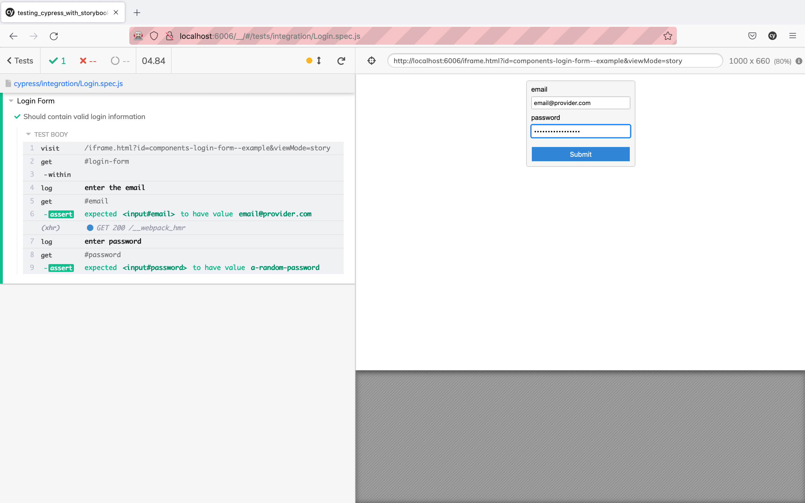

Storybook seamlessly integrates with additional testing frameworks like [Cypress](https://www.cypress.io/) and [Playwright](https://playwright.dev/) to provide a comprehensive testing solution. By leveraging the Component Story Format (CSF), developers can write test cases that simulate user interactions and verify the behavior of individual components within the Storybook environment. This approach enables developers to thoroughly test their components' functionality, responsiveness, and visual appearance across different scenarios, resulting in more robust and reliable applications.

### With Cypress

[Cypress](https://www.cypress.io/) is an end-to-end testing framework. It enables you to test a complete instance of your application by simulating user behavior. With Component Story Format, your stories are reusable with Cypress. Each named export (in other words, a story) is renderable within your testing setup.

An example of an end-to-end test with Cypress and Storybook is testing a login component for the correct inputs. For example, if you had the following story:

<!-- prettier-ignore-start -->

<CodeSnippets
  paths={[
    'react/login-form-with-play-function.js.mdx',
    'react/login-form-with-play-function.ts.mdx',
    'angular/login-form-with-play-function.ts.mdx',
    'vue/login-form-with-play-function.js.mdx',
    'vue/login-form-with-play-function.ts.mdx',
    'web-components/login-form-with-play-function.js.mdx',
    'web-components/login-form-with-play-function.ts.mdx',
    'svelte/login-form-with-play-function.js.mdx',
  ]}
  usesCsf3
  csf2Path="writing-tests/importing-stories-in-tests#snippet-login-form-with-play-function"
/>

<!-- prettier-ignore-end -->

<Callout variant="info" icon="💡">

The play function contains small snippets of code that run after the story renders. It allows you to sequence interactions in stories.

</Callout>

With Cypress, you could write the following test:

<!-- prettier-ignore-start -->

<CodeSnippets
  paths={[
    'common/component-cypress-test.js.mdx',
  ]}
/>

<!-- prettier-ignore-end -->

When Cypress runs your test, it loads Storybook's isolated iframe and checks if the inputs match the test values.

### With Playwright

[Playwright](https://playwright.dev/) is a browser automation tool and end-to-end testing framework from Microsoft. It offers cross-browser automation, mobile testing with device emulation, and headless testing. With Component Story Format, your stories are reusable with Playwright. Each named export (in other words, a story) is renderable within your testing setup.

A real-life scenario of user flow testing with Playwright would be how to test a login form for validity. For example, if you had the following story already created:

<!-- prettier-ignore-start -->

<CodeSnippets
  paths={[
    'react/login-form-with-play-function.js.mdx',
    'react/login-form-with-play-function.ts.mdx',
    'angular/login-form-with-play-function.ts.mdx',
    'vue/login-form-with-play-function.js.mdx',
    'vue/login-form-with-play-function.ts.mdx',
    'web-components/login-form-with-play-function.js.mdx',
    'web-components/login-form-with-play-function.ts.mdx',
    'svelte/login-form-with-play-function.js.mdx',
  ]}
  usesCsf3
  csf2Path="writing-tests/importing-stories-in-tests#snippet-login-form-with-play-function"
/>

<!-- prettier-ignore-end -->

<Callout variant="info" icon="💡">

The play function contains small snippets of code that run after the story renders. It allows you to sequence interactions in stories.

</Callout>

With Playwright, you can write a test to check if the inputs are filled and match the story:

<!-- prettier-ignore-start -->

<CodeSnippets
  paths={[
    'common/component-playwright-test.js.mdx',
  ]}
/>

<!-- prettier-ignore-end -->

Once you execute Playwright, it opens a new browser window, loads Storybook's isolated iframe, asserts if the inputs contain the specified values, and displays the test results in the terminal.

#### Learn about other UI tests

- [Test runner](./test-runner.md) to automate test execution
- [Visual tests](./visual-testing.md) for appearance
- [Accessibility tests](./accessibility-testing.md) for accessibility
- [Interaction tests](./interaction-testing.md) for user behavior simulation
- [Coverage tests](./test-coverage.md) for measuring code coverage
- [Snapshot tests](./snapshot-testing.md) for rendering errors and warnings
- End-to-end tests for simulating real user scenarios
- [Unit tests](./stories-in-unit-tests.md) for functionality
